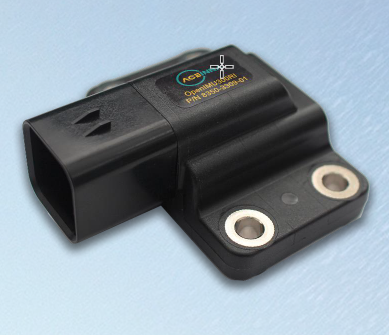

OpenIMU300RI - Robust Industrial CAN Module
===========================================
.. contents:: Contents
    :local:

The following image shows the OpenIMU300RI unit.

The following diagram shows the default coordinate frame for the OpenIMU300RI.
The coordinate frame can be changed using a UART or CAN message.

.. figure::  media/OpenIMU300RI_CoordinateFrame.png
    :width: 5.11in
    :height: 4.75in
    :align: center

    OpenIMU300RI Default Coordinate Frame

The OpenIMU300RI Robust Industrial CAN module integrates highly-reliable MEMS inertial
sensors (acceleration, angular rate/gyro, and magnetic field) in a miniature
factory-calibrated package to provide consistent performance through the extreme
operating environments.

OpenIMU300RI has excellent acceleration and gyro performance that matches
systems ten times more expensive.

*   Hardware

    *	Precision 3-axis MEMS Accelerometer
    *	Low-Drift 3-axis MEMS angular rate sensor
    *	High Performance 3-axis AMR Magnetometer
    *	168 MHz ARM M4 microcontroller
    *	Wide Temp Range, -40C to +85C
    *	Wide Supply Voltage Range, 5 V – 32 V
    *	High Reliability, MTBF > 50k hours
    *	IP67 Ampseal Connector

        * CAN 2.0 interface

    *   UART - conditionally, one of the following:

        * Debug Console interface
        * -or- Aceinna Navigation Studio interface

    *   SPI and I2C buses for communicating with internal sensor peripherals

        *   SPI - Angular Rate sensor
        *   I2C - Accelerometer and Magnetometer (if present)

*   Firmware and Firmware Support

    *   In-System Firmware Upgrade
    *	Open Source Tool Chain
    *	Open Source Algorithms (VG / AHRS / INS)
    *	Built in 16-State Open Source Extended State Kalman Filter
    *	Open Community & Support

.. toctree::
    :maxdepth: 1
    :hidden:

    300RI/imu-sensors
    300RI/electrical
    300RI/mechanical
    300RI/CAN-UART
    300RI/pinout
    300RI/arm-cortex-cpu

.. include:: <isonum.txt>
