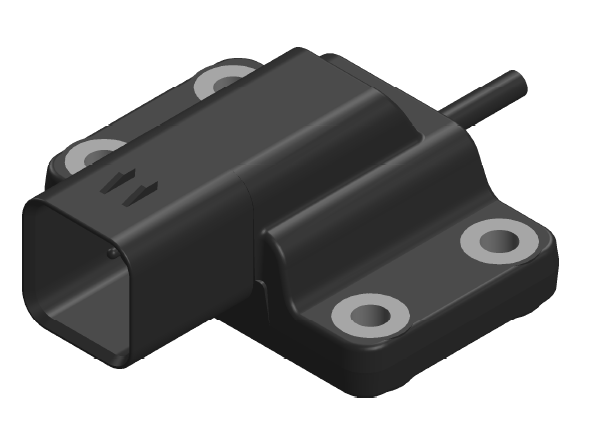

OpenIMU300RI - EZ Embed CAN Module
==================================
.. contents:: Contents
    :local:

The following image shows the OpenIMU300RI Evaluation Kit.

The following image shows the OpenIMU300RI unit in a Development Kit configuration, 
with a breakout header for connecting the STMicro ST-LINK V2 debugger.

.. image:: ./300RI/_images/OpenIMU300RI_DevKit.png
    :height: 400

The OpenIMU300RI *EZ Embed* CAN module integrates highly-reliable MEMS inertial
sensors (acceleration, angular rate/gyro, and
magnetic field) in a miniature factory-calibrated package to provide
consistent performance through the extreme
operating environments.

OpenIMU300RI has excellent acceleration and gyro performance that matches
systems ten times more expensive.
It is easy to syncronize and interface with external GPS, as well as other
sensors.

* Integrated 3-Axis Angular Accelerometer
* Integrated 3-Axis Linear Accelerometer
* Integrated 3-Axis Magnetic Sensor
* 168MHz STM32 M4 CPU
* UART Interface (for development)
* CAN bus interface for production
* Update Rate to 800Hz
* In-System Firmware Upgrade
* Automotive SAE qualified housing
* Small Size (66mm x 64.83mm x 9.5mm)
* Drop-in replacement for IMU300ZI
* Wide Temp Range -40 to 85 |deg| C
* High Reliability > 50,000hr MTBF

.. toctree::
    :maxdepth: 2

    300RI/imu-sensors
    300RI/CoordinateFrame
    300RI/electrical
    300RI/mechanical
    300RI/CAN-UART
    300RI/arm-cortex-cpu
    300RI/pinout

.. include:: <isonum.txt>
