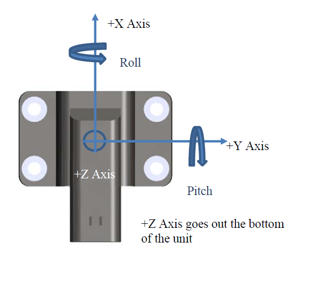

Coordinate Frame
================

.. contents:: Contents
    :local:

The following diagram shows the default coordinate frame for the OpenIMU300RI. 
The coordinate frame can be changed using a UART or CAN message.

    
    OpenIMU300RI Default Coordinate Frame

