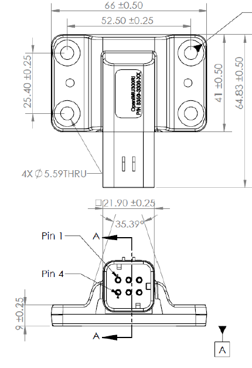

OpenIMU300RI Mechanical Diagram and Mounting Specifications
==============================================================

.. contents:: Contents
    :local:

The following diagram shows the mechanical drawings for the OpenIMU300RI. The mechanical dimensions are in mm.

.. note::

    Mounting Specifications

    *   Use 4 - M5 Alloy Steel Socket Head Screws to secure the OpenIMU300RI
    *   Torque the screws to 2.37 N-m (21 inch-pounds)
    *   It is recommended to use thread lock.
    *   If a washer and lock washer are used, the washer outer diameter must
        not be larger than the outer diameter of the bushing. A washer
        diameter of 10 mm is recommended if a washer is used.

    **OpenIMU300RI Mechanical Diagram**
