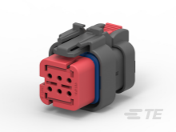
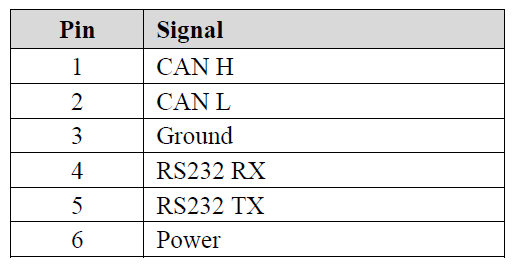

OpenIMU300RI Connector Pinout
==============================

.. contents:: Contents
    :local:

The OpenIMU300RI mating connector is the TE Connectivity 776531-1 (Ampseal-16 Housing "AS 16, 6P PLUG ASSY, RD, KEY 1" ) 
or equivalent.

    OpenIMU300RI Connector

The pinout for that connector is shown in the following diagram.  
Pin 1 is in the upper right corner of the diagram.

.. figure::  _images/OpenIMU300RI_CAN_PinDiagram.png
    :align: center

    OpenIMU300RI Connector Pinout

The connector pin definitions are defined in the table below.

    OpenIMU300RI Connector Pinout

.. note::

    Power is applied to the OpenIMU300RI on pin 6. Pin 3 is ground.  The OpenIMU300RI 
    accepts an unregulated 5 to 32 VDC input. It is reverse polarity and ESD protected internally

