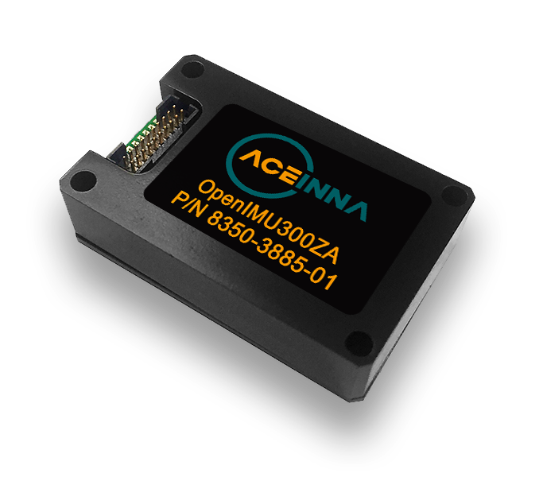

OpenIMU300ZA - *EZ Embed* Automotive Module
===========================================
.. contents:: Contents
    :local:

OpenIMU300ZA *EZ Embed* module integrates highly-reliable MEMS inertial
sensors (acceleration, angular rate/gyro, and
magnetic field) in a miniature factory-calibrated package to provide
consistent performance through the extreme
operating environments.

OpenIMU300ZA has excellent acceleration and gyro performance that matches
systems ten times more expensive.
It is easy to syncronize and interface with external GPS, as well as other
sensors.

* Integrated 3-Axis Angular Rate
* Integrated 3-Axis Accelerometer
* Integrated 3-Axis Magnetic Sensor
* 168MHz STM32 M4 CPU
* SPI / UART Interfaces
* Update Rate to 800Hz
* Syncronization Input
* In-System Upgrade
* Small Size (24x37x9.5mm)
* Drop-in Upgrade for IMU380ZA, IMU381ZA
* Wide Temp Range -40 to 85 |deg| C
* High Reliability > 50,000hr MTBF

.. toctree::
    :maxdepth: 1

    300ZA/imu-sensors
    300ZA/electrical
    300ZA/mechanical
    300ZA/spi-uart
    300ZA/pinout
    300ZA/arm-cortex-cpu

.. include:: <isonum.txt>
