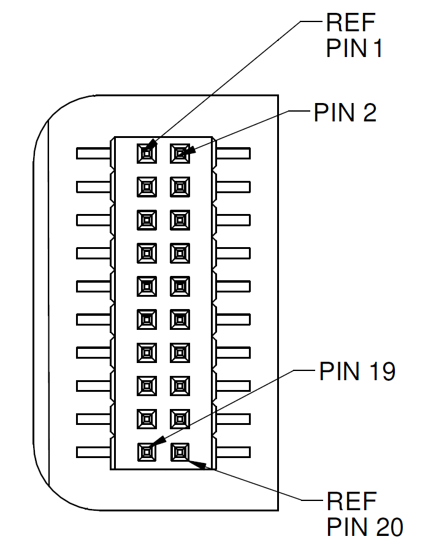

Connector Pinout
================

.. contents:: Contents
    :local:

The OpenIMU300ZA main connector is a SAMTEC FTM-110-02-F-DV-P defined below. The mating connector that can be used is the SAMTEC CLM-110-02.

|Connector.png|

                   OpenIMU300ZA Interface Connector

The connector pin definitions are defined in the table below.

**Table Interface Connector Pin Definition**

+-----------------------+-----------------------+
| **Pin**               | **Pin Description     |
|                       | (OpenIMU300ZA)**      |
|                       |                       |
+-----------------------+-----------------------+
| 1                     || Inertial-Sensor      |
|                       | Sampling Indicator    |
|                       || (sampling upon       |
|                       | falling edge)         |
+-----------------------+-----------------------+
| 2                     || Synchronization Input|
|                       | (1KHz Pulse used to   |
|                       || synchronize SPI Comm)|
|                       | / 1PPS Input          |
|                       || (External GPS)       |
+-----------------------+-----------------------+
| 3                     | SPI Clock (SCLK) /    |
|                       | UART TX               |
+-----------------------+-----------------------+
| 4                     | SPI Data Output       |
|                       | (MISO) / UART RX      |
+-----------------------+-----------------------+
| 5                     | SPI Data Input (MOSI) |
+-----------------------+-----------------------+
| 6                     | SPI Chip Select (SS)  |
+-----------------------+-----------------------+
| 7                     || Data Ready (SPI      |
|                       | Communication Data    |
|                       || Ready) / SPI-UART    |
|                       | Port Select           |
+-----------------------+-----------------------+
| 8                     | External Reset (NRST) |
+-----------------------+-----------------------+
| 9                     | Reserved - factory    |
|                       | use only              |
+-----------------------+-----------------------+
| 10                    | Power VIN (3-5 VDC)   |
+-----------------------+-----------------------+
| 11                    | Power VIN (3-5 VDC)   |
+-----------------------+-----------------------+
| 12                    | Power VIN (3-5 VDC)   |
+-----------------------+-----------------------+
| 13                    | Power GND             |
+-----------------------+-----------------------+
| 14                    | Power GND             |
+-----------------------+-----------------------+
| 15                    | Power GND             |
+-----------------------+-----------------------+
| 16                    | Reserved – factory    |
|                       | use only              |
+-----------------------+-----------------------+
| 17                    | External GPS UART TX  |
+-----------------------+-----------------------+
| 18                    | Reserved – factory    |
|                       | use only              |
+-----------------------+-----------------------+
| 19                    | External GPS UART RX  |
+-----------------------+-----------------------+
| 20                    | Reserved – factory    |
|                       | use only              |
+-----------------------+-----------------------+

**Power Input and Power Input Ground**

Power is applied to the OpenIMU300ZA on pins 10 through 15. Pins 13-15 are
ground; Pins 10-12 accepts 3 to 5 VDC unregulated input. Note that these
are redundant power ground input pairs.

.. note::

    Do not reverse the power leads or damage may occur. Do not add greater
    than 5.5 volts on the power pins or damage may occur. This system has no
    reverse voltage or over-voltage protection.

