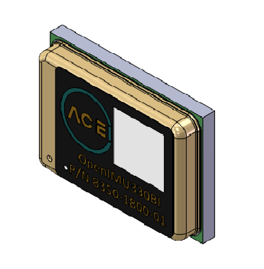

OpenIMU330BI - Triple Redundant, 2 |deg|/Hr, SMT Module
========================================================
.. contents:: Contents
    :local:

The following image shows the OpenIMU330BI unit.  

	
The OpenIMU330BI *EZ Embed* module integrates highly-reliable MEMS inertial
sensors (acceleration, angular rate/gyro, and
magnetic field) in a miniature factory-calibrated package to provide
consistent performance through the extreme
operating environments.

OpenIMU330BI has excellent acceleration and gyro performance that matches
systems ten times more expensive.
It is easy to synchronize and interface with external GPS, as well as other
sensors.
The main feature of OpenIMU300BI is tripple redundancy for each inertial sensor.

* Integrated tripple redundant 3-Axis Angular Rate Sensors
* Integrated tripple redundant 3-Axis Accelerometer
* 80MHz STM32 M4 CPU with FPU
* SPI / UART Interfaces
* Sensors Update Rate to 800Hz
* Synchronization Input
* In-System Upgrade
* Ultra Small Size: TBD
* Wide Temp Range -40 to 85 |deg| C
* High Reliability > 50,000hr MTBF
* Low power

.. toctree::
    :maxdepth: 1

    330BI/imu-sensors
    330BI/electrical
    330BI/mechanical
    330BI/spi-uart
    330BI/pinout
    330BI/arm-cortex-cpu

.. include:: <isonum.txt>
