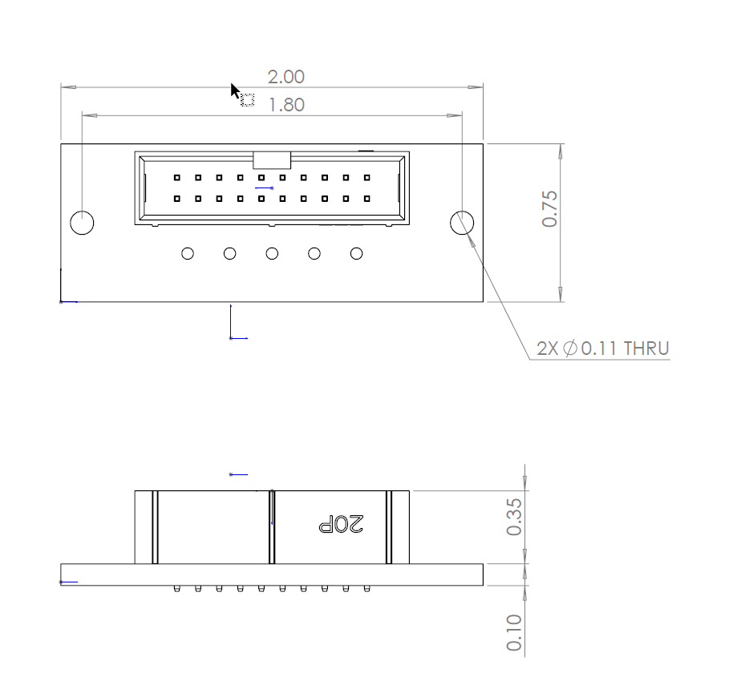
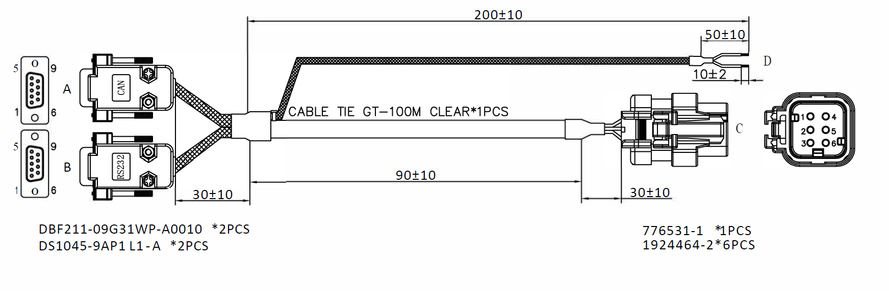

OpenIMU300RI Eval Kit
=====================

.. contents:: Contents
    :local:

The OpenIMU300RI evaluation kit includes:

*   A robust and easy-to-use test fixture.
*   An OpenIMU300RI IMU module attached to the test fixture.
*   An ST-LINK J-TAG debugger, a debugger cable, and a USB cable.
*   A multiple-connector cable for RS232/CAN/Power connection.

.. image:: media/OpenIMU-Unlabeled-box.png
    :height: 200

.. image:: media/STLink.png
    :height: 200

**OpenIMU300RI Evaluation Kit Introduction**

The OpenIMU evaluation kit is a hardware platform used to evaluate the
OpenIMU300RI inertial navigation system and develop various applications
based on this platform.  It is supported by the Aceinna Navigation Studio,
which provides easy access to the features of the
OpenIMU300RI and explains how to integrate the device in a custom design.
The Components section below provides the contents of the kit.

.. note::

    An external DC power supply is required.  The power supply must be able to provide 400mA at 4.9VDC to 32VDC.

    The cable shown in the Evaluation Kit figure is not representative of the cable that will be provided with the Evaluation Kit

+-------------------------------------------------+------------------------------------------------+
| .. figure:: media/OpenIMU300RI_DevKit.png       | .. figure:: media/OpenIMU300RI-EvalKit.png     |
|    :height: 300                                 |    :height: 500                                |
+-------------------------------------------------+------------------------------------------------+
||   **OpenIMU300RI Evaluation Kit Fixture with** || **OpenIMU300RI Evaluation Kit**               |
||   **OpenIMU300RI unit and JTAG Header Board**  |                                                |
+-------------------------------------------------+------------------------------------------------+

**OpenIMU300RI Evaluation Kit components**

    **OpenIMU300RI unit**

        OpenIMU300RI is 9 DOF (degrees of freedom) fully calibrated inertial unit. It is used as the base for development custom
        inertial navigation applications.

    **OpenIMU300RI Evaluation Kit fixture and JTAG header board**

        The OpenIMU300RI unit and the JTAG header board are connected to a text fixture.
        The OpenIMU300RI Evaluation JTAG header board provides the means to connect the kit to an ST Link debugger.
        The JTAG header board is connected to the unit with a cable that goes through a drilled hole in the back of the unit.

    **ST-Link debugger**

        The ST-Link debugger is a standard JTAG SWD debugger provided by STMicroelectronics company.
        It is used for in-system debugging of applications via SWD interface.

    **OpenIMU300RI Breakout Cable**

        A breakout cable is included that provides a connector to the OpenIMU300RI unit and to two 9-pin D-sub connectors; one for RS23s communication and the other for CAN Bus communication.

.. note::
    The OpenIMU300RI Evaluation Kit does not include a
    baseboard, so there is no schematic supplied.  The only
    external interfaces are through the JTAG connector and the unit's
    UART/CAN connector.

. note::
    The drawing below is a preliminary drawing and is provided for information only.  The final drawing may be different.

	**Eval Kit JTAG Header Board Mechanical Drawing**

JTAG Header Board Mechanical Drawing PDF File :download:`download link <media/OpenIMU300RI-EvalKit-JTAG-Header-Mechanical-Drawing-8040-3306-01.pdf>`

**OpenIMU300RI Evaluation Kit Cable Mechanical Drawing**

.
OpenIMU300RI Evaluation Kit Cable Mechanical Drawing PDF file :download:`download link <media/CABLEOPENIMU300RI.pdf>`

	**OpenIMU300RI Evaluation Kit Cable Mechanical Drawing**

..
    **SWD (JTAG) connector**

        20-pin connector P3 used for connecting ST-Link or J-Link debuggers to the unit for
        in-system debugging of applications via SWD interface. It has standard pin-out.

        +-------------------+-------------------------+
        | **Pin**           |   Main Function         |
        |                   |                         |
        +-------------------+-------------------------+
        | 1                 | Vref                    |
        +-------------------+-------------------------+
        |2, 4, 6, 8, 10 , 12| GND                     |
        |14, 16, 18, 20     |                         |
        +-------------------+-------------------------+
        | 7                 | SWDIO                   |
        +-------------------+-------------------------+
        | 9                 | SWCLK                   |
        +-------------------+-------------------------+
        | 15                | nRST                    |
        +-------------------+-------------------------+
        | 19                | 3.3V from debugger      |
        +-------------------+-------------------------+

    **OpenIMU evaluation kit power**

        Set the external DC power supply set to 12V.
        Power the kit up by turning on the power supply.

    **Communication with IMU from PC**

        The unit communicates to the PC through the UART RS232 9-pin D-sub connector, which would be connected to a PC via
        the PC's RS232  9-pin D-Sub or via a RS232-to-USB adapter.

**OpenIMU Evaluation Kit Important Notice**

::

     This evaluation kit is intended for use for FURTHER ENGINEERING, DEVELOPMENT,
     DEMONSTRATION, OR EVALUATION PURPOSES ONLY. It is not a finished product and may not (yet)
     comply with some or any technical or legal requirements that are applicable to finished products,
     including, without limitation, directives regarding electromagnetic compatibility, recycling (WEEE),
     FCC, CE or UL (except as may be otherwise noted on the board/kit). Aceinna supplied this board/kit
     "AS IS," without any warranties, with all faults, at the buyer's and further users' sole risk. The
     user assumes all responsibility and liability for proper and safe handling of the goods. Further,
     the user indemnifies Aceinna from all claims arising from the handling or use of the goods. Due to
     the open construction of the product, it is the user's responsibility to take any and all appropriate
     precautions with regard to electrostatic discharge and any other technical or legal concerns.
     EXCEPT TO THE EXTENT OF THE INDEMNITY SET FORTH ABOVE, NEITHER USER NOR ACEINNA
     SHALL BE LIABLE TO EACH OTHER FOR ANY INDIRECT, SPECIAL, INCIDENTAL, OR
     CONSEQUENTIAL DAMAGES.
     No license is granted under any patent right or other intellectual property right of Aceinna covering
     or relating to any machine, process, or combination in which such Aceinna products or services might
     be or are used.
