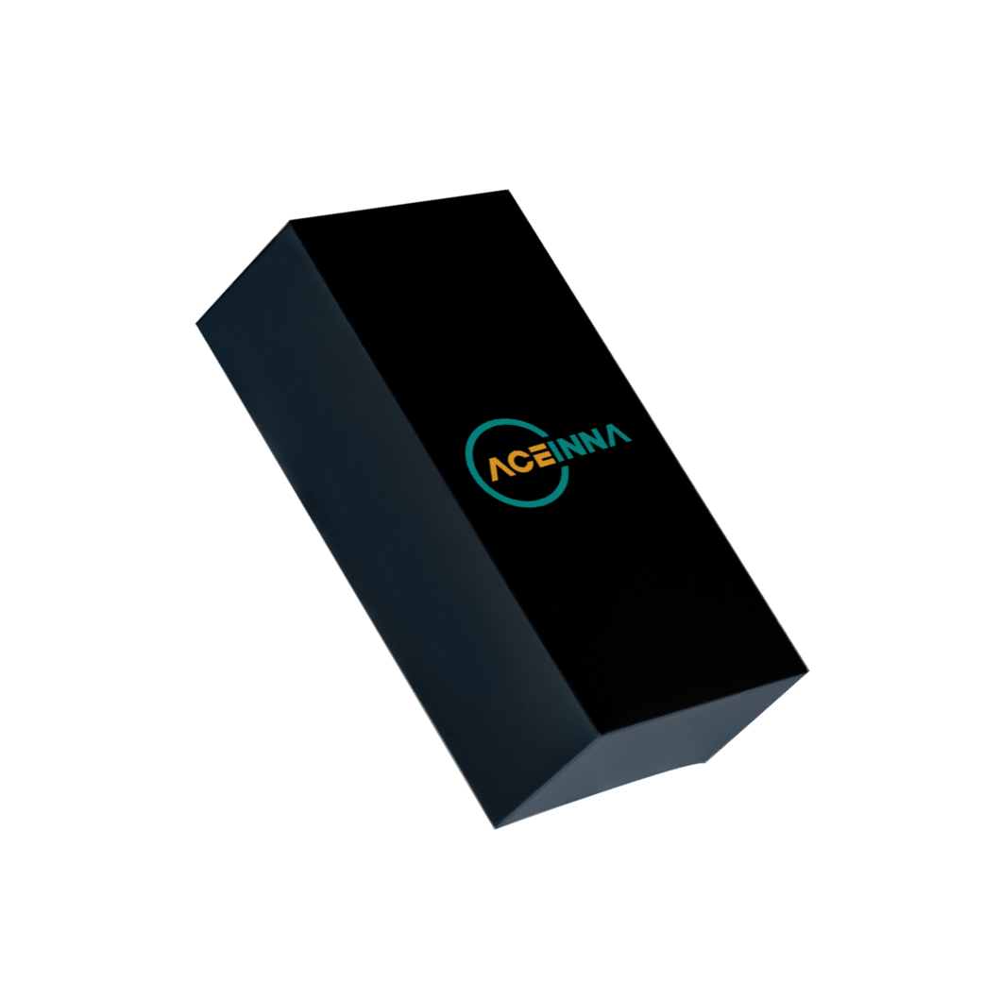
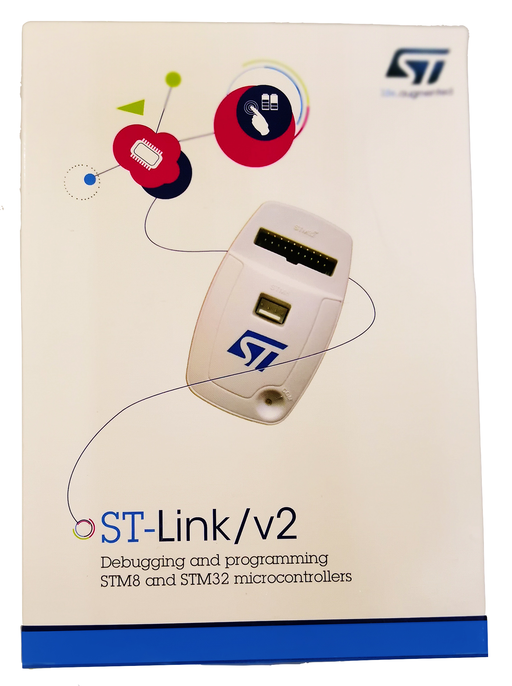

OpenRTK 330
===========

.. contents:: Contents
    :local:

The OpenIMU300RI evaluation kit includes:

*   A robust and easy-to-use test fixture.
*   An OpenIMU300RI IMU module attached to the test fixture with JTAG (SWD) 20-pin connector.
*   An ST-LINK J-TAG debugger, a debugger cable, and a USB cable.
*   A multiple-connector cable for RS232/CAN/Power connection.

**OpenIMU300RI Evaluation Kit Introduction**

The OpenIMU evaluation kit is a hardware platform used to evaluate the
OpenIMU300RI inertial navigation system and develop various applications
based on this platform.  It is supported by the Aceinna Navigation Studio,
which provides easy access to the features of the
OpenIMU300RI and explains how to integrate the device in a custom design.
The Components section below provides the contents of the kit.

.. note::

    An external DC power supply is required.  The power supply must be able to provide 400mA at 4.9VDC to 32VDC.

    The cable shown in the Evaluation Kit figure may look different than the cable that will be provided with the Evaluation Kit

+------------------------------------------------------+------------------------------------------------+
| .. figure:: media/OpenIMU300RI_DevKit.png            | .. figure:: media/OpenIMU300RI-EvalKit.png     |
|    :height: 300                                      |    :height: 500                                |
+------------------------------------------------------+------------------------------------------------+
||   **OpenIMU300RI Evaluation Unit**                  || **OpenIMU300RI Evaluation Kit**               |
||   **installed on test fixture with JTAG connector** ||                                               |
+------------------------------------------------------+------------------------------------------------+

**OpenIMU300RI Evaluation Kit components**

    **OpenIMU300RI unit**

        OpenIMU300RI is 9 DOF (degrees of freedom) fully calibrated inertial unit. It is used as the base for development custom
        inertial navigation applications.

    **OpenIMU300RI Evaluation Kit fixture and JTAG header board**

        The OpenIMU300RI unit with JTAG header board are mounted on the text fixture.
        The JTAG header provides means to debug/upload applications on evaluation unit.

    **ST-Link debugger**

        The ST-Link debugger is a standard JTAG SWD debugger provided by STMicroelectronics company.
        It is used for in-system debugging/uploading of applications via SWD interface.

    **OpenIMU300RI Breakout Cable**

        An included cable provides means of connecting unit to PC via RS232 interface, connecting unit to the CAN bus and powering up unit.

	    Next table provides connectors pin assignments in supplied cable

    +-------------+------------+------------+-----------+-----------+
    | Signal Name || Unit      || RS232     || CAN      || Power    |
    |             || Connector || Connector || Connector|| Wires    |
    +-------------+------------+------------+-----------+-----------+
    | GND         |    3       |   5        |           |  Black    |
    +-------------+------------+------------+-----------+-----------+
    | VIN         |    6       |            |           |  Red      |
    +-------------+------------+------------+-----------+-----------+
    | RS232 TX    |    5       |   2        |           |           |
    +-------------+------------+------------+-----------+-----------+
    | RS232 RX    |    4       |   3        |           |           |
    +-------------+------------+------------+-----------+-----------+
    | CAN H       |    1       |            | 7         |           |
    +-------------+------------+------------+-----------+-----------+
    | CAN L       |    2       |            | 2         |           |
    +-------------+------------+------------+-----------+-----------+

**OpenIMU Evaluation Kit Important Notice**

::

     This evaluation kit is intended for use for FURTHER ENGINEERING, DEVELOPMENT,
     DEMONSTRATION, OR EVALUATION PURPOSES ONLY. It is not a finished product and may not (yet)
     comply with some or any technical or legal requirements that are applicable to finished products,
     including, without limitation, directives regarding electromagnetic compatibility, recycling (WEEE),
     FCC, CE or UL (except as may be otherwise noted on the board/kit). Aceinna supplied this board/kit
     "AS IS," without any warranties, with all faults, at the buyer's and further users' sole risk. The
     user assumes all responsibility and liability for proper and safe handling of the goods. Further,
     the user indemnifies Aceinna from all claims arising from the handling or use of the goods. Due to
     the open construction of the product, it is the user's responsibility to take any and all appropriate
     precautions with regard to electrostatic discharge and any other technical or legal concerns.
     EXCEPT TO THE EXTENT OF THE INDEMNITY SET FORTH ABOVE, NEITHER USER NOR ACEINNA
     SHALL BE LIABLE TO EACH OTHER FOR ANY INDIRECT, SPECIAL, INCIDENTAL, OR
     CONSEQUENTIAL DAMAGES.
     No license is granted under any patent right or other intellectual property right of Aceinna covering
     or relating to any machine, process, or combination in which such Aceinna products or services might
     be or are used.
