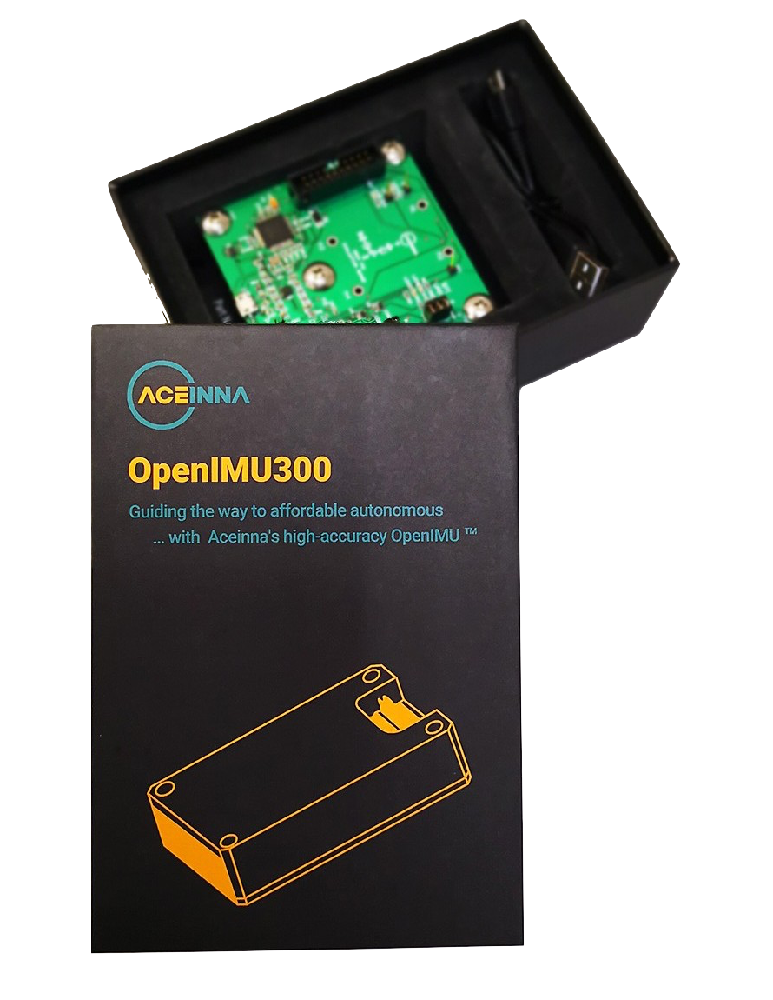

OpenRTK 330 LI Eval Kit
=======================

.. contents:: Contents
    :local:
    
The OpenIMU300ZI evaluation kit consists of a robust and easy-to-use eval board, a test fixture, the OpenIMU300ZI IMU module, and an ST-LINK J-TAG pod.

.. image:: media/STLink.png
    :height: 200

The following pages cover:

*   Detailed Overview
*   Eval Board Mechanical Drawing
*   Eval Board Schematic

.. toctree::
    :maxdepth: 2
    :hidden:

    EVB-OpenIMU300ZI/overview
    EVB-OpenIMU300ZI/mechanical
    EVB-OpenIMU300ZI/schematic
   
