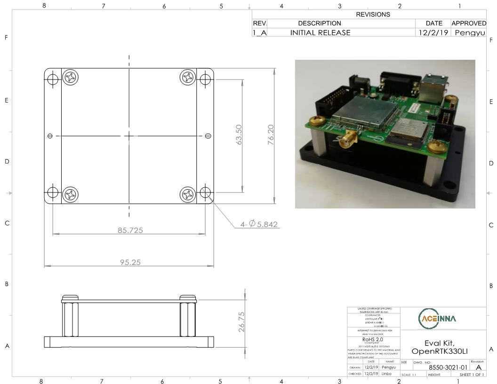

EVB Mechanical Drawing
===================================

.. contents:: Contents
    :local:

The following mechanical drawing shows the EVB dimension (in mm) and the position of IMU navigation center (the z-axis offset between IMU sensor and EVB PCB board is about 1 mm):

    .. image:: ../media/EVB_IMU_Center_dimension.png

The following mechnical drawing shows the dimension (in mm) of the mounting plate for the OpenRTK330LI EVB:

.. note:: Use the browser's back button to return to this page.

.. Mechanical Drawing :download:`download link <../media/8550-3021-01_EVK_OpenRTK330LI.PDF>`
