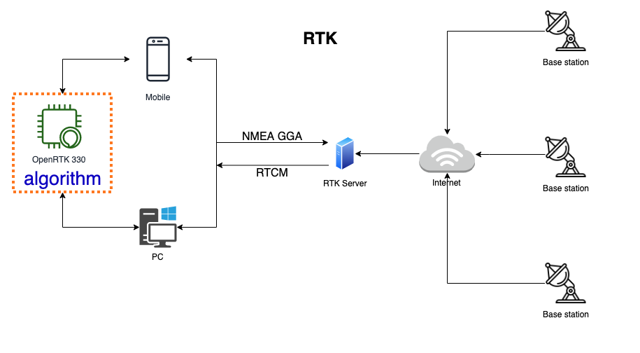
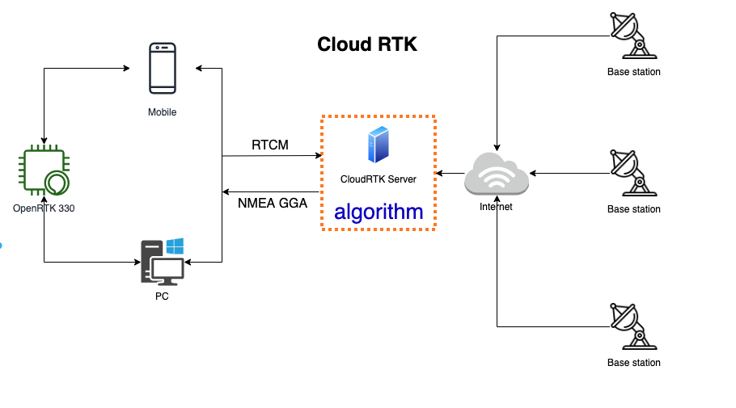

RTK/Cloud RTK
=============

RTK
~~~

OpenRTK330 sends nmea gga data to RTK server, RTK server calculates the appropriate 
base station according to the coordinates of gga data, and then sends the real-time 
observation data of the base station to OpenRTK330.

Cloud RTK
~~~~~~~~~

OpenRTK330 sends its observation data to the cloud RTK server. Cloud RTK calculates 
coordinates according to the observation data, selects the appropriate base station 
using the coordinates, then uses the observation data of the base station and OpenRTK330 
to carry out RTK algorithm operation, and then sends the calculated NMEA GGA data to OpenRTK330.

+---------------+--------------------------+------------------------------+
| Type          | Send Data to Server      | Receive Data from Server     |
+---------------+--------------------------+------------------------------+
|    **RTK**    | NMEA GGA                 | RTCM (Base station data)     |
+---------------+--------------------------+------------------------------+
| **Cloud RTK** | RTCM (Observation data)  | NMEA GGA                     |
+---------------+--------------------------+------------------------------+