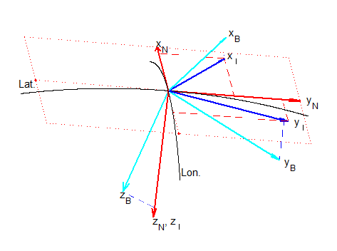

******************
Coordinate Frames
******************

.. contents:: Contents
    :local:

.. role::  raw-html(raw)
    :format: html

.. sectionauthor:: Joseph S Motyka <jmotyka at aceinna.com>

A body's position and orientation can only be measured relative to another set of basis vectors
(coordinate-frame).  In this formulation, inertial sensors provide the information to compute the
attitude and position of a body in space relative to an "inertial" frame, such as the
Earth-Centered, Earth-Fixed frame (ECEF) or the North/East/Down-frame (NED)\ [#inertial]_.  The
equations to come use the superscripts listed in `Table 1 <CoordFrames.html#id2>`__  to specify the frame in
which a variable is measured.

.. Comment --> (`Table <Sensors.html#id4>`__)

.. Comment --> file:///Users/jmotyka/platformio/docs_aceinna-dmu380/_build/html/algorithms/CoordFrames.html#id2

.. table:: **Table 1: Frames and their Identifiers used throughout Algorithm Derivation**
    :widths: auto

    +-------------+-----------------+-----------------------------------------------------------------------------------+
    |  **Frame**  | **Superscript** |  **Description**                                                                  |
    +=============+=================+===================================================================================+
    | ECEF-Frame  | E               || Frame aligned with Earth's axis (z-axis parallel to axis-of-                     |
    |             |                 || rotation, x-axis exits at the equator through the prime-                         |
    |             |                 || meridian); rotates with the Earth (**not shown in Figure 1**)                    |
    +-------------+-----------------+-----------------------------------------------------------------------------------+
    | NED-Frame   | N               || Frame aligned with the local tangent-frame (z-axis parallel to                   |
    |             |                 || the gravity vector) with the x-axis aligned with true or                         |
    |             |                 || magnetic north.  (**Red lines in Figure 1**)                                     |
    +-------------+-----------------+-----------------------------------------------------------------------------------+
    | Perp-Frame  | :math:`\perp`   || Frame aligned with the local tangent-frame (|zSubPerp|\ -axis                    |
    |             |                 || parallel to the gravity vector).  (**Purple lines in Figure 1**)                 |
    +-------------+-----------------+-----------------------------------------------------------------------------------+
    | Body-Frame  | B               || Frame aligned with the body-frame.  |xSubB|\ -axis lies in the                   |
    |             |                 || plane formed by the |xSubPerp| and |zSubPerp|\ -axes. (**Light**                 |
    |             |                 || **Blue lines in Figure 1**)                                                      |
    +-------------+-----------------+-----------------------------------------------------------------------------------+

*Figure 1* shows the relative orientation of three of the four frames listed in *Table 1* (ECEF not
shown) for a hypothetical body on the surface of the Earth with a roll of 20°, a pitch of 10°, and
a heading of 30°.  The red lines illustrate the components of the :math:`\perp`-frame axes in
the N-Frame while the light blue lines indicate the projection of the B-Frame axes onto the N-frame.

.. _fig-coord-frames:

    **Figure 1: Coordinate Frames used in Derivation (N, \perp, and B-Frames)**

.. |xSubPerp| replace:: :math:`x_\perp`
.. |ySubPerp| replace:: :math:`y_\perp`
.. |zSubPerp| replace:: :math:`z_\perp`
.. |xSubB| replace:: :math:`x_\perp`
.. |ySubB| replace:: :math:`y_\perp`
.. |zSubB| replace:: :math:`z_\perp`

.. [#inertial] Strictly speaking, neither the ECEF-frame nor the NED-frame are inertial.  Both move
               and rotate relative to the stars; the NED-frame changes with location as well.
               However, the two are sufficient for use with the OpenIMU line of products.
