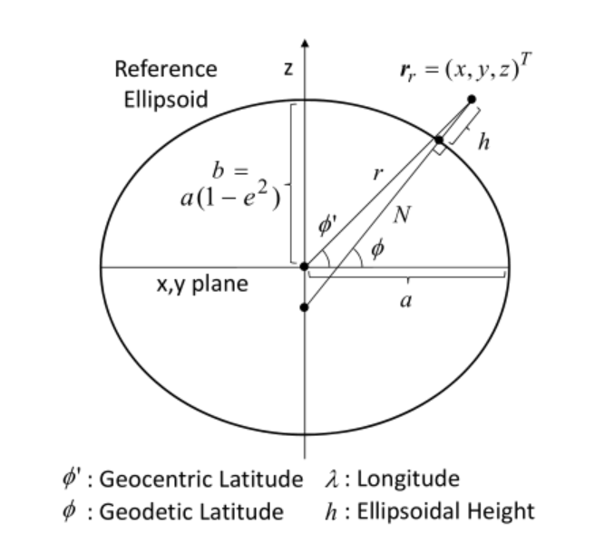
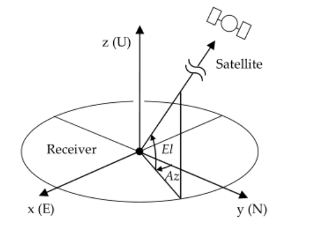

Coordinates System
==================

******************
Coordinate Frames
******************

.. role::  raw-html(raw)
    :format: html

.. sectionauthor:: Joseph S Motyka <jmotyka at aceinna.com>

A body's position and orientation can only be measured relative to another set of basis vectors
(coordinate-frame).  In this formulation, inertial sensors provide the information to compute the
attitude and position of a body in space relative to an "inertial" frame, such as the
Earth-Centered, Earth-Fixed frame (ECEF) or the North/East/Down-frame (NED)\ [#inertial]_.  The
equations to come use the superscripts listed in `Table 1 <CoordFrames.html#id2>`__  to specify the frame in
which a variable is measured.

.. Comment --> (`Table <Sensors.html#id4>`__)

.. Comment --> file:///Users/jmotyka/platformio/docs_aceinna-dmu380/_build/html/algorithms/CoordFrames.html#id2

.. table:: **Table 1: Frames and their Identifiers used throughout Algorithm Derivation**
    :widths: auto

    +-------------+-----------------+-----------------------------------------------------------------------------------+
    |  **Frame**  | **Superscript** |  **Description**                                                                  |
    +=============+=================+===================================================================================+
    | ECEF-Frame  | E               || Frame aligned with Earth's axis (z-axis parallel to axis-of-                     |
    |             |                 || rotation, x-axis exits at the equator through the prime-                         |
    |             |                 || meridian); rotates with the Earth (**not shown in Figure 1**)                    |
    +-------------+-----------------+-----------------------------------------------------------------------------------+
    | NED-Frame   | N               || Frame aligned with the local tangent-frame (z-axis parallel to                   |
    |             |                 || the gravity vector) with the x-axis aligned with true or                         |
    |             |                 || magnetic north.  Red lines in *Figure 1*.                                        |
    +-------------+-----------------+-----------------------------------------------------------------------------------+
    | Perp-Frame  | :math:`\perp`   || Frame aligned with the local tangent-frame (|zSubPerp|\ -axis                    |
    |             |                 || parallel to the gravity vector).  Dark blue lines in *Figure 1*                  |
    +-------------+-----------------+-----------------------------------------------------------------------------------+
    | Body-Frame  | B               || Frame aligned with the body-frame.  |xSubB|\ -axis lies in the                   |
    |             |                 || plane formed by the |xSubPerp| and |zSubPerp|\ -axes. Light                      |
    |             |                 || blues lines in *Figure 1*                                                        |
    +-------------+-----------------+-----------------------------------------------------------------------------------+

*Figure 1* shows the relative orientation of three of the four frames listed in *Table 1* (ECEF not
shown) for a hypothetical body on the surface of the Earth with a roll of 20°, a pitch of 10°, and
a heading of 30°.  The dashed red lines illustrate the components of the :math:`\perp`-frame axes in
the N-Frame while the dashed blue lines indicate the projection of the B-Frame axes onto the N-frame.

.. _fig-coord-frames:

.. figure:: ./media/CoordFrames.png
    :alt: CoordFrames
    :width: 5.0in
    :align: center

    **Figure 1: Coordinate Frames used in Derivation (N, \perp, and B-Frames)**

.. |xSubPerp| replace:: :math:`x_\perp`
.. |ySubPerp| replace:: :math:`y_\perp`
.. |zSubPerp| replace:: :math:`z_\perp`
.. |xSubB| replace:: :math:`x_\perp`
.. |ySubB| replace:: :math:`y_\perp`
.. |zSubB| replace:: :math:`z_\perp`

.. [#inertial] Strictly speaking, neither the ECEF-frame nor the NED-frame are inertial.  Both move
               and rotate relative to the stars; the NED-frame changes with location as well.
               However, the two are sufficient for use with the OpenIMU line of products.

*************************
Coordinate Transformation
*************************

The receiver or satellite positions in OpenRTK are internally represented as the X, Y, Z 
components in an ECEF (earth center earth fixed) coordinates system. What ECEF frame used 
is not explicitly defined but depends on the satellite ephemeris and the predefined 
base station position. For example, with GPS signals and navigation data, the single point positioning 
results are obtained in WGS84. The baseline analysis with the base station with the position 
in an ECEF frame basically brings the rover position in the same ECEF frame. Practically, 
all of usually used ECEF frames in GNSS navigation processing like WGS 84, PZ90.02 and ITRF, 
are identical within the accuracy of broadcast ephemeris or single point positioning. However, 
more strict and careful handling of the coordinates system is needed for the baseline analysis or PPP. 
The unified coordinates system is desirable to minimize the processing error in these cases. 

Transformation from geodetic position to ECEF XYZ position
----------------------------------------------------------

The geodetic position are defined based on a reference ellipsoid. The geodetic latitude :math:`\phi_r`, 
longitude :math:`\lambda_r` and the ellipsoidal height :math:`h` can be transformed to ECEF XYZ position
:math:`{\pmb r}_r = {(x,y,z)^T}` as follows:

.. math::
  
 &e^2 = f(2-f)\\
 {\hspace{5mm}} \\
 &v = \frac{a}{\sqrt{(1-{e}^{2}sin{\phi_r}^2)}}\\
 {\hspace{5mm}} \\
 &r_r=\begin{pmatrix}
 {(v + h)cos\phi_{r}cos\lambda_r}\\ 
 {(v+h)cos\phi_{r}sin\lambda_r}\\
 {v(1 - e^2)sin\phi_r}
 \end{pmatrix}

where:
  
   :math:`a`: major radius of the earth reference ellipsoid (m)

   :math:`f`: flattening of the earth reference ellipsoid

OpenRTK uses the following values for a and f of the reference ellipsoid provided by the WGS84 datum.

   :math:`a` = 6378137.0 (m)

   :math:`f` = 1.0/298.257223563

 

Transformation from ECEF XYZ position to geodetic position
----------------------------------------------------------

To transform the XYZ position :math:`{\pmb r}_r = {(x,y,z)^T}` in ECEF to the geodetic position, 
the following procedure is applied. The geodetic latitude is derived by an iterative method in the procedure. 

.. math::

  &r = \sqrt {x^2 + y^2}\\
  {\hspace{5mm}} \\
  &\phi_{r,0} = 0\\
  {\hspace{5mm}} \\
  &\phi_{r,i+1} = arctan(\frac{z}{r} - \frac{ae^2tan\phi_{r,i}}{r\sqrt{1 + (1 - e^2){tan}^2\phi_{r,i}}})\\
  {\hspace{5mm}} \\
  &\phi_r = \lim_{i \to \infty}\phi_{r,i}\\
  {\hspace{5mm}} \\
  &\lambda = ATANA(y,x)\\
  {\hspace{5mm}} \\
  &h = \frac{r}{cos\phi_r} - \frac{a}{\sqrt{(1-e^2){sin}^2\phi_r}}
  

Azimuth and elevation angles of satellite direction
---------------------------------------------------

The unit LOS (line‐of‐sight) vector from the receiver to the satellite 
can be expressed in the ECEF coordinates as: 

.. math::

  {\pmb e}^s_r = \frac{{\pmb r}^s(t^s)-{\pmb r}_r(t_r)}{\left \| {\pmb r}^s(t^s)-{\pmb r}_r(t_r) \right \|}

In the equation, the earth rotation effect is neglected. The azimuth and elevation 
angles :math:`Az_r^s` and :math:`El_r^s` of the satellite direction from the receiver 
site can be derived from: 

.. math::

  &{\pmb e}_{r,enu}^s = {\pmb E}_r{\pmb e}_r^s = {(e_e,e_n,e_u)}^T\\
  {\hspace{5mm}} \\
  &Az_r^s = ATAN2(e_e,e_n)\\
  {\hspace{5mm}} \\
  &El_r^s = arcsin(e_u)

where :math:`\pmb E_r` is the coordinates rotation matrix from ECEF to the local coordinates at the receiver position.

