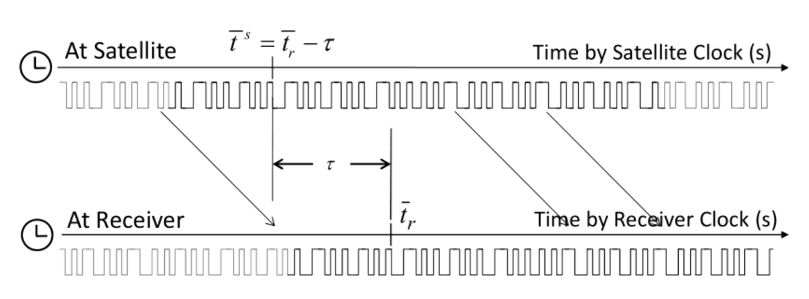

GNSS Signal Measurement Models
==============================

Pseudorange measurement Models
------------------------------

The pseudorange is defined as ʺthe distance from the receiver antenna to the satellite antenna 
including receiver and satellite clock offsets (and other biases, such as atmospheric delays)ʺ.  The 
:math:`L_i` pseudorange :math:`P_{r,i}^s` can be expressed by using the signal reception time  
:math:`\bar t_r` (s) measured by the receiver clock  and the signal transmission time :math:`\bar t^s` (s) 
measured by the satellite clock  as:

.. math::

  P_{r,i}^s = c(\bar t_r - \bar t^s)

The equation can be written by using the geometric range :math:`\rho_r^s` between satellite and receiver antennas, 
the receiver and satellite clock biases :math:`dt_r dT^s`, the ionospheric and tropospheric delay :math:`I_{r,i}^s`, 
:math:`T_r^s`, and the measurement error :math:`\varepsilon_p` as:

.. math::
  
  P_{r,i}^s &= c((t_r+dt_r(t_r))-(t^s+dT^s(t^s)))+\varepsilon_p\\
  &=c(t_r-t^s)+c(dt_r(t_r)-dT^s(t^s))+\varepsilon_p\\
  &=(\rho_r^s + I_{r,i}^s+T_r^s)+c(dt_r(t_r)-dT^s(t^s))+\varepsilon_p\\
  &=\rho_r^s+c(dt_r(t_r)-dT^s(t^s))+I_{r,i}^s+T_r^s+\varepsilon_p

Carrier‐phase and phase‐range measurement model 
-----------------------------------------------

The carrier‐phase is ʺ... actually being a measurement on the beat frequency between 
the received carrier of the satellite signal and a receiver‐generated reference frequencyʺ.
The :math:`L_i` carrier‐phase :math:`\phi_{r,i}^s` can be expressed as: 

.. math::

  \phi_{r,i}^s &= \phi_{r,i}^s(t^s) + N_{r,i}^s + \varepsilon_\phi\\
  &=(f_i(t_r+dt_r(t_r)-t_0)+\phi_{r,0,i})-(f_i(t^s+dT^s(t^s)+t_0)+\phi_{0,i}^s)+N_{r,i}^s+\varepsilon_\phi\\
  &=\frac{c}{\lambda_i}(t_r-t^s)+\frac{c}{\lambda_i}(dt_r(t_r)-dT^s(t^s))+(\phi_{r,0,i}+\phi_{0,i}^s+N_{r,i}^s)+\varepsilon_\phi

where :math:`t_0` is the initial time (s), :math:`\phi_{r,i}(t)` is the :math:`L_i` phase (cycle) of receiver local oscillator 
and :math:`\phi_i^s(t)` is the :math:`L_i` phase (cycle) of transmitted navigation signal at the time :math:`t`.
:math:`\phi_{r,0,i}` is the :math:`L_i` initial phase (cycle) of receiver local oscillator and :math:`\phi_{r,0,i}^s` is 
the :math:`L_i` initial phase (cycle) of transmitted navigation signal at the time :math:`t_0`.

The :math:`L_i` phase‐range :math:`\Phi_{r,i}^s`, defined as the carrier‐phase multiplied by the carrier frequency 
:math:`\lambda_i` in m, also can be expressed by using the carrier phase bias :math:`B_{r,i}^s`, and carrier‐phase 
correction terms :math:`d\Phi_{r,i}^s`, including antenna phase center offsets and variations, station displacement 
by earth tides, phase windup effect and relativity correction on the satellite clock as:

.. math::

  \Phi_{r,i}^s &= \lambda_i\phi_{r.i}^s\\
  &=c(t_r-t^s)+c(dt_r(t_r)-dT^s(t^s))+\lambda_i(\phi_{r,0,i}-\phi_{0,i}^s+N_{r,i}^s)+\lambda_i\varepsilon_\phi\\
  &=\rho_r^s+c(dt_r(t_r)-dT^s(t^s))-I_{r,i}^s+T_r^s+\lambda_iB_{r,i}^s+d\Phi_{r,i}^s+\varepsilon_\phi\\

where:

 .. math::

   &B_{r,i}^s=\phi_{0,i}^s+N_{r,i}^s\\
   &d\Phi_{r,i}^s=-{\pmb{d}_{r,pco,i}}^Te_{r,enu}^s+{(\pmb{E}^s\pmb{d}_{pco,i}^s)}^T&
   \pmb{e}_r^s+d_{r,pcv,i}(El)+d_{pcv,i}^s(\theta)-{\pmb{d}_{r,disp}}^T\pmb{e}_{r,enu}^s+\lambda_i\phi_{pw}

:math:`N_{r,i}^s` is often called as carrier‐phase integer ambiguity, carrier‐cycle ambiguity or simply ambiguity. 
For the detailed formulation of the carrier‐phase correction terms.
