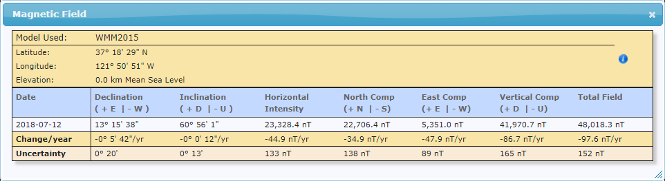
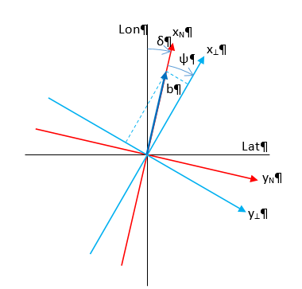

*******************
Measurement Vector
*******************

.. toctree::
    :maxdepth: 4

.. sectionauthor:: Joseph S Motyka <jmotyka at aceinna.com>

Overview
=========

It is possible to choose among various measurement models for a given EKF implementation.  The
particular model is selected based on many factors, one being the limitations of the available
measurements.  This formulation was selected due to the incomplete knowledge of the magnetic
environment of the system  and uses the available sensor information as follows:

    1) Accelerometers “level” the system (used to compute :math:`{^{⊥}}{\phi}{_{meas}^{B}}` and
       :math:`{^{⊥}}{\theta}{_{meas}^{B}}`) FN

    2) Magnetometers and/or GPS heading information align the ⊥-frame with true or magnetic north
       (:math:`{^{N}}{\psi}{^{⊥}}`)

    3) GPS position and velocity measurements update the position and velocity estimates
       (:math:`\vec{r}^{N}` and :math:`\vec{v}^{N}`)

Based upon these steps, the measurement vector, :math:`\vec{z}_{k}`, is formed:

.. math::

    \vec{z}_{k} = {
                    \begin{Bmatrix} {
                                      \begin{array}{c}
                                                       {\vec{r}_{GPS}^{N}}
                                                       \cr
                                                       {\vec{v}_{GPS}^{N}}
                                                       \cr
                                                       {^{N}}{\vec{\Theta}}{_{meas}^{B}}
                                      \end{array}
                    } \end{Bmatrix}
                  }

with the corresponding measurement model, :math:`\vec{h}_{k}`:

.. math::

    \vec{h}_{k} = {
                    \begin{Bmatrix} {
                                      \begin{array}{c}
                                                       {\vec{r}_{pred}^{N}}
                                                       \cr
                                                       {\vec{v}_{pred}^{N}}
                                                       \cr
                                                       {^{N}}{\vec{\Theta}}{_{pred}^{B}}
                                      \end{array}
                    } \end{Bmatrix}
                  }

Both :math:`{^{N}}{\vec{\Theta}}{_{meas}^{B}}` and :math:`{^{N}}{\vec{\Theta}}{_{pred}^{B}}` are
3x1 column vectors containing the roll, pitch, and heading values. FN

Measurement Vector (:math:`\vec{z}_{k}`)
=========================================

The measurement vector, :math:`\vec{z}_{k}` is comprised of position, velocity, and attitude
information as defined above.  It is formed from sensor measurements:.  However, only the GPS
velocity is available directly from measurements; other information must be derived from sensor
readings using the relationship described below.

Roll and Pitch Measurements
-----------------------------

Roll and pitch values are computed from the accelerometer signal.  Under static conditions,
measurements made by the accelerometer consists solely of gravity and sensor noise.  Along the axis
pointed in the direction of gravity, the sensor measures -1 [g].  This is due to the proof-mass
being pulled in the direction of gravity, which is equivalent to a deceleration of 1 [g] in the
absence of gravity.

.. math::

    \vec{a}_{meas} = \vec{a}_{grav} = -\vec{g}

Static roll and pitch values are determined by noting that gravity is constant in the N-Frame
(⊥-Frame):

.. math::

    \vec{g}^{N} = \vec{g}^{⊥} = \begin{Bmatrix} { 0 \\
                                                  0 \\
                                                  1
                                 } \end{Bmatrix}

and can be transformed into the body frame through :math:`{^{B}{R}^{⊥}}`:

.. math::

    \vec{g}^{B} = {^{B}{R}^{⊥}} \cdot \vec{g}^{⊥}
                = { \begin{pmatrix} { {^{⊥}{R}^{B}} } \end{pmatrix} }^{T} \cdot \vec{g}^{⊥}
                = { \begin{pmatrix} { {^{⊥}{R}^{B}} } \end{pmatrix} }^{T} \cdot \begin{Bmatrix} { 0 \\
                                                                                                  0 \\
                                                                                                  1
                                                                                } \end{Bmatrix}

Using the definition of :math:`{^{⊥}{R}^{B}}` (discussed in
`Attitude Parameters <AttitudeParameters.html#mathematical-relationships-between-attitude-parameters>`__)
and expanding the equation, the accelerometer measurements can be related to roll and pitch angles:
 

.. math::

    \vec{g}^{B} = -\vec{a}_{meas}^{B}

    
.. math::

    \begin{Bmatrix} {
                      \begin{array}{c}
                                       {-sin \begin{pmatrix} { {^{⊥}{\theta}^{B}} } \end{pmatrix}}
                                       \cr
                                       {cos \begin{pmatrix} { {^{⊥}{\theta}^{B}} } \end{pmatrix} \cdot sin \begin{pmatrix} { {^{⊥}{\phi}^{B}} } \end{pmatrix}}
                                       \cr
                                       {cos \begin{pmatrix} { {^{⊥}{\theta}^{B}} } \end{pmatrix} \cdot cos \begin{pmatrix} { {^{⊥}{\phi}^{B}} } \end{pmatrix}}
                      \end{array}
    } \end{Bmatrix} = {
                        \begin{Bmatrix} {
                                          \begin{array}{c}
                                                           {-a}_{mx}^{B} \\
                                                           {-a}_{my}^{B} \\
                                                           {-a}_{mz}^B
                                          \end{array}
                        } \end{Bmatrix}
                      }

From this result, the angles corresponding to the accelerometer signal are found:

.. math::

    {^{⊥}}{\phi}{_{meas}^{B}} =atan2(-a_{my}^{B},-a_{mz}^{B} )

.. math::

    {^{⊥}}{\theta}{_{meas}^{B}}  =-asin(-\hat{a}_{mx}^{B} )

where, :math:`\hat{a}_{mx}^{B}` is the x-axis acceleration value normalized by the total
acceleration magnitude:

.. math::

    \hat{a}_{mx}^{B} = { {a_{mx}^B} \over \| {\vec{a}_{meas}^{B}} \|}

Normalization of the y and z-axis accelerometer values can be performed.  However this is not
required as the :math:`atan` function uses the ratio of the two (the normalization factor cancels
out).

Heading Measurements
----------------------

Heading measurements are determined from the following:

    1) Magnetometers
    2) GPS Velocity

    
Magnetometer-Based Heading
^^^^^^^^^^^^^^^^^^^^^^^^^^^

Magnetometers measure the local magnetic field at a high DRs but the readings can be affected by
hard and soft-iron disturbances in the system or by changes in the external magnetic field.  Hard
and soft-iron effects are local to the system and can be accounted for; external field disturbances
cannot be corrected.

Adjustment of the magnetic field measurement for hard/soft-iron disturbances can be performed
according to the following equation:

.. math::

    \vec{m}_{corr}^{B} = R_{SI} \cdot S_{SI} \cdot {R_{SI}}^{T} \cdot (\vec{m}_{meas}^{B} - \vec{m}_{bias}^{B} - \vec{m}_{HI}^{B} )

where :math:`\vec{m}_{meas}^{B}` is the measured magnetic field vector in the body-frame,
:math:`\vec{m}_{HI}^{B}` is the hard-iron disturbance, and :math:`R_{SI}` and :math:`S_{SI}` are the
soft-iron disturbances.  Note: for this analysis the magnetometer bias is neglected; assumed to be
negligible or lumped in with the hard-iron.

Hard and soft-iron parameters are estimated by performing a magnetic-alignment maneuver.  Note that
the application of these corrections do not adjust individual magnetometer channels to match the
actual field strength.  Only the relative magnetic field is corrected, resulting in a unit-circle
for the xy magnetic-field.  However, as shown later, this enables the heading to be calculated from
the corrected signal.

Heading calculation
""""""""""""""""""""

The heading is computed using the fact that, in the magnetic NED-frame, the y-axis component of the
magnetic field is zero.  In the true-north NED-frame this is not the case; a magnetic declination
angle corrects for this.  The magnetic field at a given point can be found using the World Magnetic
Model (WMM) or from NOAA’s website (https://www.ngdc.noaa.gov/geomag-web/#igrfwmm).  In San Jose,
CA, the magnetic field estimates are provided in Table 4:

.. _fig-magfield-strength:

    **Table 4: Magnetic Field Components based on WMM**

*Figure 4* illustrates the relationship between the Lines of constant Lat/Lon, the NED-frame, and
the ⊥-frame.  Declination is specified with :math:`\delta` and heading is specified with
:math:`\psi`.

.. _fig-magfield-n-and-b-frames:

    
    **Figure 4: Relationship of Magnetic-Field to N and B-Frames**

The magnetic field vector, :math:`\vec{b}`, can be broken down into two components:

    1) the xy-plane component and

    2) the vertical component

The relationship between heading and magnetic field is based on the components of
:math:`\vec{b}^{N}` as measured in the NED-frame:

.. math::

    \vec{b}^{⊥} = {^{⊥}{R}^{N}} \cdot \vec{b}^{N} = {^{⊥}{R}^{N}} \cdot \begin{pmatrix} { b_{xy} \\
                                                                                           0 \\
                                                                                           b_{z}
                                                                         } \end{pmatrix}

Expanding the expression results in the following:

.. math::

    \begin{Bmatrix} { b_{x}^{⊥} \\
                      b_{y}^{⊥} \\
                      b_{z}^{⊥}
    } \end{Bmatrix} = \begin{Bmatrix} {  b_{xy} \cdot cos{ \begin{pmatrix} { {^{N}{\psi}^{⊥}} } \end{pmatrix} } \\
                                        -b_{xy} \cdot sin{ \begin{pmatrix} { {^{N}{\psi}^{⊥}} } \end{pmatrix} } \\
                                         b_{z}^{⊥}
                      } \end{Bmatrix}

From this, the heading is computed:

.. math::

    tan{ \begin{pmatrix} { {^{N}{\psi}^{⊥}} } \end{pmatrix} } = { {b_{xy} \cdot \sin{ \begin{pmatrix} { {^{N}{\psi}^{⊥}} } \end{pmatrix} }} \over {b_{xy} \cdot \cos{ \begin{pmatrix} { {^{N}{\psi}^{⊥}} } \end{pmatrix} }} }
                                                              = { {-b_{y}^{⊥}} \over {b_{x}^{⊥}} }
                                                              = { {-m_{corr,y}^{⊥}} \over {m_{corr,x}^{⊥}} }

Note: the values for :math:`b_{x}^{⊥}` and :math:`b_{y}^{⊥}` are the corrected and ‘leveled’ values
of the measured magnetic-field in the body-frame; roll and pitch estimates are used to level the
signal via :math:`{^{⊥}{R}_{pred}^{B}}`.

.. math::

    {\vec{m}_{corr}^{⊥}} = {^{⊥}{R}_{pred}^{B}} \cdot {\vec{m}_{corr}^{B}}

Note: as this calculation only corrects the magnetic-field in the xy body-frame, the heading
solution is best when the system is nearly level. he solution begins to degrade as the roll and
pitch increase.  This can be accounted for by adjusting the measurement covariance matrix,
:math:`R`, accordingly.  Additionally, the solution also begins to degrade as the iron in the system
increases.

GPS Heading
^^^^^^^^^^^^

Heading is also provided directly from the GPS messages.  The four messages currently decoded by the
IMU381/OpenIMU firmware provide true heading via messages listed in Table 6.

.. table:: **Table 6: GPS Messaging and Heading Measurement**

    +------------+-----------------------+----------------------------------+-------------+
    | **System** | **Message**           | **Description**                  | **Units**   |
    +============+=======================+==================================+=============+
    | NovAtel    | BESTVEL               || Actual direction of motion over | [deg]       |
    |            |                       || ground (track over ground) with |             |
    |            |                       || respect to True North           |             |
    +------------+-----------------------+----------------------------------+-------------+
    | NMEA       | VTG                   | True track made good             | [deg]       |
    +------------+-----------------------+----------------------------------+-------------+
    | SiRF       || Geodetic Navigation  || Course Over Ground              | [deg x 100] |
    |            || Data – Message ID 41 || (COG, True)                     |             |
    +------------+-----------------------+----------------------------------+-------------+
    | ublox      | NAV-VELNED            | Heading of motion 2-D            | [deg]       |
    +------------+-----------------------+----------------------------------+-------------+

of the PS  readings  and angles derived from accelerometer readings (equations provided in
Measurement Covariance section):

GPS Position and Velocity
--------------------------

GPS-based position is derived from the GPS lat/lon/alt message (BestPos, GGA, etc) and converted to
NED-position using the WGS84 model.

GPS-based velocity is obtained from the BestVel, etc message.  However, the NMEA message does not
provide vertical velocity, derived from or accounted for in other ways.  In all cases the N and
E-velocity is calculated from heading and ground speed.  The relationship is:

.. math::

    v_{N} = v_{XY} * \cos{ \begin{pmatrix} { {^{N}{\psi}^{⊥}} } \end{pmatrix} }

    v_{E} = v_{XY} * \sin{ \begin{pmatrix} { {^{N}{\psi}^{⊥}} } \end{pmatrix} }

