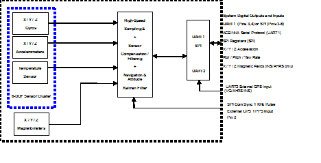

IMU App
=======

The App name, IMU, stands for Inertial Measurement Unit,
and the name is indicative of the basic inertial measurement unit
functionality provided by this APP. The IMU App signal
processing chain consists of high-speed sampling of the 9-DOF sensor cluster
(accelerometers, rate sensors, and magnetometers), programmable
low-pass filters, and the execution of built-in calibration models. 

Additionally any configuration parameters
settings such as axes rotation are applied to the IMU data. The 200Hz
IMU data is continuously being maintained inside the IMU APP, and is
Digital IMU data is output over the UART port at a selectable fixed rate (200, 100, 50, 25, 20,
10, 5 or 2 Hz). The digital IMU data is available in one of several measurement
packet formats including Scaled Sensor Data ('z1' Packet). 

|image1|

.. contents:: Contents
    :local:

