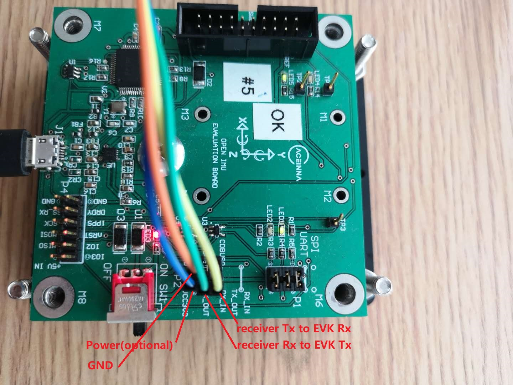
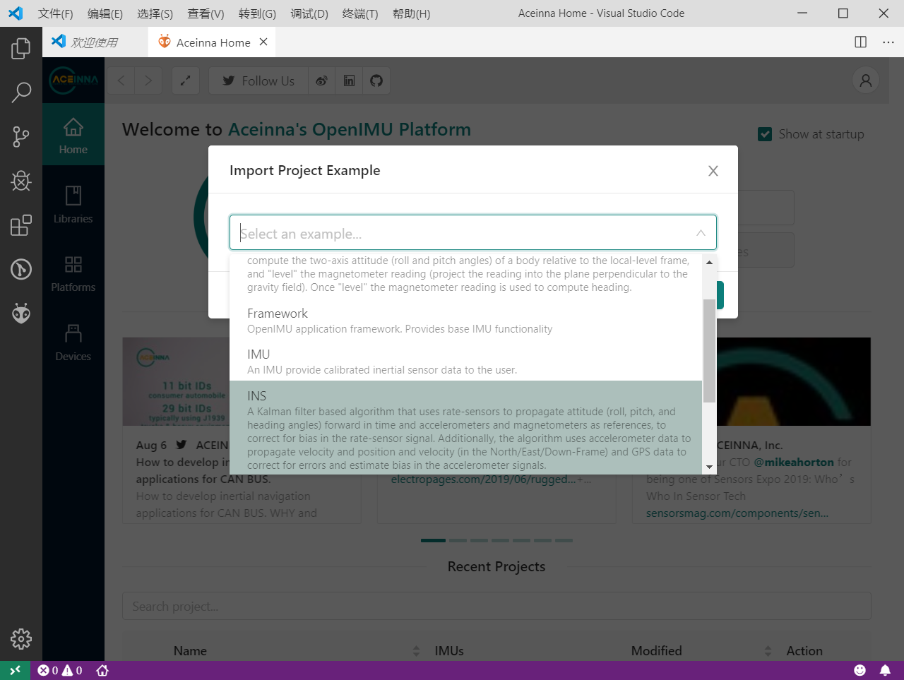

GPS/INS App
===========

The INS APP supports all of the features and operating modes of the
VG/AHRS APP, and it includes additional capability of interfacing
with an external GPS receiver and associated software running on the
processor, for the computation of navigation information as well as
orientation information. The APP name, GPS/INS APP, stands for Inertial
Navigation System, and it is indicative of the navigation reference
functionality that APP provides by outputting inertially-aided
navigation information (Latitude, Longitude, and Altitude),
inertially-aided 3D velocity information, as well as heading, roll,
and pitch measurements, in addition to digital IMU data.

The processor performs time-triggered trajectory propagation at 100Hz
and will synchronize the sensor sampling with the GPS UTC (Universal
Coordinated Time) second boundary when available.

As with the AHRS/VG APP, the algorithm has two major phases of
operation. Immediately after power-up, the INS APP uses the
accelerometers to compute the initial roll and pitch angles. 
During the first 60 seconds of startup, the INS APP should
remain approximately motionless in order to properly initialize the rate
sensor bias. The initialization phase lasts approximately 60 seconds,
and the initialization phase can be monitored in the operation mode
transmitted by default in each measurement packet.

After initialization phase, the OpenIMU continuously maintains the digital
IMU data; the dynamic roll, pitch, and heading data; as well as the
navigation data. The body frame sensed angular rate is first integrated to
orientation at a fixed N times per second. For improved accuracy and to avoid
singularities when dealing with the cosine rotation matrix, a quaternion
formulation is used in the algorithm to provide attitude propagation.
Using the attitude, the body frame accelerometer signals are rotated into the NED frame and
integrated to velocity. And then, NED velocity is integrated to get position.
At this point, the data is blended with GPS
position and velocity data in the EKF, and output as a complete navigation solution.

The INS APP blends GPS derived heading and accelerometer measurements
into the EKF update depending on the health and status of the associated
sensors. If the GPS link is lost or poor, the Kalman Filter solution
stops tracking accelerometer bias, but the algorithm continues to apply
gyro bias correction and provides stabilized angle outputs. The EKF
tracking states are reduced to angles and gyro bias only. The
accelerometers will continue to integrate velocity, however,
accelerometer noise, bias, and attitude error will cause the velocity
estimates to start drifting within a few seconds. The attitude tracking
performance will degrade, the heading will freely drift, and the filter
will revert to the VG only EKF formulation. The UTC packet
synchronization will drift due to internal clock drift.

Quick Start
-----------

In this section, we explain how to get the INS app running with an external GPS receiver that
outputs NMEA GGA, VTG and RMC messages. The default baud rate for UART is 115200. Although NMEA is not recommended in our INS app due to
lack of some required information of the algorithm, it is chosen here because its popularity and simplicity.
Our GPS driver supports NMEA message decoding, so you don't need to write a single line of code.

It is assumed that you are using our :doc:`OpenIMU300ZI EVK <../EVB-OpenIMU300ZI>`.

Connect the GPS receiver to the EVK
^^^^^^^^^^^^^^^^^^^^^^^^^^^^^^^^^^^

In the following picture, the onboard 3.3V and GND are used to power the GPS receiver. 
You can also choose your own power supply.

Burn the INS App into The Unit
^^^^^^^^^^^^^^^^^^^^^^^^^^^^^^

The unit has a built-in IMU app. The INS app need loaded by yourself. There are two recommended ways to do that.

**Using the Python Driver**

This is for people who only want to use the precompiled bin file.

The :doc:`Python Driver <../tools/python>` loads the INS app via the built-in bootloader of the OpenIMU300ZI unit.
Please follow steps below.

1. Connect the unit to the Python Driver.

  Please refer to :doc:`Python Interface <../tools/python>`. If the unit is successfully connected, you will see information like this.

  .. image:: ../media/connected_to_python_driver.png

2. Visist the App page of our Developer Site.

  You can get access to all available apps in our `Developer Site <https://developers.aceinna.com/code/apps>`_.
  The OpenIMU300ZI INS app is the one you need.

    .. image:: ../media/ins-app-fig-300.png

3. Burn the INS app.

  Click "UPGRADE" and wait it to complete.

    .. image:: ../media/ins-app-upgrade-fig-300.png

**Using Aceinna Extension in VS Code**

If you want to modify our open-source code, you may want to try this way.

Please first refer to :doc:`PC Tools Installation <../install>` to install required tools and
then to :doc:`Aceinna Extension <../tools/vscode>` for basic usage of the extention. After importing
the project of the INS app, you can modify the code, compile the project and upload the bin file to the unit.

Get and Visualize the Output
^^^^^^^^^^^^^^^^^^^^^^^^^^^^

1. Connect the unit to the Python Driver.

2. Visit our `Developer Site <https://developers.aceinna.com/devices/record-next>`_.
  
  You can see the detailed information about the unit.

  .. image:: ../media/webgui-ins-connected.png

  
  Choose "Geo Map" as output, and click the play button, and you can see the live position on the map.

  .. image:: ../media/webgui-geomap-play.png

How to Add Support of a New GPS Receiver Protocal
-------------------------------------------------

Currently we support NMEA, uBlox Nav-PVT and NovaTel Bestpos/Bestvel. If your receiver protocal is not in the list,
it is easy for you to add code to decode a new protocol. Let's take uBlox nav-pvt for example to explain how to do this.

1. define the name (UBLOX_BINARY) of the protocol in GlobalConstas.h. ::

    // Choices for GPS protocol type
    typedef enum{
        AUTODETECT              = -1,
        UBLOX_BINARY            =  0,
        NOVATEL_BINARY          =  1,
        NOVATEL_ASCII           =  2,
        NMEA_TEXT               =  3,
        DEFAULT_SEARCH_PROTOCOL =  NMEA_TEXT, // 3
        SIRF_BINARY             =  4,
        INIT_SEARCH_PROTOCOL    =  SIRF_BINARY, ///< 4 max value, goes through each until we hit AUTODETECT
        UNKNOWN                 = 0xFF
    } enumGPSProtocol;

2. In driverGPSAllEntrance.c, add this new protocol in SetGpsProtocol(). After this, the new protocal can be set
via Aceinna Navigation Studio Web GUI. ::

    BOOL  SetGpsProtocol(int protocol, int fApply)
    {
        switch(protocol)
        {
            case NMEA_TEXT:
            case NOVATEL_BINARY:
            case UBLOX_BINARY:
                break;
            default:
                return FALSE;
        }
        if(fApply)
        {
            gGpsDataPtr->GPSProtocol = protocol;
        }

        return TRUE;
    }

3. In driverGPS.c, call the routine to decode this protocol. ::

    switch(GPSData->GPSProtocol){
        case NMEA_TEXT: 
            parseNMEAMessage(tmp, gpsMsg, GPSData);
            break; 
        case NOVATEL_BINARY:
            parseNovotelBinaryMessage(tmp, gpsMsg, GPSData);
            break;
        case UBLOX_BINARY:
            parseUbloBinaryMessage(tmp, gpsMsg, GPSData);
            break;
        default:
            break;
            }
    }

4. Implement the decoding routine (parseUbloBinaryMessage) in a proper file. For this example,
it is implemented processUbloxGPS.c.

   
  
.. note::

    If you have any question, please search or post a new topic on `Aceinna Forum <https://forum.aceinna.com>`_.

.. contents:: Contents
    :local:

