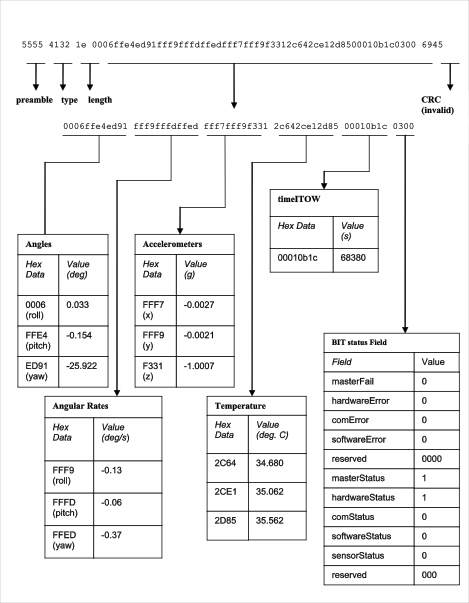
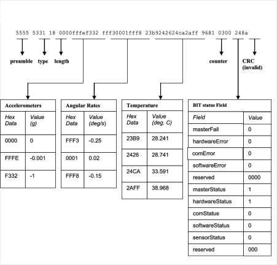
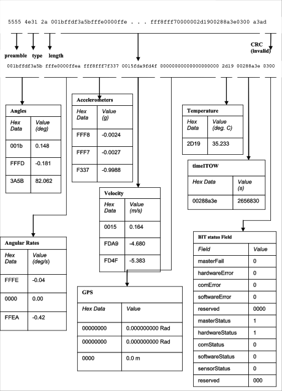

Appendix D: Sample Packet decoding
==================================

|appendix chart1|

Figure 30 Example payload from Angle Data Packet 2 (A2)

|appendix chart2|

Figure 31 Example payload from Scaled Data Packet 1 (S1)

|appendix chart3|

Figure 32 Example payload from Nav Data Packet 1 (N1)

