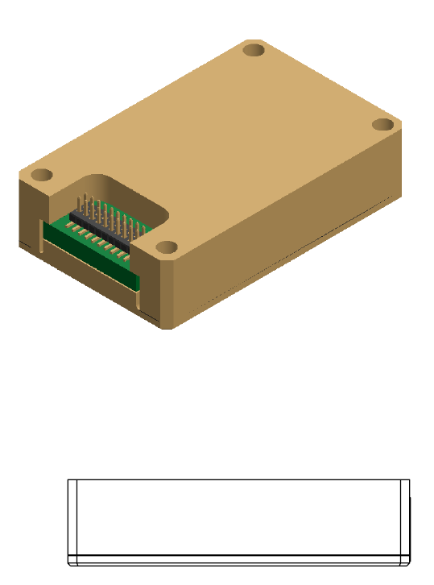
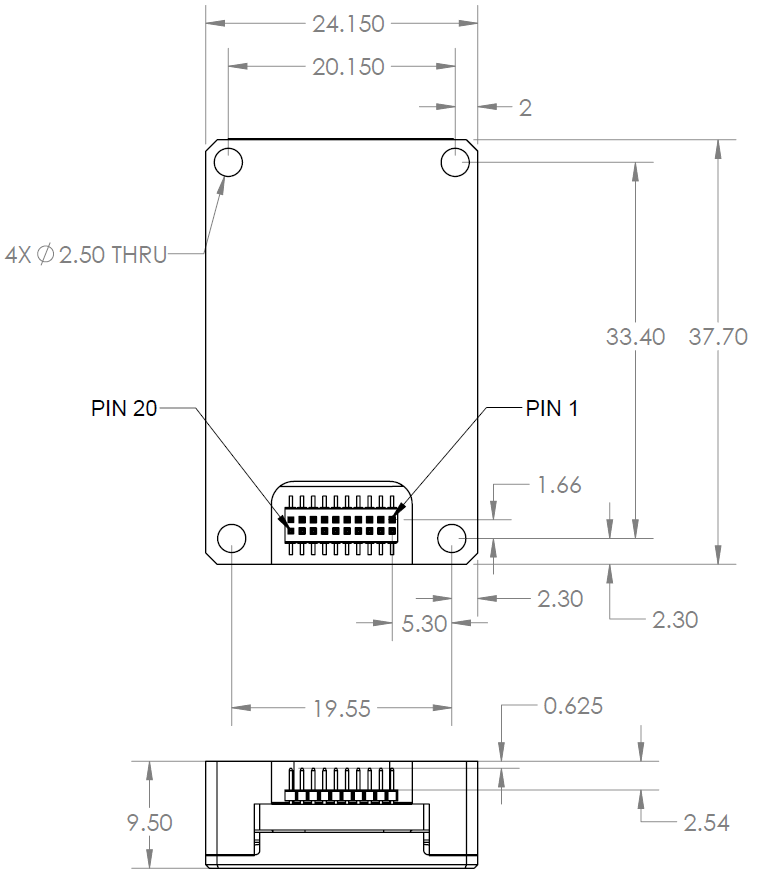

Interface
*********

Electrical Interface
--------------------

DMUx81ZA Connector and Mating Connector
------------------------------

The DMUx81ZA main connector is a SAMTEC FTM-110-02-F-DV-P defined in
`Figure 1 <\l>`__. The DMUx81ZA uses the same connector, and is drop-in
compatible to the DMUx81ZA, for an easy upgrade path. The mating
connector that can be used is the SAMTEC CLM-110-02.

|Connector.png|

                   Figure 1 DMUx81ZA Interface Connector

The connector pin definitions are defined in `Table 3 <\l>`__.

**Table 3 Interface Connector Pin Definition- DMUx80 vs. DMUx81 (Previous Generation)**

+-----------------------+-----------------------+-----------------------+
| **Pin**               | **Pin Description-    | **Pin Description     |
|                       | DMUx81 (For           | (DMUx81)**            |
|                       | Reference)**          |                       |
+-----------------------+-----------------------+-----------------------+
| 1                     | Reserved – factory    || Inertial-Sensor      |
|                       | use only              | Sampling Indicator    |
|                       |                       || (sampling upon       |
|                       |                       | falling edge)         |
+-----------------------+-----------------------+-----------------------+
| 2                     || Synchronization Input|| Synchronization Input|
|                       | (1KHz Pulse used to   | (1KHz Pulse used to   |
|                       || synchronize SPI Comm)|| synchronize SPI Comm)|
|                       | / 1PPS Input          | / 1PPS Input          |
|                       || (External GPS)       || (External GPS)       |
+-----------------------+-----------------------+-----------------------+
| 3                     | SPI Clock (SCLK) /    | SPI Clock (SCLK) /    |
|                       | UART TX               | UART TX               |
+-----------------------+-----------------------+-----------------------+
| 4                     | SPI Data Output       | SPI Data Output       |
|                       | (MISO) / UART RX      | (MISO) / UART RX      |
+-----------------------+-----------------------+-----------------------+
| 5                     | SPI Data Input (MOSI) | SPI Data Input (MOSI) |
+-----------------------+-----------------------+-----------------------+
| 6                     | SPI Chip Select (SS)  | SPI Chip Select (SS)  |
+-----------------------+-----------------------+-----------------------+
| 7                     || Data Ready (SPI      || Data Ready (SPI      |
|                       | Communication Data    | Communication Data    |
|                       || Ready) / SPI-UART    || Ready) / SPI-UART    |
|                       | Port Select           | Port Select           |
+-----------------------+-----------------------+-----------------------+
| 8                     | External Reset (NRST) | External Reset (NRST) |
+-----------------------+-----------------------+-----------------------+
| 9                     | Reserved – factory    | Reserved - factory    |
|                       | use only              | use only              |
+-----------------------+-----------------------+-----------------------+
| 10                    | Power VIN (3-5 VDC)   | Power VIN (3-5 VDC)   |
+-----------------------+-----------------------+-----------------------+
| 11                    | Power VIN (3-5 VDC)   | Power VIN (3-5 VDC)   |
+-----------------------+-----------------------+-----------------------+
| 12                    | Power VIN (3-5 VDC)   | Power VIN (3-5 VDC)   |
+-----------------------+-----------------------+-----------------------+
| 13                    | Power GND             | Power GND             |
+-----------------------+-----------------------+-----------------------+
| 14                    | Power GND             | Power GND             |
+-----------------------+-----------------------+-----------------------+
| 15                    | Power GND             | Power GND             |
+-----------------------+-----------------------+-----------------------+
| 16                    | Reserved – factory    | Reserved – factory    |
|                       | use only              | use only              |
+-----------------------+-----------------------+-----------------------+
| 17                    | External GPS UART TX  | External GPS UART TX  |
+-----------------------+-----------------------+-----------------------+
| 18                    | Reserved – factory    | Reserved – factory    |
|                       | use only              | use only              |
+-----------------------+-----------------------+-----------------------+
| 19                    | External GPS UART RX  | External GPS UART RX  |
+-----------------------+-----------------------+-----------------------+
| 20                    | Reserved – factory    | Reserved – factory    |
|                       | use only              | use only              |
+-----------------------+-----------------------+-----------------------+

.. _power-input-and-power-input-ground:

Power Input and Power Input Ground
----------------------------------

Power is applied to the DMUx81ZA on pins 10 through 15. Pins 13-15 are
ground; Pins 10-12 accepts 3 to 5 VDC unregulated input. Note that these
are redundant power ground input pairs.

**WARNING**

Do not reverse the power leads or damage may occur. Do not add greater
than 5.5 volts on the power pins or damage may occur. This system has no
reverse voltage or over-voltage protection.

.. _serial-data-interface:

Serial Data Interface
---------------------

The user can select the serial interface used with the DMUx81ZA by
controlling the logic level on connector pin 7 at system startup. If pin
7 is left floating then the DMUx81ZA is configured for SPI
communications on pins 3-6. Pin 7 is set as an output and used as the
DATA READY discrete for SPI communications. Additionally, the user can
synchronize the output data on the SPI port by providing a 1 KHz input
pulse on Pin 2. For the complete SPI interface definition, please refer
to Section `5 <\l>`__.

If the connector pin 7 is grounded then the DMUx81ZA is configured for
low-level UART output on pins 3 and 4. This is a standard UART
asynchronous output data port. For the complete UART interface
definition, please refer to Sections `6 <\l>`__-`8 <\l>`__. Note that
the two output port interface methods are controlled independently from
each other. The UART port output controls apply only to data being
output over the UART port, and the SPI output controls apply only to
data being output over the SPI port.

.. _external-gps-vgx81za-ahrsx81za-and-insx81za:

External GPS Aiding (VGx81ZA AHRSx81ZA and INSx81ZA)
----------------------------------------------------

The VGx81ZA/AHRSx81ZA/INSx81ZA allows the use of an external GPS
receiver to be connected the external GPS UART port (pins 17, 19). The
user is required to configure the GPS receiver to output the GPS
messages that the DMUx81ZA Series expects.

Table 4 shows the supported GPS protocols and guidelines for
configuration. Note that the details of the GPS messages can be found in
the respective GPS protocol documents. The user must configure the
VG/AHRS/INSx81ZA to accept external GPS information using NAV-VIEW as
described in Appendix A. If the VG/AHRS/INSx81ZA is parsing valid
external GPS data and the GPS receiver has 3D lock, then the comStatus
noExternalGPS flag will be zero, otherwise it will be one. See Section
`9 <\l>`__ for a complete description of system status indications.

Since NMEA protocol does not provide vertical velocity, the vertical
velocity that the DMUx81ZA Series estimates (based upon GPS altitude
changes) may not be sufficient for airborne applications (see

Table 4 ). Therefore, the NMEA protocol is not recommended for airborne
applications.

        **Table 4 External GPS Receiver for VG/AHRS/INSx81ZA**

+-----------------+-----------------+-----------------+-----------------+
| **Protocols**   | **Required      | **Required      | **Baud rate**   |
|                 | Messages**      | Message Rate**  |                 |
+-----------------+-----------------+-----------------+-----------------+
| SIRF Binary     |                 | 1 Hz            | 115,200         |
+-----------------+-----------------+-----------------+-----------------+
| NovAtel Binary  | BestPosB,       | 1Hz             | 115,200         |
|                 | BestVelB        |                 |                 |
+-----------------+-----------------+-----------------+-----------------+
| NMEA            | GPGGA, GPVTG    | 1Hz             | 115,200         |
+-----------------+-----------------+-----------------+-----------------+

Not recommended for airborne applications.

The external GPS UART port should be configured to 8 data bits, 1 start
bit, 1 stop bit, no parity bit, and no flow control.

PPS Input Interface
-------------------

When using external GPS aiding for a VG/AHRS/INSx81ZA system, Pin 2
should be used for the 1PPS input signal to force synchronization of
sensor data collection to a 1Hz rising-edge signal. The signal must
maintain 0.0-0.2 V zero logic and 3.0-5.0 volts high logic and stay
within 100ms of the internal system 1 second timing. Sending this signal
to the system will align the sensor data collection and algorithm
processing to its rising edge and 10ms boundaries thereafter.

SPI Com Synchronization Input
-----------------------------

If the user does not have 1PPS available from an external GPS receiver,
then Pin 2 can be used as a sync pulse to force synchronization of
sensor data collection to a 1 kHz rising-edge signal for output over the
SPI port. See Section `5.9 <\l>`__ for a more complete description.

External GPS Receiver Antenna Connection
----------------------------------------

The external GPS receiver needs to receive signals from as many
satellites as possible. A GPS receiver doesn’t work properly in narrow
streets and underground parking lots or if objects or human beings cover
the antenna. Poor visibility may result in position drift or a prolonged
Time-To-First-Fix (TTFF). A good sky visibility is therefore a
prerequisite. Even the best receiver can’t make up for signal loss due
to a poor antenna, in-band jamming or a poor RF cable. Placing the
antenna on a 4 inch or larger ground plane is highly recommended.

**IMPORTANT**

Place the antenna with optimal sky visibility and use a ground plane.
Route the GPS Antenna RF cable away from sources of radiated energy
(i.e. switching power supplies).

.. _reserved-factory-use-only:

Reserved - Factory Use Only
---------------------------

During normal operation of the DMUx81ZA, no connection is made to the
Reserved – factory use only pins. These pins have internal pull-up
mechanisms and must have no connections for the DMUx81ZA to operate
properly.

.. _mechanical-interface:

Mechanical Interface
--------------------

The DMUx81ZA mechanical interface is defined by the outline drawing in
`Figure 2 <\l>`__.

|image5|\ |image8.png|

                   Figure 2 DMUx81ZA Outline Drawing

NOTES UNLESS OTHERWISE STATED:

MATING CONNECTOR SAMTEC CLM-110-02

DIMENSION TO CENTROID OF PIN ONE

.. |Connector.png| image:: media/image2.png
   :width: 2.24in
   :height: 2.85in

