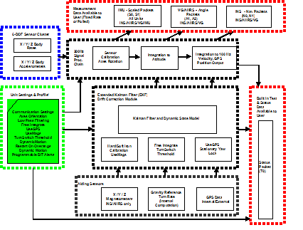
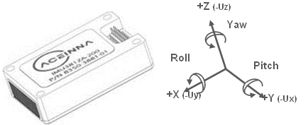
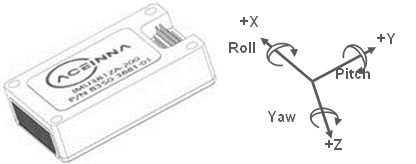
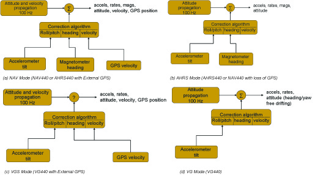

Theory of Operation
*******************

This section of the manual covers detailed theory of operation for each
member of the DMUx81ZA Series starting with the basic IMUx81ZA and then
reviewing each major variant (VG, AHRS and INS) with their associated
additional features, outputs, and performance. Table 5 shows the basic
features of each member of the DMUx81ZA Series with cross references to
important sections for review.

         **Table 5 DMUx81ZA Series Overview**

+-----------------------+-----------------------+-----------------------+
| **Product**           | **Features**          | **Learning More**     |
+-----------------------+-----------------------+-----------------------+
| IMUx81ZA              | 6-DOF IMU, 9-DOF IMU  | Read `3.1 <\l>`__ and |
|                       |                       | `3.2 <\l>`__          |
+-----------------------+-----------------------+-----------------------+
| VGx81ZA               | 6-DOF IMU             | Read `3.1 <\l>`__,    |
|                       |                       | `3.2 <\l>`__, and     |
|                       | Roll, Pitch           | `3.3 <\l>`__          |
+-----------------------+-----------------------+-----------------------+
| AHRSx81ZA             || 9-DOF IMU (3-Axis    | Read `3.1 <\l>`__,    |
|                       | Internal              | `3.2 <\l>`__,         |
|                       || Magnetometer)        | `3.3 <\l>`__, and     |
|                       |                       | `3.4 <\l>`__          |
|                       | Roll, Pitch, and      |                       |
|                       | Heading               |                       |
+-----------------------+-----------------------+-----------------------+
| INSx81ZA              || 9-DOF IMU (3-Axis    | Read `3.1 <\l>`__,    |
|                       | Internal Magnetometer | `3.2 <\l>`__,         |
|                       || and external GPS     | `3.3 <\l>`__,         |
|                       | Receiver)             | `3.4 <\l>`__, and     |
|                       |                       | `3.5 <\l>`__          |
|                       || Position, Dynamic    |                       |
|                       | Velocity, Roll,       |                       |
|                       || Pitch, and Heading   |                       |
+-----------------------+-----------------------+-----------------------+

`Figure 3 <\l>`__ shows the DMUx81ZA Series hardware block diagram. At
the core of the DMUx81ZA Series is a rugged 6-DOF (Degrees of Freedom)
MEMS inertial sensor cluster that is common across all members of the
DMUx81ZA Series. The 6-DOF MEMS inertial sensor cluster includes three
axes of MEMS angular rate sensing and three axes of MEMS linear
acceleration sensing. These sensors are based on rugged, field proven
silicon bulk micromachining technology. Each sensor within the cluster
is individually factory calibrated using ACEINNA’s automated
manufacturing process. Sensor errors are compensated for temperature
bias, scale factor, non-linearity and misalignment effects using a
proprietary algorithm from data collected during manufacturing.
Accelerometer and rate gyro sensor bias shifts over temperature (-40
:sup:`0`\ C to +71 :sup:`0`\ C) are compensated and verified using
calibrated thermal chambers and rate tables.

The 6-DOF inertial sensor cluster data is fed into a high speed signal
processing chain, which provides the sensor compensation and digital
filtering. The processor also calculates attitude and navigation data
for the appropriate models (VG, AHRS and INS). Measurement data packets
are available at fixed continuous output rates or on a polled basis from
the SPI port or the UART port. The SPI port outputs data via registers,
and the user can perform polled reads of each register, or a block burst
read of a set of predefined registers. Output data over the SPI port can
be synchronized to an external 1 KHz pulse. Alternatively, users can
input a 1 PPS signal from an external GPS receiver when providing
external GPS data over the secondary UART2 port. The complete SPI
interface is defined in Section 4. The UART port outputs data packets
are asynchronous and defined in Sections 5-7. As shown in the block
diagram (`Figure 3 <\l>`__), the INSx81ZA and AHRSx81ZA include an
internal 3-axis magnetometer.

|image26|

Figure 3 DMUx81ZA Series Hardware Block Diagram

`Figure 4 <\l>`__ shows the software block diagram. The 6-DOF inertial
sensor cluster data is fed into a high speed 200Hz signal processing
chain. These 6-DOF signals pass through one or more of the processing
blocks and these signals are converted into output measurement data as
shown. Measurement data packets are available at fixed continuous output
rates or on a polled basis. The type of measurement data packets
available depends on the unit type according to the software block
diagram and Table 6. Aiding sensor data is used by an Extended Kalman
Filter (EKF) for drift correction in the INS, AHRS and VG Series
products. Built-In-Test and Status data is available in the measurement
packet or via the special Status Packet T0.

As shown in the software block diagram, the DMUx81ZA Series has a unit
setting and profile block which configures the algorithm to user and
application specific needs. This feature is one of the more powerful
features in the DMUx81ZA Series architecture as it allows the DMUx81ZA
Series to work in a wide range of commercial applications by settings
different modes of operation for the DMUx81ZA Series.

|image27|

Figure 4 DMUx81ZA Series Software Block Diagram

Simplified functional block diagrams for INS, AHRS and VG series
products derived from `Figure 4 <\l>`__ are shown in `Figure 5 <\l>`__
to highlight key features of each product. The DMUx81ZA Series products
are mainly differentiated by types of aiding sensors used in the EKF for
the drift correction of the 6-DOF inertial sensor cluster.

For the AHRS product, a 3-axis magnetometer is used for correcting the
drift on yaw/heading angle. For the INS product, a 3-axis magnetometer
and a GPS receiver are used for correcting the drift on yaw/heading
angle, increasing the accuracy of the attitude estimation by
incorporating these sensor signals into the EKF, and providing a
navigation solution. The common aiding sensor for the drift correction
for the attitude (i.e., roll and pitch only) is a 3-axis accelerometer.
This is the default configuration for the VG product.

|7430-0131_fig_15|

Figure 5 Functional Block Diagram of INS, AHRS and VG Default Operating
Mode

.. _dmux81za-series-default-coordinate-system:

DMUx81ZA Series Default Coordinate System
-----------------------------------------

The DMUx81ZA Series Inertial System default coordinate systems
are shown in `Figure 6 <\l>`__ and `Figure 7 <\l>`__. As with many
elements of the DMUx81ZA Series, the coordinate system is configurable
with either NAV-VIEW or by sending the appropriate serial commands over
the UART port. These configurable elements are known as **Advanced
Settings**. This section of the manual describes the default coordinate
system settings of the DMUx81ZA Series when it leaves the factory.

|image8| 

|image9|

The axes form an orthogonal SAE right-handed coordinate system.
Acceleration is positive when it is oriented towards the positive side
of the coordinate axis. For example, with a DMUx81ZA Series product
sitting on a level table, it will measure zero g along the x- and y-axes
and -1 g along the z-axis. Normal Force acceleration is directed upward,
and thus will be defined as negative for the DMUx81ZA Series z-axis.

The angular rate sensors are aligned with these same axes. The rate
sensors measure angular rotation rate around a given axis. The rate
measurements are labeled by the appropriate axis. The direction of a
positive rotation is defined by the right-hand rule. With the thumb of
your right hand pointing along the axis in a positive direction, your
fingers curl around in the positive rotation direction. For example, if
the DMUx81ZA Series product is sitting on a level surface and you rotate
it clockwise on that surface, this will be a positive rotation around
the z-axis. The x- and y-axis rate sensors would measure zero angular
rates, and the z-axis sensor would measure a positive angular rate.

The magnetic sensors are aligned with the same axes definitions and sign
as the linear accelerometers. For example, when oriented towards
magnetic North, you will read approximately +0.25 Gauss along X, 0.0
Gauss along Y, and +0.35 Gauss along Z direction (North America).

Pitch is defined positive for a positive rotation around the y-axis
(pitch up). Roll is defined as positive for a positive rotation around
the x-axis (roll right). Yaw is defined as positive for a positive
rotation around the z-axis (turn right).

The angles are defined as standard Euler angles using a 3-2-1 system. To
rotate from the body frame to an earth-level frame, roll first, then
pitch, and then yaw.

The position output from GPS is represented in Latitude, Longitude, and
Altitude (LLA) convention on the WGS84 Ellipsoid. This is the most
commonly used spherical coordinate system. The GPS velocity is defined
in North, East and Down reference frame. The users can convert this into
Cartesian coordinate system, called Earth-Centered, Earth-Fixed (ECEF).
ECEF uses three-dimensional XYZ coordinates (in meters) to describe the
location of a GPS user or satellite. Several online resources are
available to help users with this transformation. 

.. _advanced-settings:

Advanced Settings
-----------------

The DMUx81ZA Series Inertial Systems have a number of advanced settings
that can be changed. The specific settings available vary from unit to
unit, and a detailed description of each unit (IMU, VG, AHRS, and INS)
is found in the subsequent sections of this manual. All units support
baud rate, power-up output packet type, output rate, sensor low
pass filtering, and custom axes configuration. The units can be
configured using NAV-VIEW, as described in Appendix A, and also directly
with serial commands as described in Sections `6 <\l>`__-`9 <\l>`__.

.. _imux81za-theory-of-operation:

IMUx81ZA Theory of Operation
----------------------------

The product name, IMUx81ZA, stands for Inertial Measurement Unit x81,
and the name is indicative of the inertial measurement unit
functionality that the IMUx81ZA provides by providing inertial rate and
acceleration data in 6-DOF (six degrees of freedom). The IMUx81ZA signal
processing chain consists of the 6-DOF sensor cluster, programmable
low-pass filters, and the signal processor for sensor error
compensation. The IMUx81ZA, as with other DMUx81ZA Series variants, has
a UART input/output port and a SPI input/output port.

After passing through a digitally controlled programmable low-pass
filter, the rate and acceleration sensor signals are obtained at 200Hz.
The sensor data is filtered by the processor using FIR filters. The
factory calibration data, stored in EEPROM, is used by the processor to
remove temperature bias, misalignment, scale factor errors, and
non-linearities from the sensor data. Additionally any advanced user
settings such as axes rotation are applied to the IMU data. The 200Hz
IMU data is continuously being maintained inside the IMUx81ZA, and is
available at 200Hz on the SPI output port registers. Digital IMU data is
output over the UART port at a selectable fixed rate (100, 50, 25, 20,
10, 5 or 2 Hz) or on as requested basis using the GP, ‘Get Packet’
command. The digital IMU data is available in one of several measurement
packet formats including Scaled Sensor Data (‘S1’ Packet). In the Scaled
Sensor Data (‘S1’ Packet) data is output in scaled engineering units.
See Section `7 <\l>`__ of the manual for full packet descriptions.

.. _imux81za-advanced-settings:

IMUx81ZA Advanced Settings
--------------------------

The IMUx81ZA advanced settings are described in

Table 6. All of the advanced settings are accessible through NAV-VIEW
under the Configuration Menu, Unit Configuration settings. For a full
definition of the SPI port please see section `5 <\l>`__.

           **Table 6 IMUx81ZA Advanced Settings**

+-----------------------+-----------------------+-----------------------+
| **Setting**           | **Default**           | **Comments**          |
+-----------------------+-----------------------+-----------------------+
| **Baud Rate**         | 38400                 | 57600,115200,and 23040|
|                       |                       | also available        |
+-----------------------+-----------------------+-----------------------+
| **Packet Type**       | S0                    | S1 also available     |
+-----------------------+-----------------------+-----------------------+
| **Packet Rate**       | 100Hz                 || This setting sets the|
|                       |                       | rate at which         |
|                       |                       || selected Packet Type,|
|                       |                       | packets are output.   |
|                       |                       || If polled mode is    |
|                       |                       | desired, then select  |
|                       |                       || Quiet. If Quiet is   |
|                       |                       | selected, the         |
|                       |                       || IMUx81ZA will only   |
|                       |                       | send measurement      |
|                       |                       || packets in response  |
|                       |                       | to GP commands.       |
+-----------------------+-----------------------+-----------------------+
| **Orientation**       || See `Figure 6 <\l>`__|| To configure the axis|
|                       || and `Figure          | orientation, select   |
|                       | 7 <\l>`__.            | the desired           |
|                       |                       || measurement for each |
|                       |                       | axis: NAV-VIEW will   |
|                       |                       | show                  |
|                       |                       || corresponding image  |
|                       |                       | of the IMUx81ZA, so   |
|                       |                       | it easy to            |
|                       |                       || visualize the mode of|
|                       |                       | operation.Refer to    |
|                       |                       | Section `8.4 <\l>`__  |
|                       |                       || Orientation Field    |
|                       |                       | settings for the      |
|                       |                       || twenty four possible |
|                       |                       | orientation settings. |
+-----------------------+-----------------------+-----------------------+
|| **Filter Settings**  | 20 Hz                 || The low pass filters |
|| (unfiltered, 2, 5,   |                       | are set to a default  |
|| 10, 20, 25, 40 50    |                       | of 20 Hz for the      |
|| Hz).                 |                       || accelerometers, and  |
|                       |                       | 20Hz for the angular  |
|                       |                       | rate sensors.         |
|                       |                       || one filter setting   |
|                       |                       | for all three angular |
|                       |                       | rate sensors. There   |
|                       |                       || is one filter setting|
|                       |                       | for all three         |
|                       |                       | accelerometers.       |
|                       |                       || Setting either to    |
|                       |                       | zero disables the     |
|                       |                       | low-pass filter.      |
+-----------------------+-----------------------+-----------------------+
| **BIT**               |                       | See `9.1 <\l>`__      |
+-----------------------+-----------------------+-----------------------+

**NOTE on Filter Settings**

Why change the filter settings? Generally there is no reason to change
the low-pass filter settings on the IMUx81ZA or other DMUx81ZA Series
Inertial Systems. However, when a DMUx81ZA Series product is installed
in an environment with a lot of vibration, it can be helpful to reduce
the vibration-based signal energy and noise prior to further processing
on the signal. Installing the IMUx81ZA in the target environment and
reviewing the data with NAV-VIEW can be helpful to determine if changing
the filter settings would be helpful. Although the filter settings can
be helpful in reducing vibration based noise in the signal, low filter
settings (e.g., 5Hz) also reduce the bandwidth of the signal, i.e. can
wash out the signals containing the dynamics of a target. Treat the
filter settings with caution.

.. _imux81za-built-in-test:

IMUx81ZA Built-in Test
----------------------

The IMUx81ZA Built-In Test capability allows users of the IMUx81ZA to
monitor health, diagnostic, and system status information of the unit in
real-time. The Built-In Test information consists of a BIT word (2
bytes) transmitted in every measurement packet. In addition, there is a
diagnostic packet ‘T0’ that can be requested via the Get Packet ‘GP’
command which contains a complete set of status for each hardware and
software subsystem in the IMUx81ZA. See Sections `6 <\l>`__-`8 <\l>`__
for details on the ‘T0’ packet.

The BIT word, which is contained within each measurement packet, is
detailed below. The LSB (Least Significant Bit) is the Error byte, and
the MSB (Most Significant Bit) is a Status byte with programmable
alerts. Internal health and status are monitored and communicated in
both hardware and software. The ultimate indication of a fatal problem
is the masterFail flag.

The masterStatus flag is a configurable indication that can be modified
by the user. This flag is asserted as a result of any asserted alert
signals which have been enabled. See Advanced BIT (Section `9 <\l>`__)
for details regarding the configuration of the masterStatus flags.

Table 7 shows the BIT definition and default settings for BIT
programmable alerts in the IMUx81ZA.

       **Table 7 IMUx81ZA Default BIT Status Definition**

+-----------------+-----------------+-----------------+-----------------+
| **BITstatus     | **Bits**        | **Meaning**     | **Category**    |
| Field**         |                 |                 |                 |
+-----------------+-----------------+-----------------+-----------------+
| masterFail      | 0               | 0 = normal, 1 = | BIT             |
|                 |                 | fatal error has |                 |
|                 |                 | occurred        |                 |
+-----------------+-----------------+-----------------+-----------------+
| HardwareError   | 1               | 0 = normal, 1=  | BIT             |
|                 |                 | internal        |                 |
|                 |                 | hardware error  |                 |
+-----------------+-----------------+-----------------+-----------------+
| comError        | 2               | 0 = normal, 1 = | BIT             |
|                 |                 | communication   |                 |
|                 |                 | error           |                 |
+-----------------+-----------------+-----------------+-----------------+
| softwareError   | 3               | 0 = normal, 1 = | BIT             |
|                 |                 | internal        |                 |
|                 |                 | software error  |                 |
+-----------------+-----------------+-----------------+-----------------+
| Reserved        | 4:7             | N/A             |                 |
+-----------------+-----------------+-----------------+-----------------+
| masterStatus    | 8               | 0 = nominal, 1  | Status          |
|                 |                 | = Alert, Sensor |                 |
|                 |                 | Over Range      |                 |
+-----------------+-----------------+-----------------+-----------------+
| hardwareStatus  | 9               | Disabled        | Status          |
+-----------------+-----------------+-----------------+-----------------+
| comStatus       | 10              | Disabled        | Status          |
+-----------------+-----------------+-----------------+-----------------+
| softwareStatus  | 11              | Disabled        | Status          |
+-----------------+-----------------+-----------------+-----------------+
| sensorStatus    | 12              | 0 = nominal, 1  | Status          |
|                 |                 | = Sensor Over   |                 |
|                 |                 | Range           |                 |
+-----------------+-----------------+-----------------+-----------------+
| Reserved        | 13:15           | N/A             |                 |
+-----------------+-----------------+-----------------+-----------------+

The IMUx81ZA also allows a user to configure the Status byte within the
BIT message. To configure the word, select the BIT Configuration tab
from the Unit Configuration menu. The dialog box allows selection of
which status types to enable (hardware, software, sensor, and comm). In
the case of the IMUx81ZA which has fewer features and options than other
DMUx81ZA Series products, the only meaningful parameter is sensor
over-range. It is recommended that users leave the default
configuration, which is sensorStatus enabled and flag on sensor
over-range. The over-range only applies to the rotational rate sensors.
Because instantaneous acceleration levels due to vibration can exceed
the accelerometer sensor range in many applications, none of the
DMUx81ZA Series products trigger over-range on accelerometer readings.

.. _vgx81za-theory-of-operation:

VGx81ZA Theory of Operation
---------------------------

The VGx81ZA supports all of the features and operating modes of the
IMUx81ZA, and it includes additional internal software, running on the
processor, for the computation of dynamic roll and pitch. The product
name, VGx81ZA, stands for Vertical Gyro x81, and it is indicative of the
vertical gyro functionality that the VGx81ZA replicates by providing
dynamic roll and pitch measurements, in addition to the IMU data. The
dynamic roll and pitch measurements are stabilized by the using the
accelerometers as a long-term gravity reference. Unlike the VG400 and
earlier ACEINNA VG Series products, the VGx81ZA can also output a free
integrating yaw angle measurement that is not stabilized by a
magnetometer or compass heading (see AHRSx81ZA or INSx81ZA for
stabilized heading). At a fixed 200Hz rate, the VGx81ZA continuously
maintains both the digital IMU data as well as the dynamic roll and
pitch data. As shown in the software block diagram `Figure 4 <\l>`__,
after the Sensor Calibration block, the IMU data is passed into an
Integration to Orientation block (Please refer to the `Figure 5 <\l>`__
if external GPS aiding will be used). The Integration to Orientation
block integrates body frame sensed angular rate to orientation at a
fixed 200 times per second within all of the DMUx81ZA Series products.
For improved accuracy and to avoid singularities when dealing with the
cosine rotation matrix, a quaternion formulation is used in the
algorithm to provide attitude propagation.

As also shown in the software block diagram, the Integration to
Orientation block receives drift corrections from the Extended Kalman
Filter or Drift Correction Module. In general, rate sensors and
accelerometers suffer from bias drift, misalignment errors, acceleration
errors (g-sensitivity), nonlinearity (square terms), and scale factor
errors. The largest error in the orientation propagation is associated
with the rate sensor bias terms. The Extended Kalman Filter (EKF) module
provides an on-the-fly calibration for drift errors, including the rate
sensor bias, by providing corrections to the Integration to Orientation
block and a characterization of the gyro bias state. In the VGx81ZA, the
internally computed gravity reference vector provides a reference
measurement for the EKF when the VGx81ZA is in quasi-static motion to
correct roll and pitch angle drift and to estimate the X and Y gyro rate
bias. Because the gravity vector has no horizontal component, the EKF
has no ability to estimate either the yaw angle error or the Z gyro rate
bias. The VGx81ZA adaptively tunes the EKF feedback in order to best
balance the bias estimation and attitude correction with distortion free
performance during dynamics when the object is accelerating either
linearly (speed changes) or centripetally (false gravity forces from
turns). Because centripetal and other dynamic accelerations are often
associated with yaw rate, the VGx81ZA maintains a low-passed filtered
yaw rate signal and compares it to the turnSwitch threshold field (user
adjustable). When the user platform to which the VGx81ZA is attached
exceeds the turnSwitch threshold yaw rate, the VGx81ZA lowers the
feedback gains from the accelerometers to allow the attitude estimate to
coast through the dynamic situation with primary reliance on angular
rate sensors. This situation is indicated by the
softwareStatusturnSwitch status flag. Using the turn switch maintains
better attitude accuracy during short-term dynamic situations, but care
must be taken to ensure that the duty cycle of the turn switch generally
stays below 10% during the vehicle mission. A high turn switch duty
cycle does not allow the system to apply enough rate sensor bias
correction and could allow the attitude estimate to become unstable.

The VGx81ZA algorithm has two major phases of operation. The first phase
of operation is the initialization phase. During the initialization
phase, the VGx81ZA is expected to be stationary or quasi-static so the
EKF weights the accelerometer gravity reference heavily in order to
rapidly estimate the roll and pitch angles, and X, Y rate sensor bias.
The initialization phase lasts approximately 60 seconds, and the
initialization phase can be monitored in the softwareStatus BIT
transmitted by default in each measurement packet. After the
initialization phase, the VGx81ZA operates with lower levels of feedback
(also referred to as EKF gain) from the accelerometers to continuously
estimate and correct for roll and pitch errors, as well as to estimate X
and Y rate sensor bias.

If a user wants to reset the algorithm or re-enter the initialization
phase, sending the algorithm reset command, ‘AR’, will force the
algorithm into the reset phase.

The VGx81ZA outputs digital measurement data over the UART port at a
selectable fixed rate (100, 50, 25, 20, 10, 5 or 2 Hz) or on as
requested basis using the GP, ‘Get Packet’ command. In addition to the
scaled sensor packets described in the IMUx81ZA section, the VGx81ZA has
additional measurement output packets including the default ‘A2’ Angle
Packet which outputs the roll angle, pitch angle, and digital IMU data.
‘N0’ and ‘N1’ packets are also available for use with an external GPS
receiver. See Section 6 and 7 of the manual for full packet
descriptions. All data is also available on the SPI output port
registers. Please refer to section 5 for a complete description of the
SPI port functionality.

.. _vg81za-advanced-settings:

VGx81ZA Advanced Settings
-------------------------

In addition to the configurable baud rate, packet rate, axis
orientation, and sensor low-pass filter settings, the VGx81ZA provides
additional advanced settings which are selectable for tailoring the
VGx81ZA to a specific application requirements. These VGx81ZA advanced
settings are shown in Table 8 below:

         **Table 8 VGx81ZA Series Advanced Settings**

+-----------------------+-----------------------+-----------------------+
| **Setting**           | **Default**           | **Comments**          |
+-----------------------+-----------------------+-----------------------+
| **Baud Rate**         | 38400                 | 57600, 115200, 230400 |
|                       |                       | also available        |
+-----------------------+-----------------------+-----------------------+
| **Packet Type**       | A2                    | S1, N0, N1 also       |
|                       |                       | available             |
+-----------------------+-----------------------+-----------------------+
| **Packet Rate**       | 25Hz                  || This setting sets the|
|                       |                       | rate at which         |
|                       |                       | selected Packet Type, |
|                       |                       || packets are output.  |
|                       |                       | If polled mode is     |
|                       |                       | desired, then select  |
|                       |                       || Quiet. If Quiet is   |
|                       |                       | selected, the VGx81ZA |
|                       |                       | will only send        |
|                       |                       || measurement packets  |
|                       |                       | in response to GP     |
|                       |                       | commands.             |
+-----------------------+-----------------------+-----------------------+
| **Orientation**       || See `Figure 6 <\l>`__|| To configure the axis|
|                       || and `Figure          | orientation, select   |
|                       | 7 <\l>`__.            | the desired           |
|                       |                       || measurement for each |
|                       |                       | axes: NAV-VIEW will   |
|                       |                       | show the              |
|                       |                       || corresponding image  |
|                       |                       | of the VGx81ZA, so it |
|                       |                       | easy to visualize the |
|                       |                       || mode of operation.   |
|                       |                       | See Section 8.4       |
|                       |                       || Orientation Field    |
|                       |                       | settings for the      |
|                       |                       | twenty four possible  |
|                       |                       || orientation settings.|
|                       |                       | The default setting   |
|                       |                       | points the connector  |
|                       |                       | AFT.                  |
+-----------------------+-----------------------+-----------------------+
|| **Filter Settings**  | 20 Hz                 || The low pass filters |
|| (unfiltered, 2, 5,   |                       | are set to a default  |
|| 10, 20, 25, 40, 50   |                       | of 5Hz for the        |
| Hz)                   |                       || accelerometers, and  |
|                       |                       | 20 Hz for the angular |
|                       |                       | rate sensors. There   |
|                       |                       || is one filter setting|
|                       |                       | for all three angular |
|                       |                       | rate sensors. There   |
|                       |                       || are two settings for |
|                       |                       | the accelerometers,   |
|                       |                       | one for the X and Y   |
|                       |                       || axes, and a separate |
|                       |                       | setting for the Z     |
|                       |                       | axis. The reason for  |
|                       |                       || a separate setting in|
|                       |                       | the Z-axis is that in |
|                       |                       | many installations,   |
|                       |                       || the Z-axis vibration |
|                       |                       | level is much higher  |
|                       |                       | than in the X and Y   |
|                       |                       || axes, and it can     |
|                       |                       | prove helpful to      |
|                       |                       | filter the Z-axis at  |
|                       |                       || a lower cutoff than  |
|                       |                       | the X and Y axes.     |
|                       |                       | Setting either to     |
|                       |                       || zero disables the    |
|                       |                       | low-pass filter.      |
+-----------------------+-----------------------+-----------------------+
| **Freely Integrate**  | OFF                   || The Freely Integrate |
|                       |                       | setting allows a user |
|                       |                       | to turn the VGx81ZA   |
|                       |                       || into a ‘free gyro’.  |
|                       |                       | In free gyro mode,    |
|                       |                       | the roll, pitch and   |
|                       |                       || yaw are computed     |
|                       |                       | exclusively from      |
|                       |                       | angular rate with no  |
|                       |                       || Kalman filter based  |
|                       |                       | corrections of roll,  |
|                       |                       | pitch, or yaw. When   |
|                       |                       || turned on, there is  |
|                       |                       | no coupling of        |
|                       |                       | acceleration based    |
|                       |                       || signals into the roll|
|                       |                       | and pitch. As a       |
|                       |                       | result, the roll,     |
|                       |                       || pitch, and yaw       |
|                       |                       | outputs will drift    |
|                       |                       | roughly linearly with |
|                       |                       || time due to sensor   |
|                       |                       | bias. For best        |
|                       |                       | performance, the      |
|                       |                       || Freely Integrate mode|
|                       |                       | should be used after  |
|                       |                       | the algorithm has     |
|                       |                       || initialized. This    |
|                       |                       | allows the Kalman     |
|                       |                       | Filter to estimate    |
|                       |                       || the roll and pitch   |
|                       |                       | rate sensor bias      |
|                       |                       | prior to entering the |
|                       |                       || free gyro mode. Upon |
|                       |                       | exiting the ‘free     |
|                       |                       | gyro’ mode (OFF), one |
|                       |                       || of two behaviors will|
|                       |                       | occur                 |
|                       |                       |                       |
|                       |                       || (1) If the VGx81ZA   |
|                       |                       |     has been in       |
|                       |                       |     freely integrate  |
|                       |                       |     mode for less     |
|                       |                       |     than sixty        |
|                       |                       ||    seconds, the      |
|                       |                       |     algorithm will    |
|                       |                       |     resume operation  |
|                       |                       |     at normal gain    |
|                       |                       |     settings          |
|                       |                       |                       |
|                       |                       || (2) If the VGx81ZA   |
|                       |                       |     has been in       |
|                       |                       |     freely integrate  |
|                       |                       |     mode for greater  |
|                       |                       |     than sixty        |
|                       |                       ||    seconds, the      |
|                       |                       |     algorithm will    |
|                       |                       |     force a reset and |
|                       |                       |     reinitialize with |
|                       |                       |     high gains        |
|                       |                       |     automatically.    |
+-----------------------+-----------------------+-----------------------+
| **Restart On Over     | OFF                   || This setting forces  |
| Range**               |                       | an algorithm reset    |
|                       |                       | when a sensor over    |
|                       |                       || range occurs i.e., a |
|                       |                       | rotational rate on    |
|                       |                       | any of the three axes |
|                       |                       || exceeds the maximum  |
|                       |                       | range. The default    |
|                       |                       | setting is OFF for    |
|                       |                       || the VGx81ZA.         |
|                       |                       | Algorithm reset       |
|                       |                       | returns the VGx81ZA   |
|                       |                       || to a high gain state,|
|                       |                       | where the VGx81ZA     |
|                       |                       | rapidly estimates the |
|                       |                       || gyro bias and uses   |
|                       |                       | the accelerometer     |
|                       |                       | feedback heavily.     |
|                       |                       || This setting is      |
|                       |                       | recommended when the  |
|                       |                       | source of over-range  |
|                       |                       || is likely to be      |
|                       |                       | sustained and         |
|                       |                       | potentially much      |
|                       |                       || greater than the rate|
|                       |                       | sensor operating      |
|                       |                       | limit. Large and      |
|                       |                       || sustained angular    |
|                       |                       | rate over-ranges      |
|                       |                       | result in             |
|                       |                       || unrecoverable errors |
|                       |                       | in roll and pitch     |
|                       |                       | outputs. An           |
|                       |                       || unrecoverable error  |
|                       |                       | is one where the EKF  |
|                       |                       | can not stabilize the |
|                       |                       || resulting roll and   |
|                       |                       | pitch reading. If the |
|                       |                       | over-ranges are       |
|                       |                       || expected to be of    |
|                       |                       | short duration (<1    |
|                       |                       | sec) and a modest     |
|                       |                       || percentage over the  |
|                       |                       | maximum operating     |
|                       |                       | range, it is          |
|                       |                       || recommended that the |
|                       |                       | restart on over range |
|                       |                       | setting be turned     |
|                       |                       || off. Handling of an  |
|                       |                       | inertial rate sensor  |
|                       |                       | over-range is         |
|                       |                       || controlled using the |
|                       |                       | restartOnOverRange    |
|                       |                       | switch. If this       |
|                       |                       || switch is off, the   |
|                       |                       | system will flag the  |
|                       |                       | overRange status flag |
|                       |                       || and continue to      |
|                       |                       | operate through it.   |
|                       |                       | If this switch is on, |
|                       |                       || the system will flag |
|                       |                       | a masterFail error    |
|                       |                       | during an over-range  |
|                       |                       || condition and        |
|                       |                       | continue to operate   |
|                       |                       | with this flag until  |
|                       |                       || a quasi-static       |
|                       |                       | condition is met to   |
|                       |                       | allow for an          |
|                       |                       || algorithm restart.   |
|                       |                       | The quasi-static      |
|                       |                       | condition required is |
|                       |                       || that the absolute    |
|                       |                       | value of each         |
|                       |                       | low-passed rate       |
|                       |                       || sensor fall below 3  |
|                       |                       | deg/sec to begin      |
|                       |                       | initialization. The   |
|                       |                       || system will then     |
|                       |                       | attempt a normal      |
|                       |                       | algorithm start.      |
+-----------------------+-----------------------+-----------------------+
| **Dynamic Motion**    | ON                    || The default setting  |
|                       |                       | is ON for the         |
|                       |                       | VGx81ZA. Turning off  |
|                       |                       || the dynamic motion   |
|                       |                       | setting results in a  |
|                       |                       | higher gain state     |
|                       |                       || that uses the        |
|                       |                       | accelerometer         |
|                       |                       | feedback heavily.     |
|                       |                       || During periods of    |
|                       |                       | time when there is    |
|                       |                       | known low dynamic     |
|                       |                       || acceleration, this   |
|                       |                       | switch can be turned  |
|                       |                       | off to allow the      |
|                       |                       || attitude estimate to |
|                       |                       | quickly stabilize.    |
+-----------------------+-----------------------+-----------------------+
| **Turn Switch         | 10.0 deg/sec          || With respect to      |
| threshold**           |                       | centripetal or false  |
|                       |                       | gravity forces from   |
|                       |                       || turning dynamics (or |
|                       |                       | coordinated turn),    |
|                       |                       | the VGx81ZA monitors  |
|                       |                       || the yaw-rate. If the |
|                       |                       | yaw rate exceeds a    |
|                       |                       | given Turnswitch      |
|                       |                       || threshold, the       |
|                       |                       | feedback gains from   |
|                       |                       | the accelerometer     |
|                       |                       || signals for attitude |
|                       |                       | correction are        |
|                       |                       | reduced because they  |
|                       |                       || are likely corrupted.|
+-----------------------+-----------------------+-----------------------+
| **BIT**               |                       | See 4.3.2             |
+-----------------------+-----------------------+-----------------------+

.. _vgx81za-built-in-test:

VGx81ZA Built-In Test
---------------------

As with the IMUx81ZA, the VGx81ZA Built-In Test capability allows users
of the VGx81ZA to monitor health, diagnostic, and system status
information of the unit in real-time. The Built-In Test information
consists of a BIT word (2 bytes) transmitted in every measurement
packet. In addition, there is a diagnostic packet ‘T0’ that can be
requested via the Get Packet ‘GP’ command which contains a complete set
of status for each hardware and software subsystem in the VGx81ZA. See
Sections `6 <\l>`__-`8 <\l>`__ for details on the ‘T0’ packet.

The BIT word contained within each measurement packet is detailed below.
The LSB (Least Significant Bit) is the Error byte, and the MSB (Most
Significant Bit) is a Status byte with programmable alerts. Internal
health and status are monitored and communicated in both hardware and
software. The ultimate indication of a fatal problem is the masterFail
flag.

The masterStatus flag is a configurable indication that can be modified
by the user. This flag is asserted as a result of any asserted alert
signals which have been enabled. See Advanced BIT (Section 9) for
details on configuring the masterStatus flags. Table 9 shows the BIT
definition and default settings for BIT programmable alerts in the
VGx81ZA.

        **Table 9 VGx81ZA Default BIT Status Definition**

+-----------------+-----------------+-----------------+-----------------+
| **BITstatus     | **Bits**        | **Meaning**     | **Category**    |
| Field**         |                 |                 |                 |
+-----------------+-----------------+-----------------+-----------------+
| masterFail      | 0               | 0 = normal, 1 = | BIT             |
|                 |                 | fatal error has |                 |
|                 |                 | occurred        |                 |
+-----------------+-----------------+-----------------+-----------------+
| HardwareError   | 1               | 0 = normal, 1=  | BIT             |
|                 |                 | internal        |                 |
|                 |                 | hardware error  |                 |
+-----------------+-----------------+-----------------+-----------------+
| comError        | 2               | 0 = normal, 1 = | BIT             |
|                 |                 | communication   |                 |
|                 |                 | error           |                 |
+-----------------+-----------------+-----------------+-----------------+
| softwareError   | 3               | 0 = normal, 1 = | BIT             |
|                 |                 | internal        |                 |
|                 |                 | software error  |                 |
+-----------------+-----------------+-----------------+-----------------+
| Reserved        | 4:7             | N/A             |                 |
+-----------------+-----------------+-----------------+-----------------+
| masterStatus    | 8               | 0 = nominal, 1  | Status          |
|                 |                 | = one or more   |                 |
|                 |                 | status alerts   |                 |
+-----------------+-----------------+-----------------+-----------------+
| hardwareStatus  | 9               | Disabled        | Status          |
+-----------------+-----------------+-----------------+-----------------+
| comStatus       | 10              | 0 = nominal, 1  | Status          |
|                 |                 | = No External   |                 |
|                 |                 | GPS Comm        |                 |
+-----------------+-----------------+-----------------+-----------------+
| softwareStatus  | 11              | 0 = nominal, 1  | Status          |
|                 |                 | = Algorithm     |                 |
|                 |                 | Initialization  |                 |
|                 |                 | or High Gain    |                 |
+-----------------+-----------------+-----------------+-----------------+
| sensorStatus    | 12              | 0 = nominal, 1  | Status          |
|                 |                 | = Sensor Over   |                 |
|                 |                 | Range           |                 |
+-----------------+-----------------+-----------------+-----------------+
| Reserved        | 13:15           | N/A             |                 |
+-----------------+-----------------+-----------------+-----------------+

The VGx81ZA also allows a user to configure the Status byte within the
BIT message. To configure the word, select the BIT Configuration tab
from the Unit Configuration menu. The dialog box allows selection of
which status types to enable (hardware, software, sensor, and comm).
Like the IMUx81ZA, ACEINNA recommends for the vast majority of users,
that the default Status byte for the VGx81ZA is sufficient. For users,
who wish to have additional visibility to when the VGx81ZA EFK algorithm
estimates that the VGx81ZA is turning about its Z or Yaw axis, the
softwareStatus bit can be configured to go high during a turn. In other
words, the turnSwitch will turn on the softwareStatus bit. In the
VGx81ZA, the turnSwitch is by default set at 10.0 deg/sec about the
z-axis.

.. _ahrsx81za-theory-of-operation:

AHRSx81ZA Theory of Operation
-----------------------------

The AHRSx81ZA supports all of the features and operating modes of the
IMUx81ZA and VGx81ZA, and it includes an additional internal 3-axis
magnetometer and associated software running on the processor, for the
computation of dynamic heading, as well as dynamic roll and pitch. The
product name, AHRSx81ZA, stands for Attitude Heading Reference System
x81, and it is indicative of the attitude and heading reference
functionality that the AHRSx81ZA replicates by providing dynamic
heading, roll, and pitch measurements, in addition to the VG and IMU
data. The dynamic heading measurement is stabilized using the 3-axis
magnetometer as a magnetic north reference. As in the VGx81ZA, the
dynamic roll and pitch measurements are stabilized using the
accelerometers as a long-term gravity reference. Unlike the AHRS400 and
earlier ACEINNA AHRS Series products, the AHRSx81ZA can be configured to
turn on and off the magnetic reference for user defined periods of time
(see Section 8 Advanced Commands). In addition, the AHRSx81ZA can accept
external GPS data (refer to the INSx81ZA section for details) for
improved performance.

At a fixed 200Hz rate, the AHRSx81ZA continuously maintains the digital
IMU data as well as the dynamic roll, pitch, and heading. As shown in
`Figure 4 <\l>`__, after the Sensor Calibration Block, the IMU data is
passed to the Integration to Orientation block. The Integration to
Orientation block integrates body frame sensed angular rate to
orientation at a fixed 200 times per second within all of the DMUx81ZA
Series products. For improved accuracy and to avoid singularities when
dealing with the cosine rotation matrix, a quaternion formulation is
used in the algorithm to provide attitude propagation.

As also shown in the software block diagram, the Integration to
Orientation block receives drift corrections from the Extended Kalman
Filter or Drift Correction Module. In general, rate sensors and
accelerometers suffer from bias drift, misalignment errors, acceleration
errors (g-sensitivity), nonlinearity (square terms), and scale factor
errors. The largest error in the orientation propagation is associated
with the rate sensor bias terms. The Extended Kalman Filter (EKF) module
provides an on-the-fly calibration for drift errors, including the rate
sensor bias, by providing corrections to the Integration to Orientation
block and a characterization of the gyro bias state. In the AHRSx81ZA,
the internally computed gravity reference vector and the distortion
corrected magnetic field vector provide an attitude and a heading
reference measurement for the EKF when the AHRSx81ZA is in quasi-static
motion to correct roll, pitch, and heading angle drift and to estimate
the X, Y and Z gyro rate bias. The AHRSx81ZA adaptively tunes the EKF
feedback gains in order to best balance the bias estimation and attitude
correction with distortion free performance during dynamics when the
object is accelerating either linearly (speed changes) or centripetally
(false gravity forces from turns). Because centripetal and other dynamic
accelerations are often associated with yaw rate, the AHRSx81ZA
maintains a low-passed filtered yaw rate signal and compares it to the
turnSwitch threshold field (user adjustable). When the user platform
(with the AHRSx81ZA attached) exceeds the turnSwitch threshold yaw rate,
the AHRSx81ZA lowers the feedback gains from the accelerometers to allow
the attitude estimate to coast through the dynamic situation with
primary reliance on angular rate sensors. This situation is indicated by
the softwareStatusturnSwitch status flag. Using the turn switch
maintains better attitude accuracy during short-term dynamic situations,
but care must be taken to ensure that the duty cycle of the turn switch
generally stays below 10% during the vehicle mission. A high turn switch
duty cycle does not allow the system to apply enough rate sensor bias
correction and could allow the attitude estimate to become unstable.

As described in `3.3 <\l>`__ VGx81ZA theory of operation, the AHRSx81ZA
algorithm also has two major phases of operation. The first phase of
operation is the high-gain initialization phase. During the
initialization phase, the AHRSx81ZA is expected to be stationary or
quasi-static so the EKF weights the accelerometer gravity reference and
Earth’s magnetic field reference heavily in order to rapidly estimate
the X, Y, and Z rate sensor bias, and the initial attitude and heading
of the AHRSx81ZA. The initialization phase lasts approximately 60
seconds, and the initialization phase can be monitored in the
softwareStatus BIT transmitted by default in each measurement packet.
After the initialization phase, the AHRSx81ZA operates with lower levels
of feedback (also referred to as EKF gain) from the accelerometers and
magnetometers to continuously estimate and correct for roll, pitch, and
heading (yaw) errors, as well as to estimate X, Y, and Z rate sensor
bias.

The AHRSx81ZA digital data is output over the UART port at a selectable
fixed rate (100, 50, 25, 20, 10, 5 or 2 Hz) or on as requested basis
using the GP, ‘Get Packet’ command. The AHRS400 supports the same scaled
sensor and angle mode packet format of the VGx81ZA. The AHRSx81ZA
defaults to the ‘A1’ Angle Packet which outputs the roll angle, pitch
angle, yaw angle, and digital IMU data. In the AHRSx81ZA, the ‘A1’
packet contains accurate magnetometer readings. See Sections `6 <\l>`__
and `7 <\l>`__ of the manual for full packet descriptions. All data is
also available on the SPI output port registers. Please refer to section
`5 <\l>`__ for a complete description of the SPI port functionality.

**IMPORTANT**

For proper operation, the AHRSx81ZA relies on magnetic field readings
from its internal 3-axis magnetometer. The AHRSx81ZA must be installed
correctly and calibrated for hard-iron and soft iron effects to avoid
any system performance degradation. See section `3.4.1 <\l>`__ for
information and tips regarding installation and calibration.

.. _ahrsx81za-magnetometer-calibration-and-alignment:

AHRSx81ZA Magnetometer Calibration and Alignment
------------------------------------------------

The AHRSx81ZA uses magnetic sensors to compute heading. Ideally, the
magnetic sensors would measure only the earth’s magnetic field to
compute the heading angle. In the real world, however, residual
magnetism in your system will add to the magnetic field measured by the
AHRSx81ZA. This extra magnetic field will create errors in the heading
measurement if they are not accounted for. These extra magnetic fields
are called hard iron magnetic fields. In addition, magnetic material can
change the direction of the magnetic field as a function of the input
magnetic field. This dependence of the local magnetic field on input
direction is called the soft iron effect. The AHRSx81ZA can actually
measure any constant magnetic field that is associated with your system
and correct for it. The AHRSx81ZA can also make a correction for some
soft iron effects. The process of measuring these non-ideal effects and
correcting for them is called hard iron and soft iron calibration. This
calibration will help correct for magnetic fields that are fixed with
respect to the AHRSx81ZA. It cannot help for time varying fields, or
fields created by parts that move with respect to the AHRSx81ZA. Because
time varying fields cannot be compensated, selection of a proper
installation location is important.

During the calibration procedure, the AHRSx81ZA makes a series of
measurements while the user system is being turned through a complete
360 degree circle. A 360 degree rotation gives the AHRSx81ZA visibility
to hard and soft iron distortion in the horizontal plane. Using
NAV-VIEW, a user can see the hard and soft iron effects by selecting the
Misalignment option on the Configuration Menu, and viewing the magnetic
circle during the calibration.

The AHRSx81ZA uses these measurements to model the hard iron and soft
iron environment in your system, and store these as calibration
constants in the EEPROM. The status of the AHRSx81ZA magnetometer
calibration is indicated by the
softwareErrordataErrormagAlignOutOfBounds error flag available in the
‘T0’ packet. The current release of this software does not currently
implement this feature however. In future releases, this functionality
will be restored. The user can access the hardIron and
softIronScaleRatio calibration data as configuration fields in NAV-VIEW,
or by using the communication protocol over UART or SPI. Also, the
softwareError bit of the masterFail byte within the BIT word is
transmitted in every measurement packet. When the AHRSx81ZA has not been
properly calibrated, this softwareError bit will be set to fail (high).
The current release of this software does not currently implement this
feature however. In future releases, this functionality will be
restored.

In order for the AHRSx81ZA calibration to work properly, the AHRSx81ZA
must be installed in your system prior to calibration. If you perform
the calibration process with the AHRSx81ZA by itself, you will only
correct for the magnetism in the AHRSx81ZA itself. If you then install
the AHRSx81ZA in a vehicle (for instance), and the vehicle is magnetic,
you will still see errors arising from the magnetism of the vehicle. The
AHRSx81ZA must be calibrated after installation and prior to use of the
system

The AHRSx81ZA also provides a command interface for initiating the hard
iron / soft iron calibration without the using NAV-VIEW. The user can
send a ‘WC’ command to initiate the calibration, and then rotate the
user system through 360 degrees. The ‘WC’ command has two options –
auto-termination and manual termination. With, auto-termination, the
AHRSx81ZA tracks the yaw movement and after x81 degrees of rotation
returns the calibration complete response, ‘CD’. The auto-termination
sequence can falsely terminate if the 360 degree rotation is not
completed within 2 minutes of the ‘WC’ command initiation. Manual
termination requires the user to send a second ‘WC’ command with the
termination code in the payload. Manual termination is a good option
when the user system moves very slowly (e.g., large marine vessel) and
completing the 360 degree rotation may require more than two minutes.

The calibration complete, ‘CD’, command response message contains the X
and Y hard iron bias, as well as the soft iron ratio and soft iron phase
angle. This information can be interpreted to give an indication of the
quality of the calibration. See the section Hard Iron/Soft Iron
Overview in `Appendix A: Installation and Operation of NAV-VIEW <\l>`__
for more information on the hard iron bias, soft iron ratio and soft
iron phase angle. Section `7 <\l>`__ has programming details for the
‘WC’ and ‘CD’ commands, as well as the “GF” commands that allow the user
to request the parameters committed to EEPROM memory.

|warning1| **WARNING**

The AHRSx81ZA and INSx81ZA units must be mounted at least 24” away from
large ferrous objects and fluctuating magnetic fields. Failure to locate
the unit in a clean magnetic environment will affect the attitude
solution.

.. _ahrsx81za-advanced-settings:

AHRSx81ZA Advanced Settings
---------------------------

In addition to the configurable baud rate, packet rate, axis
orientation, and sensor low-pass filter settings, the AHRSx81ZA provides
additional advanced settings which are selectable for tailoring the
AHRSx81ZA to a specific application requirements. The AHRSx81ZA advanced
settings are shown in Table 10:

        **Table 10 AHRSx81ZA Series Advanced Settings**

+-----------------------+-----------------------+-----------------------+
| **Setting**           | **Default**           | **Comments**          |
+-----------------------+-----------------------+-----------------------+
| **Baud Rate**         | 38400                 | 57600,115200,230400   |
|                       |                       | also available        |
+-----------------------+-----------------------+-----------------------+
| **Packet Type**       | A1                    | S0, S1, A2, N0, N1    |
|                       |                       | also available        |
+-----------------------+-----------------------+-----------------------+
| **Packet Rate**       | 25 Hz                 || This setting sets the|
|                       |                       | rate at which         |
|                       |                       | selected Packet Type, |
|                       |                       || packets are output.  |
|                       |                       | If polled mode is     |
|                       |                       | desired, then select  |
|                       |                       || Quiet. If Quiet is   |
|                       |                       | selected, the VGx81ZA |
|                       |                       | will only send        |
|                       |                       || measurement packets  |
|                       |                       | in response to GP     |
|                       |                       | commands.             |
+-----------------------+-----------------------+-----------------------+
| **Orientation**       || See `Figure 6 <\l>`__|| To configure the axis|
|                       || and `Figure          | orientation, select   |
|                       | 7 <\l>`__.            | the desired           |
|                       |                       || measurement for each |
|                       |                       | axes: NAV-VIEW will   |
|                       |                       | show the              |
|                       |                       || corresponding image  |
|                       |                       | of the AHRSx81ZA, so  |
|                       |                       | it easy to visualize  |
|                       |                       || the mode of          |
|                       |                       | operation. See        |
|                       |                       | section `8.4 <\l>`__  |
|                       |                       || Orientation Field    |
|                       |                       | settings for the      |
|                       |                       | twenty four possible  |
|                       |                       || orientation settings.|
|                       |                       | The default setting   |
|                       |                       | points the connector  |
|                       |                       || AFT.                 | 
+-----------------------+-----------------------+-----------------------+
|| **Filter Settings**  | 20 Hz accels          || The low pass filters |
|| (unfiltered, 2, 5,   |                       | are set to a default  |
|| 10, 20, 25, 40, 50   | 20 Hz rates           | of 20Hz for the       |
| Hz)                   |                       || accelerometers, and  |
|                       |                       | 20Hz for the angular  |
|                       |                       | rate sensors. There   |
|                       |                       || is one filter setting|
|                       |                       | for all three angular |
|                       |                       | rate sensors. There   |
|                       |                       || is one filter setting|
|                       |                       | for all three         |
|                       |                       | accelerometer         |
|                       |                       || sensors. The reason  |
|                       |                       | for filtering the     |
|                       |                       | accelerometers is     |
|                       |                       || that in many         |
|                       |                       | installations, the    |
|                       |                       | vibration level can   |
|                       |                       || be high, and it can  |
|                       |                       | prove helpful to      |
|                       |                       | filter                |
|                       |                       || accelerometers.      |
|                       |                       | Setting either to     |
|                       |                       | zero disables the     |
|                       |                       || low-pass filter.     |
+-----------------------+-----------------------+-----------------------+
| **Freely Integrate**  | OFF                   || The Freely Integrate |
|                       |                       | setting allows a user |
|                       |                       | to turn the AHRSx81ZA |
|                       |                       || into a ‘free gyro’.  |
|                       |                       | In free gyro mode,    |
|                       |                       | the roll, pitch and   |
|                       |                       || yaw are computed     |
|                       |                       | exclusively from      |
|                       |                       | angular rate with no  |
|                       |                       || kalman filter based  |
|                       |                       | corrections of roll,  |
|                       |                       | pitch, or yaw. When   |
|                       |                       || turned on, there is  |
|                       |                       | no coupling of        |
|                       |                       | acceleration based    |
|                       |                       || signals into the roll|
|                       |                       | and pitch or          |
|                       |                       | magnetometer based    |
|                       |                       || signals to the yaw.  |
|                       |                       | As a result, the      |
|                       |                       | roll, pitch, and yaw  |
|                       |                       || outputs will drift   |
|                       |                       | roughly linearly with |
|                       |                       | time due to sensor    |
|                       |                       || bias. For best       |
|                       |                       | performance, the      |
|                       |                       | Freely Integrate mode |
|                       |                       || should be used after |
|                       |                       | the algorithm has     |
|                       |                       | initialized. This     |
|                       |                       || allows the Kalman    |
|                       |                       | Filter to estimate    |
|                       |                       | the roll and pitch    |
|                       |                       || rate sensor bias     |
|                       |                       | prior to entering the |
|                       |                       | free gyro mode. Upon  |
|                       |                       || exiting the ‘free    |
|                       |                       | gyro’ mode (OFF), one |
|                       |                       | of two behaviors will |
|                       |                       || occur                |
|                       |                       |                       |
|                       |                       ||     (1) If the       |
|                       |                       |     AHRSx81ZA has     |
|                       |                       |     been in freely    |
|                       |                       |     integrate mode    |
|                       |                       ||     for less than    |
|                       |                       |     sixty seconds,    |
|                       |                       |     the algorithm     |
|                       |                       |     will resume       |
|                       |                       ||     operation at     |
|                       |                       |     normal gain       |
|                       |                       |     settings          |
|                       |                       |                       |
|                       |                       ||     (2) If the       |
|                       |                       |     AHRSx81ZA has     |
|                       |                       |     been in freely    |
|                       |                       |     integrate mode    |
|                       |                       ||     for greater than |
|                       |                       |     sixty seconds,    |
|                       |                       |     the algorithm     |
|                       |                       |     will force a      |
|                       |                       ||     reset and        |
|                       |                       |     reinitialize with |
|                       |                       |     high gains        |
|                       |                       |     automatically.    |
+-----------------------+-----------------------+-----------------------+
| **Use Mags**          | ON                    ||     The Use Mags     |
|                       |                       |     setting allows    |
|                       |                       |     users to turn on  |
|                       |                       |     and off the       |
|                       |                       ||     magnetometer     |
|                       |                       |     feedback for      |
|                       |                       |     yaw/heading       |
|                       |                       |     stabilization.    |
|                       |                       ||     The default      |
|                       |                       |     setting is ON for |
|                       |                       |     the AHRSx81ZA.    |
|                       |                       |     When Use Mags is  |
|                       |                       ||     turned ON, the   |
|                       |                       |     AHRSx81ZA uses    |
|                       |                       |     the magnetic      |
|                       |                       |     field sensor      |
|                       |                       ||     readings to      |
|                       |                       |     stabilize the     |
|                       |                       |     drift in yaw, and |
|                       |                       |     it slaves the yaw |
|                       |                       ||     to the compass   |
|                       |                       |     reading provided  |
|                       |                       |     from the magnetic |
|                       |                       |     field sensor      |
|                       |                       ||     readings. When   |
|                       |                       |     Use Mags is       |
|                       |                       |     turned OFF, the   |
|                       |                       |     heading (yaw)     |
|                       |                       ||     angle measurement|
|                       |                       |     of the AHRSx81ZA  |
|                       |                       |     will drift and    |
|                       |                       |     freely integrate. |
|                       |                       ||     In effect, this  |
|                       |                       |     setting converts  |
|                       |                       |     an AHRSx81ZA into |
|                       |                       |     the functionality |
|                       |                       ||     of the VGx81ZA.  |
|                       |                       |     However, unlike a |
|                       |                       |     VGx81ZA this can  |
|                       |                       |     be done on a      |
|                       |                       ||     selectable basis |
|                       |                       |     and changed in    |
|                       |                       |     real time during  |
|                       |                       |     a mission. The    |
|                       |                       ||     reason for this  |
|                       |                       |     setting is to     |
|                       |                       |     give the user an  |
|                       |                       |     ability to turn   |
|                       |                       ||     off the          |
|                       |                       |     magnetometer      |
|                       |                       |     stabilization     |
|                       |                       |     when severe       |
|                       |                       ||     magnetic         |
|                       |                       |     distortion may be |
|                       |                       |     occurring. This   |
|                       |                       |     setting is        |
|                       |                       ||     desirable when   |
|                       |                       |     the user system   |
|                       |                       |     temporarily moves |
|                       |                       |     in close          |
|                       |                       ||     proximity to a   |
|                       |                       |     large ferrous     |
|                       |                       |     object. When the  |
|                       |                       |     Use Mags switch   |
|                       |                       ||     is turned from   |
|                       |                       |     OFF to ON, the    |
|                       |                       |     AHRSx81ZA will    |
|                       |                       |     reinitialize the  |
|                       |                       ||     yaw/heading angle|
|                       |                       |     with the compass  |
|                       |                       |     reading provided  |
|                       |                       |     from the magnetic |
|                       |                       ||     field sensor     |
|                       |                       |     readings.         |
+-----------------------+-----------------------+-----------------------+
| **Restart On Over     | OFF                   || This setting forces  |
| Range**               |                       | an algorithm reset    |
|                       |                       | when a sensor over    |
|                       |                       || range occurs i.e., a |
|                       |                       | rotational rate on    |
|                       |                       | any of the three axes |
|                       |                       || exceeds the maximum  |
|                       |                       | range. The default    |
|                       |                       | setting is OFF for    |
|                       |                       || the AHRSx81ZA.       |
|                       |                       | Algorithm reset       |
|                       |                       | returns the AHRSx81ZA |
|                       |                       || to a high gain state,|
|                       |                       | where the AHRSx81ZA   |
|                       |                       | rapidly estimates the |
|                       |                       || gyro bias and uses   |
|                       |                       | the accelerometer     |
|                       |                       | feedback heavily.     |
|                       |                       || This setting is      |
|                       |                       | recommended when the  |
|                       |                       | source of over-range  |
|                       |                       || is likely to be      |
|                       |                       | sustained and         |
|                       |                       | potentially much      |
|                       |                       || greater than the rate|
|                       |                       | sensor operating      |
|                       |                       | limit. Large and      |
|                       |                       || sustained angular    |
|                       |                       | rate over-ranges      |
|                       |                       | result in             |
|                       |                       || unrecoverable errors |
|                       |                       | in roll and pitch     |
|                       |                       | outputs. An           |
|                       |                       || unrecoverable error  |
|                       |                       | is one where the EKF  |
|                       |                       | can not stabilize the |
|                       |                       || resulting roll and   |
|                       |                       | pitch reading. If the |
|                       |                       | over-ranges are       |
|                       |                       || expected to be of    |
|                       |                       | short duration (<1    |
|                       |                       | sec) and a modest     |
|                       |                       || percentage over the  |
|                       |                       | maximum operating     |
|                       |                       | range, it is          |
|                       |                       || recommended that the |
|                       |                       | restart on over range |
|                       |                       | setting be turned     |
|                       |                       || off. Handling of an  |
|                       |                       | inertial rate sensor  |
|                       |                       | over-range is         |
|                       |                       || controlled using the |
|                       |                       | restartOnOverRange    |
|                       |                       | switch. If this       |
|                       |                       || switch is off, the   |
|                       |                       | system will flag the  |
|                       |                       | overRange status flag |
|                       |                       || and continue to      |
|                       |                       | operate through it.   |
|                       |                       | If this switch is on, |
|                       |                       || the system will flag |
|                       |                       | a masterFail error    |
|                       |                       | during an over-range  |
|                       |                       || condition and        |
|                       |                       | continue to operate   |
|                       |                       | with this flag until  |
|                       |                       || a quasi-static       |
|                       |                       | condition is met to   |
|                       |                       | allow for an          |
|                       |                       || algorithm restart.   |
|                       |                       | The quasi-static      |
|                       |                       | condition required is |
|                       |                       || that the absolute    |
|                       |                       | value of each         |
|                       |                       | low-passed rate       |
|                       |                       || sensor fall below 3  |
|                       |                       | deg/sec to begin      |
|                       |                       | initialization. The   |
|                       |                       || system will then     |
|                       |                       | attempt a normal      |
|                       |                       | algorithm start.      |
+-----------------------+-----------------------+-----------------------+
| **Dynamic Motion**    | ON                    || The default setting  |
|                       |                       | is ON for the         |
|                       |                       | AHRSx81ZA. Turning    |
|                       |                       || off the dynamic      |
|                       |                       | motion setting        |
|                       |                       | results in a higher   |
|                       |                       || gain state that uses |
|                       |                       | the accelerometer     |
|                       |                       | feedback heavily.     |
|                       |                       || During periods of    |
|                       |                       | time when there is    |
|                       |                       | known low dynamic     |
|                       |                       || acceleration, this   |
|                       |                       | switch can be turned  |
|                       |                       | off to allow the      |
|                       |                       || attitude estimate to |
|                       |                       | quickly stabilize.    |
+-----------------------+-----------------------+-----------------------+
| **Turn Switch         | 0.5 deg/sec           || With respect to      |
| threshold**           |                       | centripetal or false  |
|                       |                       | gravity forces from   |
|                       |                       || turning dynamics (or |
|                       |                       | coordinated turn),    |
|                       |                       | the AHRSx81ZA         |
|                       |                       || monitors the         |
|                       |                       | yaw-rate. If the yaw  |
|                       |                       | rate exceeds a given  |
|                       |                       || Turnswitch threshold,|
|                       |                       | the feedback gains    |
|                       |                       | from the              |
|                       |                       || accelerometer signals|
|                       |                       | for attitude          |
|                       |                       | correction are        |
|                       |                       || reduced because they |
|                       |                       | are likely corrupted. |
+-----------------------+-----------------------+-----------------------+
| **BIT**               |                       | See 4.4.3             |
+-----------------------+-----------------------+-----------------------+

.. _ahrsx81za-built-in-test:

AHRSx81ZA Built-In Test
-----------------------

As with the IMUx81ZA and VGx81ZA, the Built-In Test capability allows
users of the AHRSx81ZA to monitor health, diagnostic, and system status
information of the unit in real-time. The Built-In Test information
consists of a BIT word (2 bytes) transmitted in every measurement
packet. In addition, there is a diagnostic packet ‘T0’ that can be
requested via the Get Packet ‘GP’ command which contains a complete set
of status for each hardware and software subsystem in the AHRSx81ZA. See
Sections `6 <\l>`__ and `7 <\l>`__ of the Programming Guide, for details
on the ‘T0’ packet.

The BIT word contained within each measurement packet is detailed below.
The LSB (Least Significant Bit)) is the Error byte, and the MSB (Most
Significant Bit) is a Status byte with programmable alerts. Internal
health and status are monitored and communicated in both hardware and
software. The ultimate indication of a fatal problem is the masterFail
flag. The softwareError bit also provides useful information regarding
the status and quality of the AHRSx81ZA magnetic alignment. If the
AHRSx81ZA has not been properly magnetically calibrated, the AHRSx81ZA
shall indicate a softwareError.

The masterStatus flag is a configurable indication that can be modified
by the user. This flag is asserted as a result of any asserted alert
signals which has been enabled. See Section `9 <\l>`__ Advanced BIT for
details on configuring the masterStatus flags. Table 11 shows the BIT
definition and default settings for BIT programmable alerts in the
AHRSx81ZA.

       **Table 11 AHRSx81ZA Default BIT Status Definitions**

+-----------------+-----------------+-----------------+-----------------+
| **BITstatus     | **Bits**        | **Meaning**     | **Category**    |
| Field**         |                 |                 |                 |
+-----------------+-----------------+-----------------+-----------------+
| masterFail      | 0               | 0 = normal, 1 = | BIT             |
|                 |                 | fatal error has |                 |
|                 |                 | occurred        |                 |
+-----------------+-----------------+-----------------+-----------------+
| HardwareError   | 1               | 0 = normal, 1=  | BIT             |
|                 |                 | internal        |                 |
|                 |                 | hardware error  |                 |
+-----------------+-----------------+-----------------+-----------------+
| comError        | 2               | 0 = normal, 1 = | BIT             |
|                 |                 | communication   |                 |
|                 |                 | error           |                 |
+-----------------+-----------------+-----------------+-----------------+
| softwareError   | 3               || 0 = normal, 1 =| BIT             |
|                 |                 | internal        |                 |
|                 |                 || software error |                 |
|                 |                 | or              |                 |
|                 |                 || mag Align Out  |                 |
|                 |                 | of Bounds       |                 |
+-----------------+-----------------+-----------------+-----------------+
| Reserved        | 4:7             | N/A             |                 |
+-----------------+-----------------+-----------------+-----------------+
| masterStatus    | 8               | 0 = nominal, 1  | Status          |
|                 |                 | = one or more   |                 |
|                 |                 | status alerts   |                 |
+-----------------+-----------------+-----------------+-----------------+
| hardwareStatus  | 9               | Disabled        | Status          |
+-----------------+-----------------+-----------------+-----------------+
| comStatus       | 10              | 0 = nominal, 1  | Status          |
|                 |                 | = No External   |                 |
|                 |                 | GPS Comm        |                 |
+-----------------+-----------------+-----------------+-----------------+
| softwareStatus  | 11              | 0 = nominal, 1  | Status          |
|                 |                 | = Algorithm     |                 |
|                 |                 | Initialization, |                 |
|                 |                 | or High Gain    |                 |
+-----------------+-----------------+-----------------+-----------------+
| sensorStatus    | 12              | 0 = nominal, 1  | Status          |
|                 |                 | = Sensor Over   |                 |
|                 |                 | Range           |                 |
+-----------------+-----------------+-----------------+-----------------+
| Reserved        | 13:15           | N/A             |                 |
+-----------------+-----------------+-----------------+-----------------+

The AHRSx81ZA also allows a user to configure the Status byte within the
BIT message. To configure the word, select the BIT Configuration tab
from the Unit Configuration menu. The dialog box allows selection of
which status types to enable (hardware, software, sensor, and comm).
Like the VGx81ZA and IMUx81ZA, ACEINNA recommends for the vast majority
of users, that the default Status byte for the AHRSx81ZA is sufficient.
For users, who wish to have additional visibility to when the AHRSx81ZA
EFK algorithm estimates that the AHRSx81ZA is turning about its Z or Yaw
axis, the softwareStatus bit can be configured to go high during a turn.
In other words, the turnSwitch will turn on the softwareStatus bit. In
the AHRSx81ZA, the turnSwitch is by default set at 0.5 deg/sec about the
Z-axis.

.. _insx81za-theory-of-operation:

INSx81ZA Theory of Operation
----------------------------

The INSx81ZA supports all of the features and operating modes of the
IMU/VG/AHRSx81ZA, and it includes additional capability of interfacing
with an external GPS receiver and associated software running on the
processor, for the computation of navigation information as well as
orientation information. The product name, INSx81ZA, stands for Inertial
Navigation System x81, and it is indicative of the navigation reference
functionality that the INSx81ZA provides by outputting inertially-aided
navigation information (Latitude, Longitude, and Altitude),
inertially-aided 3-axis velocity information, as well as heading, roll,
and pitch measurements, in addition to digital IMU data.

At a fixed 100Hz rate, the INSx81ZA continuously maintains the digital
IMU data; the dynamic roll, pitch, and heading data; as well as the
navigation data. As shown in the software block diagram in `Figure
4 <\l>`__, after the Sensor Calibration block, the IMU data is passed
into an “Integration to Orientation” block. The “Integration to
Orientation” block integrates body frame sensed angular rate to
orientation at a fixed 100 times per second within all of the DMUx81ZA
Series products (except IMUx81ZA). For improved accuracy and to avoid
singularities when dealing with the cosine rotation matrix, a quaternion
formulation is used in the algorithm to provide attitude propagation.
Following the integration to orientation block, the body frame
accelerometer signals are rotated into the NED level frame and are
integrated to velocity. At this point, the data is blended with GPS
position data, and output as a complete navigation solution.

As shown in `Figure 4 <\l>`__, the Integration to Orientation and the
Integration to Velocity signal processing blocks receive drift
corrections from the Extended Kalman Filter (EKF) drift correction
module. The drift correction module uses data from the aiding sensors,
when they are available, to correct the errors in the velocity,
attitude, and heading outputs. Additionally, when aiding sensors are
available corrections to the rate gyro and accelerometers are performed.

The INSx81ZA blends GPS derived heading and accelerometer measurements
into the EKF update depending on the health and status of the associated
sensors. If the GPS link is lost or poor, the Kalman Filter solution
stops tracking accelerometer bias, but the algorithm continues to apply
gyro bias correction and provides stabilized angle outputs. The EKF
tracking states are reduced to angles and gyro bias only. The
accelerometers will continue to integrate velocity, however,
accelerometer noise, bias, and attitude error will cause the velocity
estimates to start drifting within a few seconds. The attitude tracking
performance will degrade, the heading will freely drift, and the filter
will revert to the VG only EKF formulation. The UTC packet
synchronization will drift due to internal clock drift.

The status of GPS signal acquisition can be monitored from the
hardwareStatus BIT as discussed in Section `3.5.3 <\l>`__ INSx81ZA Built
in Test. From a cold start, it typically takes 40 seconds for GPS to
lock. The actual lock time depends on the antenna’s view of the sky and
the number of satellites in view.

The processor performs time-triggered trajectory propagation at 100Hz
and will synchronize the sensor sampling with the GPS UTC (Universal
Coordinated Time) second boundary when available.

As with the AHRSx81ZA and VGx81ZA, the algorithm has two major phases of
operation. Immediately after power-up, the INSx81ZA uses the
accelerometers and magnetometers to compute the initial roll, pitch and
yaw angles. The roll and pitch attitude will be initialized using the
accelerometer’s reference of gravity, and yaw will be initialized using
the leveled magnetometers X and Y axis reference of the earth’s magnetic
field. During the first 60 seconds of startup, the INSx81ZA should
remain approximately motionless in order to properly initialize the rate
sensor bias. The initialization phase lasts approximately 60 seconds,
and the initialization phase can be monitored in the softwareStatus BIT
transmitted by default in each measurement packet. After the
initialization phase, the INSx81ZA operates with lower levels of
feedback (also referred to as EKF gain) from the GPS, accelerometers,
and magnetometers.

Digital data is output over the UART port at a selectable fixed rate
(100, 50, 25, 20, 10, 5 or 2 Hz) or on as requested basis using the GP,
‘Get Packet’ command. In addition to the angle mode packets of the
AHRSx81ZA and scaled sensor packets of the IMUx81ZA, the INSx81ZA has
additional output measurement packets including the default ‘N1’
Navigation Packet which outputs the Latitude, Longitude, Altitude, X,Y,Z
velocities, accelerations, and roll angle, pitch angle, yaw angle, and
digital IMU data. See Sections `6 <\l>`__ and `7 <\l>`__ of the manual
for full packet descriptions. All data is also available on the SPI
output port registers. Please refer to section `5 <\l>`__ for a complete
description of the SPI port functionality.

**IMPORTANT**

For proper operation, the INSx81ZA relies on magnetic field readings
from its internal 3-axis magnetometer. The INSx81ZA must be installed
correctly and calibrated for hard-iron and soft iron effects to avoid
any system performance degradation. See section `3.4.1 <\l>`__ for
information and tips regarding installation and calibration and why
magnetic calibration is necessary. Please review this section of the
manual before proceeding to use the INSx81ZA.

**IMPORTANT**

For optimal performance the INSx81ZA utilizes GPS readings from an
external GPS receiver. The GPS receiver requires proper antennae
installation for operation. See section `2.1.4 <\l>`__ for information
and tips regarding antenna installation.

.. _insx81za0magnetometer-calibration-and-alignment:

INSx81ZA Magnetometer Calibration and Alignment
-----------------------------------------------

The INSx81ZA requires the three axis magnetic field sensor to be
calibrated while installed in its operating environment. See section
`3.4.1 <\l>`__ for information and tips regarding installation and
calibration and why magnetic calibration is necessary. Please review
this section of the manual before proceeding to use the INSx81ZA.

.. _insx81za-advanced-settings:

INSx81ZA Advanced Settings
--------------------------

In addition to the configurable baud rate, packet rate, axis
orientation, and sensor low-pass filter settings, the INSx81ZA provides
additional advanced settings which are selectable for tailoring the
INSx81ZA to a specific application requirements. The INSx81ZA advanced
settings are shown in Table 12 below:

      **Table 12 INSx81ZA Series Advanced Settings**

+-----------------------+-----------------------+-----------------------+
| **Setting**           | **Default**           | **Comments**          |
+-----------------------+-----------------------+-----------------------+
| **Baud Rate**         | 38400                 | 57600,115200,230400   |
|                       |                       | also available        |
+-----------------------+-----------------------+-----------------------+
| **Packet Type**       | N1                    | S0, S1, A1, A2, N0    |
|                       |                       | also available        |
+-----------------------+-----------------------+-----------------------+
| **Packet Rate**       | 25 Hz                 || This setting sets the|
|                       |                       | rate at which         |
|                       |                       | selected Packet Type, |
|                       |                       || packets are output.  |
|                       |                       | If polled mode is     |
|                       |                       | desired, then select  |
|                       |                       || Quiet. If Quiet is   |
|                       |                       | selected, the         |
|                       |                       | INSx81ZA will only    |
|                       |                       || send measurement     |
|                       |                       | packets in response   |
|                       |                       | to GP commands.       |
+-----------------------+-----------------------+-----------------------+
| **Orientation**       || See `Figure 6 <\l>`__|| To configure the axis|
|                       || and `Figure          | orientation, select   |
|                       | 7 <\l>`__.            | the desired           |
|                       |                       || measurement for each |
|                       |                       | axes; NAV-VIEW will   |
|                       |                       | show the              |
|                       |                       || corresponding image  |
|                       |                       | of the INSx81ZA, so   |
|                       |                       | it easy to visualize  |
|                       |                       || the mode of          |
|                       |                       | operation. See        |
|                       |                       | section `8.4 <\l>`__  |
|                       |                       || Orientation Field    |
|                       |                       | settings for the      |
|                       |                       | twenty four possible  |
|                       |                       || orientation settings.|
|                       |                       | The default setting   |
|                       |                       | points the connector  |
|                       |                       || AFT.                 |
+-----------------------+-----------------------+-----------------------+
|| **Filter Settings**  | 20 Hz accels          || The low pass filters |
|| (unfiltered, 2, 5,   |                       | are set to a default  |
|| 10, 20, 25, 40, 50   | 20 Hz rates           | of 20Hz for the       |
| Hz)                   |                       || accelerometers, and  |
|                       |                       | 20Hz for the angular  |
|                       |                       | rate sensors. There   |
|                       |                       || is one filter setting|
|                       |                       | for all three angular |
|                       |                       | rate sensors. There   |
|                       |                       || is one filter setting|
|                       |                       | for all three         |
|                       |                       | accelerometer         |
|                       |                       || sensors. The reason  |
|                       |                       | for filtering the     |
|                       |                       | accelerometers is     |
|                       |                       || that in many         |
|                       |                       | installations, the    |
|                       |                       | vibration level can   |
|                       |                       || be high, and it can  |
|                       |                       | prove helpful to      |
|                       |                       | filter                |
|                       |                       || accelerometers.      |
|                       |                       | Setting either to     |
|                       |                       | zero disables the     |
|                       |                       || low-pass filter.     |
+-----------------------+-----------------------+-----------------------+
| **Freely Integrate**  | OFF                   || The Freely Integrate |
|                       |                       | setting allows a user |
|                       |                       | to turn the INSx81ZA  |
|                       |                       || into a ‘free gyro’.  |
|                       |                       | In free gyro mode,    |
|                       |                       | the roll, pitch and   |
|                       |                       || yaw are computed     |
|                       |                       | exclusively from      |
|                       |                       | angular rate with no  |
|                       |                       || kalman filter based  |
|                       |                       | corrections of roll,  |
|                       |                       | pitch, and yaw. When  |
|                       |                       || turned on, there is  |
|                       |                       | no coupling of        |
|                       |                       | acceleration based    |
|                       |                       || signals into the roll|
|                       |                       | and pitch or          |
|                       |                       | magnetometer based    |
|                       |                       || signal to the yaw. As|
|                       |                       | a result, the roll,   |
|                       |                       | pitch, and yaw        |
|                       |                       || outputs will drift   |
|                       |                       | roughly linearly with |
|                       |                       | time due to sensor    |
|                       |                       || bias. For best       |
|                       |                       | performance, the      |
|                       |                       | Freely Integrate mode |
|                       |                       || should be used after |
|                       |                       | the algorithm has     |
|                       |                       | initialized. This     |
|                       |                       || allows the Kalman    |
|                       |                       | Filter to estimate    |
|                       |                       | the roll and pitch    |
|                       |                       || rate sensor bias     |
|                       |                       | prior to entering the |
|                       |                       | free gyro mode. Upon  |
|                       |                       || exiting the ‘free    |
|                       |                       | gyro’ mode (OFF), one |
|                       |                       | of two behaviors will |
|                       |                       || occur                |
|                       |                       |                       |
|                       |                       || (1) If the INSx81ZA  | 
|                       |                       |     has been in       |
|                       |                       |     freely integrate  |
|                       |                       |     mode for less     |
|                       |                       ||     than sixty       |
|                       |                       |     seconds, the      |
|                       |                       |     algorithm will    |
|                       |                       |     resume operation  |
|                       |                       ||     at normal gain   |
|                       |                       |     settings          |
|                       |                       |                       |
|                       |                       || (2) If the INSx81ZA  |
|                       |                       |     has been in       |
|                       |                       |     freely integrate  |
|                       |                       |     mode for greater  |
|                       |                       ||     than sixty       |
|                       |                       |     seconds, the      |
|                       |                       |     algorithm will    |
|                       |                       |     force a reset and |
|                       |                       ||     reinitialize with|
|                       |                       |     high gains        |
|                       |                       |     automatically.    |
+-----------------------+-----------------------+-----------------------+
| **Use GPS**           | ON                    || The Use GPS setting  |
|                       |                       | allows users to turn  |
|                       |                       | on and off the GPS    |
|                       |                       || feedback. The default|
|                       |                       | setting is ON for the |
|                       |                       | INSx81ZA. When Use    |
|                       |                       || GPS is turned OFF,   |
|                       |                       | the INSx81ZA’s        |
|                       |                       | behavior will revert  |
|                       |                       || to that of an        |
|                       |                       | AHRSx81ZA. See the    |
|                       |                       | AHRSx81ZA Theory of   |
|                       |                       || Operation for        |
|                       |                       | detailed description. |
+-----------------------+-----------------------+-----------------------+
| **Stationary Yaw      | OFF                   || This setting defaults|
| Lock**                |                       | to OFF on the         |
|                       |                       | INSx81ZA, and it is   |
|                       |                       || recommended to be OFF|
|                       |                       | for the INSx81ZA. The |
|                       |                       | stationary yaw lock   |
|                       |                       || setting is only      |
|                       |                       | recommended for       |
|                       |                       | consideration when    |
|                       |                       || the INSx81ZA is      |
|                       |                       | operating with GPS    |
|                       |                       | (Use GPS = ON) and    |
|                       |                       || WITHOUT magnetometer |
|                       |                       | feedback (Use Mags =  |
|                       |                       | OFF). Stationary yaw  |
|                       |                       || lock may be          |
|                       |                       | appropriate if the    |
|                       |                       | user platform is a    |
|                       |                       || wheeled land vehicle.|
+-----------------------+-----------------------+-----------------------+
| **Use Mags**          | ON                    ||     The Use Mags     |
|                       |                       |     setting allows    |
|                       |                       |     users to turn on  |
|                       |                       |     and off the       |
|                       |                       ||     magnetometer     |
|                       |                       |     feedback for      |
|                       |                       |     yaw/heading       |
|                       |                       |     stabilization.    |
|                       |                       ||     The default      |
|                       |                       |     setting is ON for |
|                       |                       |     the INSx81ZA.     |
|                       |                       |     When Use Mags is  |
|                       |                       ||     turned ON, the   |
|                       |                       |     INSx81ZA uses the |
|                       |                       |     magnetic field    |
|                       |                       |     sensor readings   |
|                       |                       ||     to stabilize the |
|                       |                       |     drift in yaw, and |
|                       |                       |     it slaves the yaw |
|                       |                       |     to the compass    |
|                       |                       ||     reading provided |
|                       |                       |     from the magnetic |
|                       |                       |     field sensor      |
|                       |                       |     readings. When    |
|                       |                       ||     UseMags is turned|
|                       |                       |     OFF, the heading  |
|                       |                       |     (yaw) angle       |
|                       |                       |     measurement of    |
|                       |                       ||     the INSx81ZA will|
|                       |                       |     be slaved to the  |
|                       |                       |     GPS heading if    |
|                       |                       |     GPS is available, |
|                       |                       ||     otherwise the    |
|                       |                       |     heading will      |
|                       |                       |     drift feely. The  |
|                       |                       |     reason for this   |
|                       |                       ||     setting is to    |
|                       |                       |     give the user an  |
|                       |                       |     ability to turn   |
|                       |                       |     off the           |
|                       |                       ||     magnetometer     |
|                       |                       |     stabilization     |
|                       |                       |     when severe       |
|                       |                       |     magnetic          |
|                       |                       ||     distortion may be|
|                       |                       |     occurring. This   |
|                       |                       |     setting is        |
|                       |                       |     desirable when    |
|                       |                       ||     the user vehicle |
|                       |                       |     temporarily moves |
|                       |                       |     in close          |
|                       |                       |     proximity to a    |
|                       |                       ||     large ferrous    |
|                       |                       |     object. When the  |
|                       |                       |     Use Mags switch   |
|                       |                       |     is turned from    |
|                       |                       ||     OFF to ON, the   |
|                       |                       |     INSx81ZA will     |
|                       |                       |     reinitialize the  |
|                       |                       |     yaw/heading angle |
|                       |                       ||     with the compass |
|                       |                       |     reading provided  |
|                       |                       |     from the magnetic |
|                       |                       |     field sensor      |
|                       |                       ||     readings.        |
+-----------------------+-----------------------+-----------------------+
| **Restart On Over     | OFF                   || This setting forces  |
| Range**               |                       | an algorithm reset    |
|                       |                       | when a sensor over    |
|                       |                       || range occurs i.e., a |
|                       |                       | rotational rate on    |
|                       |                       | any of the three axes |
|                       |                       || exceeds the maximum  |
|                       |                       | range. The default    |
|                       |                       | setting is OFF for    |
|                       |                       || the INSx81ZA.        |
|                       |                       | Algorithm reset       |
|                       |                       | returns the INSx81ZA  |
|                       |                       || to a high gain state,|
|                       |                       | where the INSx81ZA    |
|                       |                       | rapidly estimates the |
|                       |                       || gyro bias and uses   |
|                       |                       | the accelerometer     |
|                       |                       | feedback heavily.     |
|                       |                       || This setting is      |
|                       |                       | recommended when the  |
|                       |                       | source of over-range  |
|                       |                       || is likely to be      |
|                       |                       | sustained and         |
|                       |                       | potentially much      |
|                       |                       || greater than the rate|
|                       |                       | sensor operating      |
|                       |                       | limit. Large and      |
|                       |                       || sustained angular    |
|                       |                       | rate over-ranges      |
|                       |                       | result in             |
|                       |                       || unrecoverable errors |
|                       |                       | in roll and pitch     |
|                       |                       | outputs. An           |
|                       |                       || unrecoverable error  |
|                       |                       | is one where the EKF  |
|                       |                       | can not stabilize the |
|                       |                       || resulting roll and   |
|                       |                       | pitch reading. If the |
|                       |                       | over-ranges are       |
|                       |                       || expected to be of    |
|                       |                       | short duration (<1    |
|                       |                       | sec) and a modest     |
|                       |                       || percentage over the  |
|                       |                       | maximum operating     |
|                       |                       | range, it is          |
|                       |                       || recommended that the |
|                       |                       | restart on over range |
|                       |                       | setting be turned     |
|                       |                       || off. Handling of an  |
|                       |                       | inertial rate sensor  |
|                       |                       | over-range is         |
|                       |                       || controlled using the |
|                       |                       | restartOnOverRange    |
|                       |                       | switch. If this       |
|                       |                       || switch is off, the   |
|                       |                       | system will flag the  |
|                       |                       | overRange status flag |
|                       |                       || and continue to      |
|                       |                       | operate through it.   |
|                       |                       | If this switch is on, |
|                       |                       || the system will flag |
|                       |                       | a masterFail error    |
|                       |                       | during an over-range  |
|                       |                       || condition and        |
|                       |                       | continue to operate   |
|                       |                       | with this flag until  |
|                       |                       || a quasi-static       |
|                       |                       | condition is met to   |
|                       |                       | allow for an          |
|                       |                       || algorithm restart.   |
|                       |                       | The quasi-static      |
|                       |                       | condition required is |
|                       |                       || that the absolute    |
|                       |                       | value of each         |
|                       |                       | low-passed rate       |
|                       |                       || sensor fall below 3  |
|                       |                       | deg/sec to begin      |
|                       |                       | initialization. The   |
|                       |                       || system will then     |
|                       |                       | attempt a normal      |
|                       |                       || algorithm start.     |
+-----------------------+-----------------------+-----------------------+
| **Dynamic Motion**    | ON                    || The default setting  |
|                       |                       | is ON for the         |
|                       |                       | INSx81ZA. Turning off |
|                       |                       || the dynamic motion   |
|                       |                       | setting results in a  |
|                       |                       | higher gain state     |
|                       |                       || that uses the        |
|                       |                       | accelerometer         |
|                       |                       | feedback heavily.     |
|                       |                       || During periods of    |
|                       |                       | time when there is    |
|                       |                       | known low dynamic     |
|                       |                       || acceleration, this   |
|                       |                       | switch can be turned  |
|                       |                       | off to allow the      |
|                       |                       || attitude estimate to |
|                       |                       | quickly stabilize.    |
+-----------------------+-----------------------+-----------------------+
| **Turn Switch         | 0.5 deg/sec           || With respect to      |
| threshold**           |                       | centripetal or false  |
|                       |                       | gravity forces from   |
|                       |                       || turning dynamics (or |
|                       |                       | coordinated turn),    |
|                       |                       | the INSx81ZA monitors |
|                       |                       || the yaw-rate. If the |
|                       |                       | yaw rate exceeds a    |
|                       |                       | given Turnswitch      |
|                       |                       || threshold, the       |
|                       |                       | feedback gains from   |
|                       |                       | the accelerometer     |
|                       |                       || signals for attitude |
|                       |                       | correction are        |
|                       |                       | reduced because they  |
|                       |                       || are likely corrupted.|
+-----------------------+-----------------------+-----------------------+
| **BIT**               |                       | See 4.5.3             |
+-----------------------+-----------------------+-----------------------+

.. _insx81za-built-in-test:

INSx81ZA Built-In Test
----------------------

As with the IMU, VG and AHRSx81ZA, the Built-In Test capability allows
users of the INSx81ZA to monitor health, diagnostic, and system status
information of the unit in real-time. The Built-In Test information
consists of a BIT word (2 bytes) transmitted in every measurement
packet. In addition, there is a diagnostic packet ‘T0’ that can be
requested via the Get Packet ‘GP’ command which contains a complete set
of status for each hardware and software subsystem in the INSx81ZA. See
Sections `6 <\l>`__ and `7 <\l>`__ of the manual for details on the ‘T0’
packet.

The BIT word contained within each measurement packet is detailed below.
The LSB (Least Significant Bit) is the Error byte, and the MSB (Most
Significant Bit) is a Status byte with programmable alerts. Internal
health and status are monitored and communicated in both hardware and
software. The ultimate indication of a fatal problem is the masterFail
flag. The softwareError bit also provides useful information regarding
the status and quality of the INSx81ZA magnetic alignment. If the
INSx81ZA has not been properly magnetically calibrated, the INSx81ZA
shall indicate a softwareError.

The masterStatus flag is a configurable indication that can be modified
by the user. This flag is asserted as a result of any asserted alert
signals which have been enabled. See Advanced Settings for details for
configuring the masterStatus flags. Table 13 shows the BIT definition
and default settings for BIT programmable alerts in the INSx81ZA.

      **Table 13 INSx81ZA Default BIT Status Definitions**

+-----------------+-----------------+-----------------+-----------------+
| **BITstatus     | **Bits**        | **Meaning**     | **Category**    |
| Field**         |                 |                 |                 |
+-----------------+-----------------+-----------------+-----------------+
| masterFail      | 0               | 0 = normal, 1 = | BIT             |
|                 |                 | fatal error has |                 |
|                 |                 | occurred        |                 |
+-----------------+-----------------+-----------------+-----------------+
| HardwareError   | 1               | 0 = normal, 1=  | BIT             |
|                 |                 | internal        |                 |
|                 |                 | hardware error  |                 |
+-----------------+-----------------+-----------------+-----------------+
| comError        | 2               | 0 = normal, 1 = | BIT             |
|                 |                 | communication   |                 |
|                 |                 | error           |                 |
+-----------------+-----------------+-----------------+-----------------+
| softwareError   | 3               || 0 = normal, 1 =| BIT             |
|                 |                 | internal        |                 |
|                 |                 || software error |                 |
|                 |                 | or              |                 |
|                 |                 || mag Align Out  |                 |
|                 |                 | of Bounds       |                 |
+-----------------+-----------------+-----------------+-----------------+
| Reserved        | 4:7             | N/A             |                 |
+-----------------+-----------------+-----------------+-----------------+
| masterStatus    | 8               | 0 = nominal, 1  | Status          |
|                 |                 | = one or more   |                 |
|                 |                 | status alert    |                 |
+-----------------+-----------------+-----------------+-----------------+
| hardwareStatus  | 9               | 0 = nominal, 1  | Status          |
|                 |                 | = Internal GPS  |                 |
|                 |                 | unlocked or     |                 |
|                 |                 | 1PPS invalid    |                 |
+-----------------+-----------------+-----------------+-----------------+
| comStatus       | 10              | Disabled        | Status          |
+-----------------+-----------------+-----------------+-----------------+
| softwareStatus  | 11              | 0 = nominal, 1  | Status          |
|                 |                 | = Algorithm     |                 |
|                 |                 | Initialization  |                 |
|                 |                 | or high gain    |                 |
+-----------------+-----------------+-----------------+-----------------+
| sensorStatus    | 12              | 0 = nominal, 1  | Status          |
|                 |                 | = Sensor Over   |                 |
|                 |                 | Range           |                 |
+-----------------+-----------------+-----------------+-----------------+
| Reserved        | 13:15           | N/A             |                 |
+-----------------+-----------------+-----------------+-----------------+

The INSx81ZA also allows a user to configure the Status byte within the
BIT message. To configure the word, select the BIT Configuration tab
from the Unit Configuration menu. The dialog box allows selection of
which status types to enable (hardware, software, sensor, and comm).
Like the IMU, VG and AHRSx81ZA, ACEINNA recommends for the vast majority
of users, that the default Status byte for the INSx81ZA is sufficient.
For users, who wish to have additional visibility or alerts relative to
the GPS sensor status or algorithm status, they can configure additional
triggers for both the softwareStatus and hardwareStatus (See Section
`9 <\l>`__ of the user’s manual for a description of all the BIT
fields).

.. |image26| image:: media/image26.png
   :width: 4.53in
   :height: 3.79in

.. |warning1| image:: media/image2.jpeg
   :width: 0.25208in
   :height: 0.20903in
