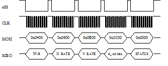
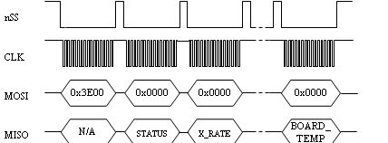
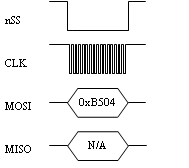
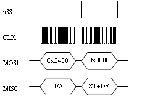
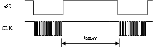
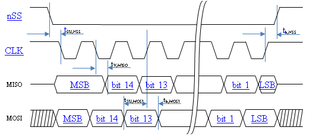

DMUx81ZA SPI Port Interface Definition
**************************************

The DMUx81ZA provides a SPI interface for data communications. This
section of the user’s manual defines the DMUx81ZA register map, register
control capabilities, and the data register reading and writing
methodologies.

The DMUx81ZA operates as a slave device. The master device must be
configured to communicate with the DMUx81ZA using the following
settings:

Data transferred in 16-bit word-length and MSB-first

f\ :sub:`CLK` ≤ 2.0 MHz

CPOL = 1 (clock polarity) and CPHA = 1 (clock phase)

Additional operational requirements are described in Section
`5.8 <\l>`__.

DMUx81ZA Register Map
---------------------

Table 18 describes the DMUx81ZA register map.

          **Table 18 DMUx81ZA Register Map**

+-------------+-------------+-------------+-------------+---------------+
| **Name**    | **Read/Writ | **Address** | **Default** |**Function**   |
|             | e**         |             |             |               |
+-------------+-------------+-------------+-------------+---------------+
| Reserved    | N/A         | 0x00 to     | N/A         |               |
|             |             | 0x03        |             |               |
+-------------+-------------+-------------+-------------+---------------+
| X_RATE      | R           | 0x04        | N/A         || X-Axis       |
|             |             |             |             | Rate-Sensor   |
|             |             |             |             || Output       |
+-------------+-------------+-------------+-------------+---------------+
| Y_RATE      | R           | 0x06        |             || Y-Axis       |
|             |             |             |             | Rate-Sensor   |
|             |             |             |             || Output       |
+-------------+-------------+-------------+-------------+---------------+
| Z_RATE      | R           | 0x08        |             || Z-Axis       |
|             |             |             |             | Rate-Sensor   |
|             |             |             |             || Output       |
+-------------+-------------+-------------+-------------+---------------+
| X_ACCEL     | R           | 0x0A        | N/A         || X-Axis       |
|             |             |             |             | Accelerometer |
|             |             |             |             || Output       |
+-------------+-------------+-------------+-------------+---------------+
| Y_ACCEL     | R           | 0x0C        |             || Y-Axis       |
|             |             |             |             | Accelerometer |
|             |             |             |             || Output       |
+-------------+-------------+-------------+-------------+---------------+
| Z_ACCEL     | R           | 0x0E        |             || Z-Axis       |
|             |             |             |             | Accelerometer |
|             |             |             |             || Output       |
+-------------+-------------+-------------+-------------+---------------+
| X_MAG       | R           | 0x10        | N/A         || X-Axis       |
|             |             |             |             | Magnetometer  |
|             |             |             |             || Output       |
+-------------+-------------+-------------+-------------+---------------+
| Y_MAG       | R           | 0x12        |             || Y-Axis       |
|             |             |             |             | Magnetometer  |
|             |             |             |             || Output       |
+-------------+-------------+-------------+-------------+---------------+
| Z_MAG       | R           | 0x14        |             || Z-Axis       |
|             |             |             |             | Magnetometer  |
|             |             |             |             || Output       |
+-------------+-------------+-------------+-------------+---------------+
| RATE_TEMP   | R           | 0x16        | N/A         | Rate-sensor   |
|             |             |             |             | temperature   |
+-------------+-------------+-------------+-------------+---------------+
| BOARD_TEMP  | R           | 0x18        | N/A         | Board         |
|             |             |             |             | temperature   |
+-------------+-------------+-------------+-------------+---------------+
| Reserved    | R           | 0x1A to     | N/A         |               |
|             |             | 0x33        |             |               |
+-------------+-------------+-------------+-------------+---------------+
| SELF_TEST   | R/W         | 0x34/0x35   | 0x00        || See `Table   |
|             |             |             |             | 26 <\l>`__:   |
|             |             |             |             || Initiate     |
|             |             |             |             | Self-Test /   |
|             |             |             |             || Configure    |
|             |             |             |             | Data-Ready    |
|             |             |             |             || output       |
|             |             |             |             | signal        |
+-------------+-------------+-------------+-------------+---------------+
| DATA_READY  | R/W         | 0x35/0x34   | 0x04        |               |
+-------------+-------------+-------------+-------------+---------------+
| OUTPUT_DATA | R/W         | 0x36/0x37   | 0x01        || See `Table   |
| _RATE       |             |             |             | 27 <\l>`__:   |
|             |             |             |             || Set Output   |
|             |             |             |             | Data Rate     |
|             |             |             |             | (ODR)         |
+-------------+-------------+-------------+-------------+---------------+
| Reserved    | N/A         | 0x37/0x36   | 0x01        |               |
+-------------+-------------+-------------+-------------+---------------+
| RS_DYNAMIC  | R/W         | 0x38/0x39   | 0x02        || See `Table   |
| _RANGE      |             |             |             | 28 <\l>`__:   |
|             |             |             |             || Set          |
|             |             |             |             | rate-sensor   |
|             |             |             |             || dynamic      |
|             |             |             |             | range (SPI    |
|             |             |             |             || only) /      |
|             |             |             |             | Select        |
|             |             |             |             || digital      |
|             |             |             |             | filter        |
+-------------+-------------+-------------+-------------+---------------+
| LOW_PASS_FI | R/W         | 0x39/0x38   | 0x06        |               |
| LTER        |             |             |             |               |
+-------------+-------------+-------------+-------------+---------------+
| Reserved    | N/A         | 0x3A to     | N/A         |               |
|             |             | 0x3B        |             |               |
+-------------+-------------+-------------+-------------+---------------+
| STATUS      | R           | 0x3C        | N/A         || See `Table   |
|             |             |             |             | 24 <\l>`__:   |
|             |             |             |             || Diagnostic   |
|             |             |             |             | register      |
+-------------+-------------+-------------+-------------+---------------+
| STNDRD_BURS | R           | 0x3E        | N/A         || Command to   |
| T           |             |             |             | perform a     |
|             |             |             |             || burst-read   |
|             |             |             |             | of the        |
|             |             |             |             || standard     |
|             |             |             |             | data-packet   |
+-------------+-------------+-------------+-------------+---------------+
| Reserved    | R           | 0x3F to     |             |               |
|             |             | 0x40        |             |               |
+-------------+-------------+-------------+-------------+---------------+
| S0_BURST    | R           | 0x41        | N/A         || Burst-Mode   |
|             |             |             |             | Command for   |
|             |             |             |             || UCB          |
|             |             |             |             | scaled-sens   |
|             |             |             |             || or           |
|             |             |             |             | 0             |
|             |             |             |             | data-packet   |
|             |             |             |             || see Section  |
|             |             |             |             |               |
|             |             |             |             | `7.4 <\1>`__  |
|             |             |             |             |               |
+-------------+-------------+-------------+-------------+---------------+
| S1_BURST    | R           | 0x42        | N/A         || Burst-Mode   |
|             |             |             |             | Command for   |
|             |             |             |             || UCB          |
|             |             |             |             | scaled-sens   |
|             |             |             |             | or            |
|             |             |             |             | 1             |
|             |             |             |             || data-packet  |
|             |             |             |             | see           |
|             |             |             |             || Section      |
|             |             |             |             | `7.4 <\l>`__  |
|             |             |             |             |               |
+-------------+-------------+-------------+-------------+---------------+
| A1_BURST    | R           | 0x43        | N/A         || Burst-Mode   |
|             |             |             |             | Command for   |
|             |             |             |             || UCB angle 1  |
|             |             |             |             | data-packet   |
|             |             |             |             | see           |
|             |             |             |             || Section      |
|             |             |             |             | `7.4 <\l>`__  |
|             |             |             |             |               |
+-------------+-------------+-------------+-------------+---------------+
| A2_BURST    | R           | 0x44        | N/A         || Burst-Mode   |
|             |             |             |             | Command for   |
|             |             |             |             || UCB angle 2  |
|             |             |             |             | data-packet   |
|             |             |             |             | see           |
|             |             |             |             || Section      |
|             |             |             |             | `7.4 <\l>`__  |
|             |             |             |             |               |
+-------------+-------------+-------------+-------------+---------------+
| N0_BURST    | R           | 0x45        | N/A         || Burst-Mode   |
|             |             |             |             | Command for   |
|             |             |             |             || UCB nav 0    |
|             |             |             |             | data-packet   |
|             |             |             |             | see           |
|             |             |             |             || Section      |
|             |             |             |             | `7.4 <\l>`__  |
|             |             |             |             |               |
+-------------+-------------+-------------+-------------+---------------+
| Reserved    | N/A         | 0x46 to     | N/A         |               |
|             |             | 0x47        |             |               |
+-------------+-------------+-------------+-------------+---------------+
| X_HARD_IRON | R           | 0x48        | 0x0000      || Hard-iron    |
|             |             |             |             | bias          |
|             |             |             |             || (X-Axis)     |
+-------------+-------------+-------------+-------------+---------------+
| Y_HARD_IRON | R           | 0x4A        | 0x0000      || Hard-iron    |
|             |             |             |             | bias          |
|             |             |             |             || (Y-Axis)     |
+-------------+-------------+-------------+-------------+---------------+
| SF_SOFT_IRO | R           | 0x4C        | 0x8100      | Soft-iron     |
| N           |             |             |             | scale         |
|             |             |             |             | factor        |
+-------------+-------------+-------------+-------------+---------------+
| ANG_SOFT_IR | R           | 0x4E        | 0x0000      | Soft-iron     |
| ON          |             |             |             | angle         |
+-------------+-------------+-------------+-------------+---------------+
| MAG_ALIGN   | R/W         | 0x50/0x51   | N/A         || See `Table   |
|             |             |             |             | 35 <\l>`__:   |
|             |             |             |             || Magnetic-al  |
|             |             |             |             | ignment       |
|             |             |             |             || control and  |
|             |             |             |             | status        |
+-------------+-------------+-------------+-------------+---------------+
| MANUF_CODE  | R           | 0x52        | 0x1310      || Manufacturing|
|             |             |             |             | code          |
|             |             |             |             || indicating   |
|             |             |             |             | year and      |
|             |             |             |             | location      |
+-------------+-------------+-------------+-------------+---------------+
| UNIT_CODE   | R           | 0x54        | 0x0000      | Unit          |
|             |             |             |             | information   |
|             |             |             |             | code          |
+-------------+-------------+-------------+-------------+---------------+
| PRODUCT_ID  | R           | 0x56        | 0x3810      || Product      |
|             |             |             |             | identification|
|             |             |             |             || code         |
+-------------+-------------+-------------+-------------+---------------+
| SERIAL_NUMB | R           | 0x58        | Varies      | Serial        |
| ER          |             |             |             | number        |
+-------------+-------------+-------------+-------------+---------------+
| MASTER_STAT | R           | 0x5A        | N/A         || See Section  |
| US          |             |             |             | `9.2 <\l>`__  |
|             |             |             |             |               |
|             |             |             |             || Master BIT   |
|             |             |             |             | and Status    |
|             |             |             |             || Field        |
+-------------+-------------+-------------+-------------+---------------+
| HW_STATUS   | R           | 0x5C        | N/A         || See Section  |
|             |             |             |             | `9.3 <\l>`__  |
|             |             |             |             |               |
|             |             |             |             || Hardware     |
|             |             |             |             | BIT Field     |
+-------------+-------------+-------------+-------------+---------------+
| SW_MASTER   | R           | 0x5E        | N/A         || See Section  |
|             |             |             |             | `9.9 <\l>`__  |
|             |             |             |             |               |
|             |             |             |             || Software     |
|             |             |             |             | BIT Field     |
+-------------+-------------+-------------+-------------+---------------+
| SW_STATUS   | R           | 0x60        | N/A         || See Section  |
|             |             |             |             |`9.14 <\l>`__  |
|             |             |             |             |               |
|             |             |             |             || Software     |
|             |             |             |             | Status        |
|             |             |             |             || Field        |
+-------------+-------------+-------------+-------------+---------------+
| SW_ALGO     | R           | 0x62        | N/A         || See Section  |
|             |             |             |             |`9.10 <\l>`__  |
|             |             |             |             |               |
|             |             |             |             || Software     |
|             |             |             |             | Algorithm     |
|             |             |             |             || BIT Field    |
+-------------+-------------+-------------+-------------+---------------+
| SW_DATA     | R           | 0x64        | N/A         || See Section  |
|             |             |             |             |`9.11 <\l>`__  |
|             |             |             |             |               |
|             |             |             |             || Software     |
|             |             |             |             | Data BIT      |
|             |             |             |             || Field        |
+-------------+-------------+-------------+-------------+---------------+
| COMM_MASTER | R           | 0x66        | N/A         || See Section  |
|             |             |             |             | `9.6 <\l>`__  |
|             |             |             |             |               |
|             |             |             |             || Com BIT      |
|             |             |             |             | Field         |
+-------------+-------------+-------------+-------------+---------------+
| COMM_DATA_S | R           | 0x68        | N/A         || See Section  |
| TATUS       |             |             |             |`9.13 <\l>`__  |
|             |             |             |             |               |
|             |             |             |             || Com Status   |
|             |             |             |             | Field         |
+-------------+-------------+-------------+-------------+---------------+
| COMM_BUS_A  | R           | 0x6A        | N/A         || See Section  |
|             |             |             |             | `9.7 <\l>`__  |
|             |             |             |             |               |
|             |             |             |             || Com Serial   |
|             |             |             |             | A BIT Field   |
+-------------+-------------+-------------+-------------+---------------+
| COMM_BUS_B  | R           | 0x6C        | N/A         || See Section  |
|             |             |             |             | `9.8 <\l>`__  |
|             |             |             |             |               |
|             |             |             |             || Com Serial   |
|             |             |             |             | B BIT Field   |
+-------------+-------------+-------------+-------------+---------------+
| SENSOR_STAT | R           | 0x6E        | N/A         || See Section  |
| US          |             |             |             |`9.15 <\l>`__  |
|             |             |             |             |               |
|             |             |             |             || Sensor       |
|             |             |             |             | Status        |
|             |             |             |             | Field         |
+-------------+-------------+-------------+-------------+---------------+
| RS_SCALE    | R/W         | 0x70/0x71   | 0x1F        | See Section   |
|             |             |             |             |`5.7 <\l>`__   |
|             |             |             |             |               |
+-------------+-------------+-------------+-------------+---------------+
| ACCEL_SCALE | R/W         | 0x71/0x70   | 0x3F        |               |
+-------------+-------------+-------------+-------------+---------------+
| MAG_SCALE   | R/W         | 0x72/0x73   | 0x10        | See Section   |
|             |             |             |             |`5.7 <\l>`__   |
|             |             |             |             |               |
+-------------+-------------+-------------+-------------+---------------+
| Reserved    | R/W         | 0x73/0x72   | 0x03        |               |
+-------------+-------------+-------------+-------------+---------------+
| ORIENTATION | R/W         | 0x74        | 0x00        || See `Table   |
| _MSB        |             |             |             | 44 <\l>`__    |
|             |             |             |             || for valid    |
|             |             |             |             | orientation   |
|             |             |             |             || settings.    |
|             |             |             |             | The           |
|             |             |             |             || orientation  |
|             |             |             |             | register      |
|             |             |             |             || must be      |
|             |             |             |             | written in    |
|             |             |             |             || order (MSB   |
|             |             |             |             | followed by   |
|             |             |             |             || LSB) for     |
|             |             |             |             | write to      |
|             |             |             |             || take         |
|             |             |             |             | effect.       |
+-------------+-------------+-------------+-------------+---------------+
| ORIENTATION | R/W         | 0x75        | 0x00        |               |
| _LSB        |             |             |             |               |
+-------------+-------------+-------------+-------------+---------------+
| EEPROM_WRIT | W           | 0x76        | N/A         | See Section   |
| E           |             |             |             |`5.7 <\l>`__   |
|             |             |             |             |               |
+-------------+-------------+-------------+-------------+---------------+
| Reserved    | N/A         | 0x78 to     | N/A         |               |
|             |             | 0x7D        |             |               |
+-------------+-------------+-------------+-------------+---------------+
| HW_SW_VERSI | R           | 0x7E        | 0x00        | See Section   |
| ON          |             |             |             |`5.7 <\l>`__   |
|             |             |             |             |               |
+-------------+-------------+-------------+-------------+---------------+

DMUx81ZA SPI Register Read Methodology
--------------------------------------

The DMUx81ZA SPI port uses registers to store information such as:

Sensor data

Algorithm output data

Configuration/Status information

A SPI master accesses information via the SPI bus in one of two ways:

Polled-Mode

Burst-Mode

In polled-mode, the DMUx81ZA transfers information from any register
back to the master in two (or more) SPI cycles. In Burst-Mode, the
DMUx81ZA transfers predefined blocks of data in one contiguous group of
nine to twenty SPI cycles.

DMUx81ZA SPI Port Polled-mode Read
----------------------------------

In polled-mode, data transfer begins when the SPI master sets the
chip-select line (nSS) low and clocks a 16-bit word, comprised of the
register-address byte and a zero-byte, across the MOSI line. For
example, to request the unit’s serial number, stored in register 0x58,
the master sends the command 0x5810. The DMUx81ZA returns information
from this address across the MISO line during the following 16
clock-cycles.

Subsequent SPI-master commands sent to the DMUx81ZA consist of either:

Sixteen zero-bits (0x0000) to complete the read of a single register.

The address of another register followed by a zero-byte. This permits
back-to-back reads of data-registers.

**Single-Register Polled-Read**

`Figure 9 <\l>`__ illustrates a polled-mode read of a single
register (x-axis rate-sensor data), which is composed of two bytes,
starting at register address 0x04.

In this example, the SPI-master initiates a register read by clocking in
the address followed by 0x00, i.e. 0x0400, via MOSI; this combination is
referred to as a read-command. This is followed by 16 zero-bits to
complete the SPI data-transfer cycle.

As the master transmits the read command over MOSI, the DMUx81ZA
transmits information back over MISO. In this transmission, the first
data-word sent by the DMUx81ZA (as the read-command is sent) consists of
16-bits of non-applicable data. The subsequent 16-bit message contains
the x-axis rate-sensor information (most significant byte followed by
least-significant byte).

|image30|

         Figure 9 Single Register Read via Polled-Mode

**Multiple-Register Polled-Read**

`Figure 10 <\l>`__ illustrates a polled-mode read of multiple
registers. In this case, the SPI-master transmits an initial
read-command (the desired register-address appended by 0x00) across MOSI
followed by any number of additional read-commands (one for each
register of interest). The DMUx81ZA transfers the requested information
concurrently across MISO to the master. To complete the data transfer,
the final read-command must be followed by an additional 16 clock cycles
to transfer the last 16-bits of data.

In this example, the master requests data from four separate registers:
x-axis rate (0x0400), y-axis rate (0x0600), z-axis acceleration
(0x0E00), and system status (0x3C00). The transfer of 0x0000 across MOSI
completes the read by returning the status data via the MISO line.

|image31|

         Figure 10 Multiple Register Read via Polled-Mode

DMUx81ZA SPI Port Burst-Mode Read
---------------------------------

In burst-mode, the DMUx81ZA returns predefined blocks of data in single
groups, referred to as data-packets, without the need to send multiple
read commands. These groups vary from eight to nineteen words in length,
depending on the packet selected. Table 19 lists the data-packets
available for the DMUx81ZA. The data packets are described in more
detail, including data-ordering and conversion factor information, in
Section `7.4 <\l>`__.

        **Table 19 DMUx81ZA Burst-Mode Data-Packets**

+-------------+--------------+---------------+----------------+------------------+
| Data-Packet || Register    || Number of    || Pertinent     | Availability     |
|             || Address     || 16-bit       || Section       |                  |
|             |              || Words        |                |                  |
+-------------+--------------+---------------+----------------+------------------+
| Standard    | 0x3E         | 8             |`5.2 <\1>`__    | All systems      |
|             |              |               |                |                  |
+-------------+--------------+---------------+----------------+------------------+
| Scaled      | 0x41         | 15            |`7.4 <\l>`__    || All systems     |
| Sensor 0    |              |               |                | except           |
|             |              |               |                | IMUx81ZA-200     |
|             |              |               |                || and VGx81ZA     |
+-------------+--------------+---------------+----------------+------------------+
| Scaled      | 0x42         | 12            |`7.4 <\l>`__    | All systems      |
| Sensor 1    |              |               |                |                  |
+-------------+--------------+---------------+----------------+------------------+
| Angle Data  | 0x43         | 16            |`7.4 <\l>`__    || All systems     |
| 1           |              |               |                | except           |
|             |              |               |                | IMUx81ZA         |
|             |              |               |                || and VGx81ZA     |
+-------------+--------------+---------------+----------------+------------------+
| Angle Data  | 0x44         | 15            |`7.4 <\l>`__    | All systems      |
| 2           |              |               |                | except           |
|             |              |               |                | IMUx81ZA         |
+-------------+--------------+---------------+----------------+------------------+
| Nav 0       | 0x45         | 16            |`7.4 <\l>`__    | INSx81ZA         |
|             |              |               |                |                  |
+-------------+--------------+---------------+----------------+------------------+

**Burst-Read of Standard Data-Packet**

The standard data-packet comprises data from eight predefined registers.
Table 20 lists the data contained in a standard packet along with the
corresponding registers. The registers are listed in the order in which
they are sent during a burst-mode read.

       **Table 20 DMUx81ZA Burst-Mode Output Registers**

+-------------------+----------------------+-------------------------------+
| **Register Name** | **Register Address** | **Description**               |
+-------------------+----------------------+-------------------------------+
| STATUS            | 0x3C                 | System Status                 |
+-------------------+----------------------+-------------------------------+
| X_RATE            | 0x04                 | Rate Sensor Output (X-Axis)   |
+-------------------+----------------------+-------------------------------+
| Y_RATE            | 0x06                 | Rate Sensor Output (Y-Axis)   |
+-------------------+----------------------+-------------------------------+
| Z_RATE            | 0x08                 | Rate Sensor Output (Z-Axis)   |
+-------------------+----------------------+-------------------------------+
| X_ACCEL           | 0x0A                 | Accelerometer Output (X-Axis) |
+-------------------+----------------------+-------------------------------+
| Y_ACCEL           | 0x0C                 | Accelerometer Output (Y-Axis) |
+-------------------+----------------------+-------------------------------+
| Z_ACCEL           | 0x0E                 | Accelerometer Output (Z-Axis) |
+-------------------+----------------------+-------------------------------+
| BOARD_TEMP        | 0x18                 | System Temperature            |
+-------------------+----------------------+-------------------------------+

Burst-mode begins when the master requests a read from a burst-mode
data-packet (i.e. 0x3E). Eight additional SPI cycles complete the read
(one for each word in the standard data-packet). Figure 11 illustrates
the burst-mode sequence. Note: if the incorrect number of SPI cycles
follow the burst-mode command, the SPI transfer will either complete
early or remain in burst-mode; subsequent reads/writes will be out of
sync with the SPI transfer cycle of the DMUx81ZA.

|image32|

Figure 11 Multiple Register Read via Burst-Mode

**Operational notes:**

When combining polled and burst reads, use only single-register
polled-reads.

Burst-mode reads for other data-packets are performed in a manner
similar to the standard packet. The only deviation from the method
described above is the register address and the subsequent number of
data words, listed in Table 21.

Care must be taken when switching between data-packets as values
returned during the first burst-read of a new packet are invalid. A
single read-cycle is needed to populate the internal burst-mode
register; subsequent reads from the same packet contain valid
information.

During a burst read, the chip-select line (nSS) can be controlled in one
of two ways:

Toggle nSS in between each of the 16-bit words (as shown in Figure 11).

Set and hold nSS low during the entire read. After the transfer is
complete, set chip-select high.

Output Data Register
--------------------

Output data registers hold the sensor information as it is measured;
they are overwritten only when new data is available. Table 21 lists
each register, its memory address, and its conversion factor. Note: the
scale-factor described below only applies to the values in the data
registers and standard burst-mode. Scale-factors for the other output
data packets follow the values listed in Section `7.4 <\l>`__.

     **Table 21 DMUx81ZA Data Output Registers**

+-----------------------+-----------------------+-----------------------+
| **Name**              || **Read**             | **Function**          |
|                       || **Address**          |                       |
+-----------------------+-----------------------+-----------------------+
| X_RATE                | 0x04                  || X, Y, Z-axis         |
|                       |                       | rate-sensor           |
|                       |                       | information, twos     |
|                       |                       | complement format,    |
|                       |                       || conversion factor:   |
|                       |                       | 200 LSB/[ °/sec ]     |
|                       |                       | (default); changes    |
|                       |                       | with selected         |
|                       |                       || range (`Table        |
|                       |                       | 29 <\l>`__)           |
+-----------------------+-----------------------+-----------------------+
| Y_RATE                | 0x06                  |                       |
+-----------------------+-----------------------+-----------------------+
| Z_RATE                | 0x08                  |                       |
+-----------------------+-----------------------+-----------------------+
| X\_ ACCEL             | 0x0A                  || X, Y, Z-axis         |
|                       |                       | accelerometer         |
|                       |                       | information, twos     |
|                       |                       | complement format,    |
|                       |                       || conversion factor:   |
|                       |                       | 4000 LSB/g (default)  |
|                       |                       | ; changes with        |
|                       |                       | selected              |
|                       |                       || range (`Table        |
|                       |                       | 32 <\l>`__)           |
+-----------------------+-----------------------+-----------------------+
| Y\_ ACCEL             | 0x0C                  |                       |
+-----------------------+-----------------------+-----------------------+
| Z_ACCEL               | 0x0E                  |                       |
+-----------------------+-----------------------+-----------------------+
| X_MAG                 | 0x10                  || X, Y, Z-axis         |
|                       |                       | magnetometer          |
|                       |                       | information, twos     |
|                       |                       | complement format,    |
|                       |                       || conversion factor:   |
|                       |                       | 16000 LSB/G (default) |
|                       |                       | ; changes with        |
|                       |                       | selected              |
|                       |                       || range (`Table        |
|                       |                       | 34 <\l>`__)           |
+-----------------------+-----------------------+-----------------------+
| Y_MAG                 | 0x12                  |                       |
+-----------------------+-----------------------+-----------------------+
| Z_MAG                 | 0x14                  |                       |
+-----------------------+-----------------------+-----------------------+
| RATE_TEMP             | 0x16                  || Rate-sensor          |
|                       |                       | temperature           |
|                       |                       | information, twos     |
|                       |                       | complement format,    |
|                       |                       || conversion:          |
|                       |                       |                       |
|                       |                       | Tout [°C ] = Vout ·   |
|                       |                       | 0.07311 [°C/LSB ]     |
+-----------------------+-----------------------+-----------------------+
| BOARD_TEMP            | 0x18                  || System temperature   |
|                       |                       | information, twos     |
|                       |                       | complement format,    |
|                       |                       || conversion:          |
|                       |                       |                       |
|                       |                       | Tout [°C ] = Vout ·   |
|                       |                       | 0.07311 [°C/LSB ] +   |
|                       |                       | 31.0 [°C ]            |
+-----------------------+-----------------------+-----------------------+

System Registers
----------------

In addition to the output data registers, there are further read-only
registers that provide DMUx81ZA system information to the SPI master.
Table 22 provides a description of each along with their read-addresses.

        **Table 22 DMUx81ZA System Registers**

+-----------------------+-----------------------+-----------------------+
| **Name**              || **Read**             | **Function**          |
|                       || **Address**          |                       |
+-----------------------+-----------------------+-----------------------+
| DIAGNOSTIC_STATUS     | 0x3C                  || Sensor self-test and |
|                       |                       | over-range            |
|                       |                       | information (See      |
|                       |                       || Section `5.5 <\l>`__)|
+-----------------------+-----------------------+-----------------------+
| X_HARD_IRON           | 0x48                  || Results of the       |
|                       |                       | magnetic-alignment    |
|                       |                       | procedure (see        |
|                       |                       || Section              |
|                       |                       | `5.7.7 <\l>`__)       |
+-----------------------+-----------------------+-----------------------+
| Y_HARD_IRON           | 0x4A                  |                       |
+-----------------------+-----------------------+-----------------------+
| SF_SOFT_IRON          | 0x4C                  |                       |
+-----------------------+-----------------------+-----------------------+
| ANG_SOFT_IRON         | 0x4E                  |                       |
+-----------------------+-----------------------+-----------------------+
| MANUF_CODE            | 0x52                  | Product manufacturing |
|                       |                       | code                  |
+-----------------------+-----------------------+-----------------------+
| UNIT_CODE             | 0x54                  | Additional product    |
|                       |                       | manufacturing         |
|                       |                       | information           |
+-----------------------+-----------------------+-----------------------+
| PRODUCT_ID            | 0x56                  | Product ID (0x3810)   |
+-----------------------+-----------------------+-----------------------+
| SERIAL_NUMBER         | 0x58                  | Unique product        |
|                       |                       | identification number |
+-----------------------+-----------------------+-----------------------+
| MASTER_STATUS         | 0x5A                  | See Section           |
|                       |                       | `9.2 <\l>`__: Master  |
|                       |                       | BIT and Status Field  |
+-----------------------+-----------------------+-----------------------+
| HW_STATUS             | 0x5C                  | See Section           |
|                       |                       | `9.3 <\l>`__:         |
|                       |                       | Hardware BIT Field    |
+-----------------------+-----------------------+-----------------------+
| SW_MASTER             | 0x5E                  | See Section           |
|                       |                       | `9.9 <\l>`__:         |
|                       |                       | Software BIT Field    |
+-----------------------+-----------------------+-----------------------+
| SW_STATUS             | 0x60                  | See Section           |
|                       |                       | `9.14 <\l>`__:        |
|                       |                       | Software Status Field |
+-----------------------+-----------------------+-----------------------+
| SW_ALGO               | 0x62                  | See Section           |
|                       |                       | `9.10 <\l>`__:        |
|                       |                       | Software Algorithm    |
|                       |                       | BIT Field             |
+-----------------------+-----------------------+-----------------------+
| SW_DATA               | 0x64                  | See Section           |
|                       |                       | `9.11 <\l>`__:        |
|                       |                       | Software Data BIT     |
|                       |                       | Field                 |
+-----------------------+-----------------------+-----------------------+
| COMM_MASTER           | 0x66                  | See Section           |
|                       |                       | `9.6 <\l>`__: Com BIT |
|                       |                       | Field                 |
+-----------------------+-----------------------+-----------------------+
| COMM_DATA_STATUS      | 0x68                  | See Section           |
|                       |                       | `9.13 <\l>`__: Com    |
|                       |                       | Status Field          |
+-----------------------+-----------------------+-----------------------+
| COMM_BUS_A            | 0x6A                  | See Section           |
|                       |                       | `9.7 <\l>`__: Com     |
|                       |                       | Serial A BIT Field    |
+-----------------------+-----------------------+-----------------------+
| COMM_BUS_B            | 0x6C                  | See Section           |
|                       |                       | `9.8 <\l>`__: Com     |
|                       |                       | Serial B BIT Field    |
+-----------------------+-----------------------+-----------------------+
| SENSOR_STATUS         | 0x6E                  | See Section           |
|                       |                       | `9.15 <\l>`__: Sensor |
|                       |                       | Status Field          |
+-----------------------+-----------------------+-----------------------+
| HW_SW_VERSION         | 0x7E                  | Hardware and Software |
|                       |                       | Versions (See Section |
|                       |                       | `5.7.8 <\l>`__)       |
+-----------------------+-----------------------+-----------------------+

Diagnostic Status Register
--------------------------

The diagnostic status register contains information describing the
results of the self-test as well as sensor over-range information. It is
defined in Table 23.

       **Table 23 Diagnostic Status Register**

+-----------------------------------+-----------------------------------+
| **(Base Address: 0x3C),           |                                   |
| Read-Only**                       |                                   |
+-----------------------------------+-----------------------------------+
| **Bits**                          | **Description (Default: 0x0000)** |
+-----------------------------------+-----------------------------------+
| 15                                | Accelerometer Z-Axis self-test    |
|                                   | bit                               |
|                                   | 0: Pass, 1: Fail                  |
+-----------------------------------+-----------------------------------+
| 14                                | Accelerometer Y-Axis self-test    |
|                                   | bit                               |
|                                   | 0: Pass, 1: Fail                  |
+-----------------------------------+-----------------------------------+
| 13                                | Accelerometer X-Axis self-test    |
|                                   | bit                               |
|                                   | 0: Pass, 1: Fail                  |
+-----------------------------------+-----------------------------------+
| 12                                | Rate-Sensor Z-Axis self-test bit  |
|                                   | 0: Pass, 1: Fail                  |
+-----------------------------------+-----------------------------------+
| 11                                | Rate-Sensor Y-Axis self-test bit  |
|                                   | 0: Pass, 1: Fail                  |
+-----------------------------------+-----------------------------------+
| 10                                | Rate-Sensor X-Axis self-test bit  |
|                                   | 0: Pass, 1: Fail                  |
+-----------------------------------+-----------------------------------+
| [ 9:6 ]                           | Unused                            |
+-----------------------------------+-----------------------------------+
| 5                                 | Self-Test Success/Failure bit     |
|                                   | 0: Success, 1: Failure            |
+-----------------------------------+-----------------------------------+
| 4                                 | Sensor over-range bit             |
|                                   | (a 1 indicates one or more        |
|                                   | sensors have over-ranged)         |
+-----------------------------------+-----------------------------------+
| [ 3:0 ]                           | Unused                            |
+-----------------------------------+-----------------------------------+

DMUx81ZA SPI Register Write Methodology
---------------------------------------

The SPI master configures the DMUx81ZA by writing to specific registers.
However, unlike reads, writes are performed *one byte at a time*. The
specific registers that affect system configuration are listed in Table
24 along with their write-addresses.

          **Table 24 DMUx81ZA Configuration Registers**

+-----------------------+-----------------------+-----------------------+
| **Name**              | **Write Address**     | **Function**          |
+-----------------------+-----------------------+-----------------------+
| SELF_TEST             | 0x35                  | See `Table            |
|                       |                       | 26 <\l>`__: Initiate  |
|                       |                       | self-test and         |
|                       |                       | Configure Data-Ready  |
|                       |                       | output signal         |
+-----------------------+-----------------------+-----------------------+
| DATA_READY            | 0x34                  |                       |
+-----------------------+-----------------------+-----------------------+
| OUTPUT_DATA_RATE      | 0x37                  | See `Table            |
|                       |                       | 27 <\l>`__: Sets      |
|                       |                       | Output Data Rate      |
|                       |                       | (ODR) of the unit     |
+-----------------------+-----------------------+-----------------------+
| RS_DYNAMIC_RANGE      | 0x39                  | See `Table            |
|                       |                       | 28 <\l>`__: Set the   |
|                       |                       | rate-sensor dynamic   |
|                       |                       | range and the digital |
|                       |                       | filter                |
+-----------------------+-----------------------+-----------------------+
| LOW_PASS_FILTER       | 0x38                  |                       |
+-----------------------+-----------------------+-----------------------+
| MAG_ALIGN             | 0x50                  | See Section           |
|                       |                       | `5.7.7 <\l>`__:       |
|                       |                       | Command to initiate a |
|                       |                       | magnetic-alignment on |
|                       |                       | AHRS and INS variants |
+-----------------------+-----------------------+-----------------------+
| RS_SCALE              | 0x71                  | See Section           |
|                       |                       | `5.7.4 <\l>`__: Set   |
|                       |                       | the dynamic range of  |
|                       |                       | the sensors           |
+-----------------------+-----------------------+-----------------------+
| ACCEL_SCALE           | 0x70                  |                       |
+-----------------------+-----------------------+-----------------------+
| MAG_SCALE             | 0x73                  |                       |
+-----------------------+-----------------------+-----------------------+
| ORIENTATION_MSB       | 0x74                  | See Sections          |
|                       |                       | `5.7.5 <\l>`__ and    |
|                       |                       | `8.4 <\l>`__: Sets    |
|                       |                       | the orientation (x,   |
|                       |                       | y, and z-axes) of the |
|                       |                       | unit                  |
+-----------------------+-----------------------+-----------------------+
| ORIENTATION_LSB       | 0x75                  |                       |
+-----------------------+-----------------------+-----------------------+
| EEPROM_WRITE          | 0x76                  | Save the settings to  |
|                       |                       | the EEPROM            |
+-----------------------+-----------------------+-----------------------+

The following example highlights how write-commands are formed in order
to initiate a sensor self-test:

Select the write address of the desired register, e.g. 0x35 for
self-test

Change the most-significant bit of the address to 1 (the write-bit),
e.g. 0x35 becomes 0xB5

Create the write command by appending the write-bit/address combination
with the value to be written to the register, e.g. 0xB504 (see Table 25
for a description of the self-test register)

Figure 12 illustrates the sensor self-test command sent over SPI.

|image33|

Figure 12 Single Register Write to Initiate Self-Test

As described in Section `5.7.1 <\l>`__, the self-test command bit
remains set until the test completes. The master must read from register
0x34 to assess if the test is complete (Figure 13). Note: as described
in the Register Reads section, a register read returns two bytes, in
this case a read from register 0x34 returns data from registers 0x34
(self-test information) and 0x35 (data-ready settings). The value read
from the DMUx81ZA must be parsed according to Table 25 to determine
self-test completion status.

|image37|

Figure 13 Polled-Read of the Self-Test/Data-Ready Register

Configuration Registers
-----------------------

Self-test/Data-Ready
--------------------

Self-test and data-ready registers are combined into a single 16-bit
register at memory location 0x34; individual bits are assigned according
to Table 25.

           **Table 25 Self-Test/Data-Ready Register**

+-----------------------------------+-----------------------------------+
|| (Base Address: 0x34),            |                                   |
|| Read/Write                       |                                   |
+-----------------------------------+-----------------------------------+
| **Bits**                          | **Description (Default: 0x0004)** |
+-----------------------------------+-----------------------------------+
| [ 15:11 ]                         | Unused                            |
+-----------------------------------+-----------------------------------+
| 10                                || Unit self-test bit (bit reset    |
|                                   || upon completion of self-test)    |
|                                   || 0: Disabled (default)            |
|                                   || 1: Enabled                       |
+-----------------------------------+-----------------------------------+
| [ 9:8 ]                           | Unused                            |
+-----------------------------------+-----------------------------------+
| [ 7:3 ]                           | Unused                            |
+-----------------------------------+-----------------------------------+
| 2                                 || Data-ready enable bit            |
|                                   || 0: Disabled                      |
|                                   || 1: Enabled (default)             |
+-----------------------------------+-----------------------------------+
| 1                                 || Data-ready line polarity         |
|                                   || 0: Low upon data-ready (default) |
|                                   || 1: High upon data-ready          |
+-----------------------------------+-----------------------------------+
| 0                                 | Unused                            |
+-----------------------------------+-----------------------------------+

The self-test enables the system to test individual sensors by applying
a temporary bias to determine if they are responding correctly. Once
self-test completes, the self-test bit (bit 10) is reset to indicate
that the test is finished. Results of the self-test are store in the
status register, 0x3C. To initiate self-test, the master sends 0xB504
across the SPI bus.

The data-ready bits enable the master to enable or disable the
data-ready signal provided on pin 7 of the DMUx81ZA and to set the
data-ready signal polarity (high or low). To enable data-ready with a
high signal, the master sends 0xB406.

Output Data Rate
----------------

Output data rate (ODR) is contained in register 0x36; individual bits
are assigned according to Table 26. Note: these settings apply only to
data output via the DMUx81ZA SPI port and do not affect the low-level
UART output port.

      **Table 26 Output Data Rate/Clock Configuration Register**

+--------------------------------------------------------------------------+
| **(Base Address: 0x36), Read/Write**                                     |
+--------------------------------------+-----------------------------------+
| **Bits**                             | **Description (Default: 0x0101)** |
+--------------------------------------+-----------------------------------+
| [ 15:12 ]                            | Unused                            |
+--------------------------------------+-----------------------------------+
| [ 8:11 ]                             || System Output Data Rate          |
|                                      || 0x00 (0): Data output suppressed |
|                                      || 0x01 (1): 200 Hz (default)       |
|                                      || 0x02 (2): 100 Hz                 |
|                                      || 0x03 (3): 50 Hz                  |
|                                      || 0x04 (4): 25 Hz                  |
|                                      || 0x05 (5): 20 Hz                  |
|                                      || 0x06 (6): 10 Hz                  |
|                                      || 0x07 (7): 5 Hz                   |
|                                      || 0x08 (8): 4 Hz                   |
|                                      || 0x09 (9): 2 Hz                   |
|                                      || 0x10 (10): 1 Hz                  |
+--------------------------------------+-----------------------------------+
| [7:0]                                | Reserved                          |
+--------------------------------------+-----------------------------------+

The ODR enables the master to specify the output rate of data provided
by the DMUx81ZA. Setting this register directly affects the data-ready
signal. The default ODR is 200 Hz; to change the ODR to 100 Hz, the
master sends 0xB702.

Rate-sensor Scaling/Low-Pass Filter
------------------------------------

The rate-sensor scaling and digital low-pass filter configuration are
combined into a single 16-bit register at memory location 0x38;
individual bits are assigned according to Table 27. Note: these settings
apply only to data output via the DMUx81ZA SPI port and do not affect
the low-level UART output port.

       **Table 27 Sensor Scaling/Digital Low-Pass Filter Register**

+-----------------------------------------------------------------------+
| **(Base Address: 0x38),                                               |
| Read/Write**                                                          |
+-----------------------------------+-----------------------------------+
| **Bits**                          | **Description (Default: 0x0206)** |
+-----------------------------------+-----------------------------------+
| [ 15:8 ]                          || Rate-Sensor Scaling/Dynamic Range|
|                                   || Selector                         |
|                                   || 0x01 (1): +/-62.5°/sec           |
|                                   || 0x02 (2): +/-125.0°/sec (default)|
|                                   || 0x04 (4): +/-250.0°/sec          |
|                                   || 0x08 (8): +/-500.0°/sec          |
|                                   || 0x10 (16): +/-1000.0°/sec        |
+-----------------------------------+-----------------------------------+
| [7:0 ]                            || Digital Low-Pass Filter          |
|                                   || 0x00 (0): Unfiltered             |
|                                   || 0x03 (3): 40 Hz Bartlett         |
|                                   || 0x04 (4): 20 Hz Bartlett         |
|                                   || 0x05 (5): 10 Hz Bartlett         |
|                                   || 0x06 (6): 5 Hz Bartlett (default)|
|                                   || 0x30 (48): 50 Hz Butterworth     |
|                                   || 0x40 (64): 20 Hz Butterworth     |
|                                   || 0x50 (81): 10 Hz Butterworth     |
|                                   || 0x60 (96): 5 Hz Butterworth      |
+-----------------------------------+-----------------------------------+

The rate-sensor scaling selector adjusts the output scaling applied to
the rate-sensor values in registers 0x04 through 0x08 as well as
the values in the standard data-packet (scaling in the other
data-packets are not affected). Additionally, this setting affects the
limits that control the sensor over-range bit in the diagnostic status
register (Table 24); if the system undergoes motion that exceeds this
limit, the over-range bit is set. The default scaling is 125.0°/sec; to
change the scaling to 62.5°/sec, the master sends 0xB901.

The rate sensor dynamic range selection maps to a bit-weight scale
factor as defined in Table 28.

        **Table 28 Rate-Sensor Scaling Factor**

+-------------------+-------------------+------------------+----------------------+
| **Dynamic Range** | **Scale Factor**  | **Signal Limit** | **Over-Range Limit** |
+-------------------+-------------------+------------------+----------------------+
| +/-62.5°/sec      | 400 LSB/( °/sec ) | +/-81.0 °/sec    | +/-62.5 °/sec        |
+-------------------+-------------------+------------------+----------------------+
| +/-125.0°/sec     | 200 LSB/( °/sec ) | +/-160.0 °/sec   | +/-125.0 °/sec       |
+-------------------+-------------------+------------------+----------------------+
| +/-250.0°/sec     | 100 LSB/( °/sec ) | +/-200.0 °/sec   | +/-220.0 °/sec       |
+-------------------+-------------------+------------------+----------------------+
| +/-500.0°/sec     | 50 LSB/( °/sec )  | +/-400.0 °/sec   | +/-440.0 °/sec       |
+-------------------+-------------------+------------------+----------------------+
| +/-1000.0°/sec    | 25 LSB/( °/sec )  | +/-600.0 °/sec   | +/-660.0 °/sec       |
+-------------------+-------------------+------------------+----------------------+

The digital low-pass filter register sets the type and cutoff frequency
of the filter applied to the scaled sensor data. The default setting is
a 5 Hz Bartlett filter; to switch to a 20 Hz Butterworth filter, the
master sends 0xB840. `Figure 14 <\l>`__ describes the output response of
the different Bartlett filter settings.

|Picture 3|

       Figure 14 DMUx81ZA Bartlett Filter Response

Accelerometer, Magnetometer, and Alternate Rate-Sensor Scaling
--------------------------------------------------------------

The scaling and limits of the accelerometer and magnetometer output can
be configured in a manner similar to the method described in Section
`5.7.3 <\l>`__. Additionally, the rate-sensor output can be configured
via an alternate register. Changes in register 0x38 will be reflected in
this alternate register (0x71) and vice-versa.

Rate-sensor and accelerometer scaling and limits are combined into a
single 16-bit register at memory location 0x70; individual bits are
assigned according to Table 29. Note: these settings apply only to data
output via the DMUx81ZA SPI port and do not affect the low-level UART
output port.

       **Table 29 Rate-Sensor and Accelerometer Output Scaling**

+-----------------------------------------------------------------------+
| **(Base Address: 0x70),                                               |
| Read/Write**                                                          |
+-----------------------------------+-----------------------------------+
| **Bits**                          | **Description (Default: 0x1F3F)** |
+-----------------------------------+-----------------------------------+
| [ 15:12 ]                         || Rate-Sensor Scaling/Dynamic Range|
|                                   || Selector                         |
|                                   || 0x0: +/-62.5°/sec                |
|                                   || 0x1: +/-125.0°/sec (default)     |
|                                   || 0x2: +/-250.0°/sec               |
|                                   || 0x3: +/-500.0°/sec               |
|                                   || 0x4: +/-1000.0°/sec              |
+-----------------------------------+-----------------------------------+
| [ 11:8 ]                          | Reserved for future use           |
+-----------------------------------+-----------------------------------+
| [ 7:4 ]                           || Accelerometer Scaling/Dynamic    |
|                                   || Range Selector                   |
|                                   || 0x0: +/-1.0 [g]                  |
|                                   || 0x1: +/-2.0 [g]                  |
|                                   || 0x2: +/-4.0 [g]                  |
|                                   || 0x3: +/-5.0 [g] (default)        |
|                                   || 0x4: +/-8.0 [g]                  |
+-----------------------------------+-----------------------------------+
| [ 3:0 ]                           | Reserved for future use           |
+-----------------------------------+-----------------------------------+

As described in the previous section, the rate-sensor scaling selector
adjusts the output scaling applied to the rate-sensor values as well as
the limits that control the sensor over-range bit in the diagnostic
status register (Table 24). The accelerometer scaling and limits work in
the same fashion.

The rate sensor dynamic range selection maps to a bit-weight scale
factor as defined in Table 30. The accelerometer dynamic range mapping
is defined in Table 31.

          **Table 30 Rate-Sensor Scaling Factor**

+-------------------+-------------------+------------------+----------------------+
| **Dynamic Range** | **Scale Factor**  | **Signal Limit** | **Over-Range Limit** |
+-------------------+-------------------+------------------+----------------------+
| +/-62.5°/sec      | 400 LSB/( °/sec ) | +/-81.0 °/sec    | +/-62.5 °/sec        |
+-------------------+-------------------+------------------+----------------------+
| +/-125.0°/sec     | 200 LSB/( °/sec ) | +/-160.0 °/sec   | +/-125.0 °/sec       |
+-------------------+-------------------+------------------+----------------------+
| +/-250.0°/sec     | 100 LSB/( °/sec ) | +/-200.0 °/sec   | +/-220.0 °/sec       |
+-------------------+-------------------+------------------+----------------------+
| +/-500.0°/sec     | 50 LSB/( °/sec )  | +/-400.0 °/sec   | +/-440.0 °/sec       |
+-------------------+-------------------+------------------+----------------------+
| +/-1000.0°/sec    | 25 LSB/( °/sec )  | +/-600.0 °/sec   | +/-660.0 °/sec       |
+-------------------+-------------------+------------------+----------------------+

          **Table 31 Accelerometer Scaling Factor**

+-------------------+------------------+------------------+----------------------+
| **Dynamic Range** | **Scale Factor** | **Signal Limit** | **Over-Range Limit** |
+-------------------+------------------+------------------+----------------------+
| +/-1.0 [g]        | 32768 LSB/[g]    | +/-1.0 [g]       | +/-0.9 [g]           |
+-------------------+------------------+------------------+----------------------+
| +/-2.0 [g]        | 16384 LSB/[g]    | +/-1.96 [g]      | +/-1.8 [g]           |
+-------------------+------------------+------------------+----------------------+
| +/-4.0 [g]        | 8192 LSB/[g]     | +/-3.92 [g]      | +/-3.6 [g]           |
+-------------------+------------------+------------------+----------------------+
| +/-5.0 [g]        | 4000 LSB/[g]     | +/-4.5 [g]       | +/-4.5 [g]           |
+-------------------+------------------+------------------+----------------------+
| +/-8.0 [g]        | 4096 LSB/[g]     | +/-7.84 [g]      | +/-7.2 [g]           |
+-------------------+------------------+------------------+----------------------+

Magnetometer scaling and limits are in the register at memory location
0x72; individual bits are assigned according to Table 32.

           **Table 32 Magnetometer Output Scaling**

+-----------------------------------------------------------------------+
| **(Base Address: 0x72),                                               |
| Read/Write**                                                          |
+-----------------------------------+-----------------------------------+
| **Bits**                          | **Description (Default: 0x1003)** |
+-----------------------------------+-----------------------------------+
| [ 15:12 ]                         || Magnetometer Scaling/Dynamic     |
|                                   || Range Selector                   |
|                                   || 0x0: +/-1.0 [G]                  |
|                                   || 0x1: +/-2.0 [G] (default)        |
|                                   || 0x2: +/-4.0 [G]                  |
|                                   || 0x3: +/-8.0 [G]                  |
+-----------------------------------+-----------------------------------+
| [ 11:0 ]                          | Reserved for future use           |
+-----------------------------------+-----------------------------------+

Just like the rate-sensor and accelerometer scaling, the magnetometer
scaling selector adjusts the output scaling applied to the magnetometer
values. However, the limit only affects the sensor output, it does not
affect the over-range bit.

The magnetometer dynamic range selection maps to a bit-weight scale
factor as defined in Table 33.

           **Table 33 Magnetometer Scaling Factor**

+-------------------+------------------+------------------+
| **Dynamic Range** | **Scale Factor** | **Signal Limit** |
+-------------------+------------------+------------------+
| +/-1.0 [G]        | 32768 LSB/[G]    | +/-0.98 [G]      |
+-------------------+------------------+------------------+
| +/-2.0 [G]        | 16384 LSB/[G]    | +/-1.96 [G]      |
+-------------------+------------------+------------------+
| +/-4.0 [G]        | 8192 LSB/[G]     | +/-3.92 [G]      |
+-------------------+------------------+------------------+
| +/-8.0 [G]        | 4096 LSB/[G]     | +/-7.84 [G]      |
+-------------------+------------------+------------------+

Axis Orientation Settings
-------------------------

The DMUx81 gives users the ability to set the axes orientation by
selecting which axis aligns with the base axes as well as the sign. The
only constraint is the axes must conform to a right-hand definition. The
available settings are described in Section `8.5 <\l>`__. The specific
selections are provided in Table 44. The default setting is (+Ux, +Uy,
+Uz).

To specify the orientation over SPI requires the user to write to two
SPI registers (0x74 and 0x75) in succession. Writing to register 0x75
prior to 0x74 will have no effect. Additionally, reading the current
orientation from register 0x74 will reset the write and require the user
to rewrite the two bytes again (if done before both bytes are written).

To write the orientation, the user must first select the orientation and
corresponding value from Table 44. Then the value must be split into
most-significant and least-significant bytes. The most-significant byte
is then written to register 0x74. This is followed by writing the
least-significant byte to 0x75. Only by writing the two bytes
back-to-back will the selection take effect.

For example, to select an orientation of (-Ux, +Uz, +Uy) the user must
write 0x01 to 0x74 followed by 0x11 to 0x75. Note: this register does
not require the user to swap bytes for the write to load the bytes
properly, unlike other registers.

Saving the Configuration to EEPROM
----------------------------------

The DMUx81 enables the user to save certain settings to the EEPROM so
they are set automatically the next time the system is started. At this
time, only the Orientation field can be saved. To save the value either
write the address of the register to 0x76 (to save an individual
configuration setting) or a zero to save all settings.

Magnetic-Alignment
------------------

On models with magnetometers and AHRS or INS algorithms (INSx81ZA and
AHRSx81ZA), the system is capable of compensating for the hard-iron bias
and soft-iron scaling of the mounting environment. Once found, the
values are used by the Kalman filter algorithm to compensate the heading
for the magnetic environment. A complete discussion of the process is
discussed in the section *Mag Alignment Procedure* found in `Appendix A:
Installation and Operation of NAV-VIEW <\l>`__.

To initiate a magnetic alignment over the SPI bus, perform a write to
register 0x50 by appending the write-bit/address combination with 0x01,
e.g. 0xD001. Table 34 provides a description of the mag-alignment
register.

         **Table 34 Magnetic-Alignment Register**

+----------------------------------------------------------------------------+
| **(Base Address: 0x50), Read/Write**                                       |
+--------------------------------------+-------------------------------------+
| **Bits**                             | **Description (Default: 0x0000)**   |
+--------------------------------------+-------------------------------------+
| [ 15:8 ]                             | Mag-Align Initiation byte           |
+--------------------------------------+-------------------------------------+
| [ 7:0 ]                              || Mag-Align Status byte              |
|                                      || 0x00: Disabled (default)           |
|                                      || 0x0B: Alignment process complete   |
|                                      || 0x0C: Alignment process in-progress|
+--------------------------------------+-------------------------------------+

Once the mag-align procedure has begun, the Mag-Align Status byte will
be set to 0x0C. The master must monitor the least-significant byte of
register 0x50 to assess test status. Once the byte changes to 0x0B the
alignment procedure is complete. At this point, the hard-iron and
soft-iron estimates are written to registers 0x48 through 0x4F and saved
to the EEPROM. The Kalman filter algorithm is reset to stabilization
mode. It remains in this state for five seconds to allow the user to
bring the system to rest while the initialization process completes.

Conversion factors from values in the hard and soft-iron registers (0x48
through 0x4E) to decimal equivalents are provided in Table 35.

        **Table 35 DMUx81 Magnetic Alignment Parameters**

+-----------+-----------+-----------+--------------+-----------+-----------+
| **Name**  | **Regist  | **Format**| **Scaling**  | **Range** | **Units** |
|           | er        |           |              |           |           |
|           | Address** |           |              |           |           |
|           |           |           |              |           |           |
+-----------+-----------+-----------+--------------+-----------+-----------+
|| X-Axis   | 0x48      | Signed-In | 20/2^16      | [ -10,10  | Gauss     |
|| Hard-Iron|           | teger     |              | ]         |           |
|| Bias     |           |           |              |           |           |
+-----------+-----------+-----------+--------------+-----------+-----------+
|| Y-Axis   | 0x4A      | Signed-In | 20/2^16      | [ -10,10  | Gauss     |
|| Hard-Iron|           | teger     |              | ]         |           |
|| Bias     |           |           |              |           |           |
+-----------+-----------+-----------+--------------+-----------+-----------+
|| Soft Iron| 0x4C      | Unsigned- | 2/2^16       | [ 0,2 ]   | N.D.      |
|| Scale    |           | Integer   |              |           |           |
|| Ratio    |           |           |              |           |           |
+-----------+-----------+-----------+--------------+-----------+-----------+
|| Soft-Iron| 0x4E      | Signed-In | 2*pi/(2^1    | [ -pi,pi  | Radians   |
|| Angle    |           | teger     | 5            | ]         |           |
|           |           |           | – 1)         |           |           |
+-----------+-----------+-----------+--------------+-----------+-----------+

Hardware and Software Version
-----------------------------

SPI register 0x7E contains information about the hardware and software
of the DMUx81, as listed in Table 36. The software version is contains
both the major and minor version numbers concatenated. For example, a
value of 0x7F = 127, refers to a major version of 12 and a minor version
of 7.

           **Table 36 Hardware and Software Version**

+-----------------------------------+-----------------------------------+
| **(Base Address: 0x7E), Read      |                                   |
| Only**                            |                                   |
+-----------------------------------+-----------------------------------+
| **Bits**                          | **Description (Default: 0x0000)** |
+-----------------------------------+-----------------------------------+
| [ 15:8 ]                          | Hardware Version                  |
+-----------------------------------+-----------------------------------+
| [ 7:0 ]                           | Software Version (Major and Minor |
|                                   | versions concatenated)            |
+-----------------------------------+-----------------------------------+

Suggested Operation
-------------------

The following operational procedure and timing specifications should be
adhered to while communicating with the DMUx81 via SPI to ensure proper
system operation. These points are further highlighted later in this
section.

**Startup Timing**

The following timing applies at system startup (Figure 15):

During system setup, the DMUx81 should be held in reset (nRST line held
low) until the SPI master is configured and the system is ready to begin
communications with the DMUx81

After releasing the reset line, the DMUx81 requires 550 msec
(t:sub:`System Delay`) before the system is ready for use

Data should be read from the DMUx81ZA when the data-ready line is set
(see Section `5.7.1 <\l>`__)

**SPI Timing**

The timing requirements for the SPI are listed in Table 37 and
illustrated in `Figure 16 <\l>`__ and `Figure 17 <\l>`__. In addition,
the following operational constraints apply to the SPI communications:

The unit operates with CPOL = 1 (polarity) and CPHA = 1 (phase)

Data is transmitted 16-bits words, Most Significant Bit (MSB) first

        **Table 37 SPI Timing Requirements**

+-------------------+-----------------+-----------------+-----------------+
| **Parameter**     | **Description** |  **Value**      | **Units**       |
|                   |                 |                 |                 |
+-------------------+-----------------+-----------------+-----------------+
| f\ :sub:`CL`      || SPI clock      | 2 (max)         | MHz             |
|                   || frequency      |                 |                 |
+-------------------+-----------------+-----------------+-----------------+
| t\ :sub:`DELAY`   || Time between   | 9 (min)         | usec            |
|                   || successive     |                 |                 |
|                   || clock cycles   |                 |                 |
|                   || (Figure 16)    |                 |                 |
+-------------------+-----------------+-----------------+-----------------+
| t\ :sub:`SU,NSS`  || nSS setup time | 133             | nsec            |
|                   || prior to       |                 |                 |
|                   || clocking data  |                 |                 |
|                   || (Figure 17)    |                 |                 |
+-------------------+-----------------+-----------------+-----------------+
| t\ :sub:`h,NSS`   || nSS hold time  | 67              | nsec            |
|                   || following clock|                 |                 |
|                   || signal (Figure |                 |                 |
|                   || 17)            |                 |                 |
+-------------------+-----------------+-----------------+-----------------+
| t\ :sub:`V,MISO`  || Time after     | 25              | nsec            |
|                   || falling edge of|                 |                 |
|                   || previous       |                 |                 |
|                   || clock-edge that|                 |                 |
|                   || MISO data-bit  |                 |                 |
|                   || is invalid     |                 |                 |
|                   || (Figure 17)    |                 |                 |
+-------------------+-----------------+-----------------+-----------------+
| t\ :sub:`SU,MOSI` || Data input     | 5               | nsec            |
|                   || setup time     |                 |                 |
|                   || prior to rising|                 |                 |
|                   || edge of clock  |                 |                 |
|                   || (Figure 17)    |                 |                 |
+-------------------+-----------------+-----------------+-----------------+
| t\ :sub:`h,MOSI`  || Data input hold| 4               | nsec            |
|                   || time following |                 |                 |
|                   || rising edge of |                 |                 |
|                   || clock (Figure  |                 |                 |
|                   || 17)            |                 |                 |
+-------------------+-----------------+-----------------+-----------------+

|image35|

|image36|

Signal Synchronization(in the DMUx81 product only)
--------------------------------------------------

The IMUx81 is capable of synchronizing its output with a 1 kHz external
clock signal, in the form of a square wave, applied to Pin 2. When
detected, the DMUx81 ignores its internal timer, replacing it with the
external clock. Care must be taken to ensure the signal is a true 1 kHz
clock, as the firmware will assume all signals on the line have a 1 kHz
frequency. Also, once an external sync pulse is applied, the signal must
remain or the unit will cease its sampling and processing functions; the
system cannot return to internal timing without resetting the system and
removing the sync signal.

While providing a 1 kHz clock locks the system’s output to the external
signal, there still remains ambiguity as to which clock-edge corresponds
to the sampling and data-processing task. This is due to the decimation
by five of the input clock to the maximum output data rate (200 Hz). The
following method will enable the user to create a deterministic lock
between the clock and the sampling task of the DMUx81.

**Locking Data-Processing to the Input Clock Signal**

The following steps describe the process to lock the data-processing to
the input clock signal:

Hold the external reset line (pin 8) low while applying power to the
unit. When ready to configure the unit and receive data, set the reset
line high to release the unit from hold.

Wait 550 milliseconds to allow initialization of the DMUx81 to complete.
At this point the data-ready signal will toggle, indicating when the SPI
data-buffer is populated with processed data.

Configure the unit as needed.

At any point following this, begin the synchronization process by
providing a 1 kHz square-wave signal to the synchronization input of the
DMUx81 (pin 2).

The first rising edge of the input clock signal triggers the
synchronization process but actual lock does not occur until the 66th
rising edge of the input signal. This is due to initialization of the
external sync and handoff of control from the internal timer.

An additional 5 clock cycles are required before data, synchronized to
the external clock, is available. This occurs on the 71st rising edge of
the 1 kHz signal (70 milliseconds after the first rising edge).

The lock forces the data-processing task in the firmware to begin on the
rising edge of the clock signal. Data-ready (pin 7) is set approximately
400 micro-seconds after the task begins (the time it takes to process
the data), indicating that the latest data has been placed into the SPI
register. Subsequent data, locked to the external clock signal, is
placed into the SPI register depending upon the ODR (set via SPI
register 0x37). For instance, if the ODR is set to 100 Hz (corresponding
to a value 0x02 in register 0x36), then the process is repeated at every
tenth rising edge of the external clock. For a 200 Hz ODR, the process
repeats at every fifth rising edge.

**Inertial-Sensor Sampling Indicator**

When the user requires finer knowledge of the instant that data is
sampled, the DMUx81 provides the ability to determine when the sensor
read is performed. A falling edge of the signal provided on pin 1
indicates when the inertial sensors are sampled. By combining this
information with the synchronization process described above, the user
can account for the sensor latency due to the data-sampling and
processing tasks.

Bootloader
----------

DMUx81 possesses the capability to upgrade the firmware via an on-board
boot loader. The feature isn’t ready now.

.. |image30| image:: media/image30.png
   :width: 4.53in
   :height: 3.79in

.. |Picture 3| image:: media/image8.png
   :width: 5.5in
   :height: 3.99in

