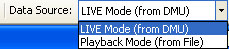

Contents
********

|image0|

|image1|

|image2|

WARNING

This product has been developed by ACEINNA exclusively for commercial
applications. It has not been tested for, and ACEINNA makes no
representation or warranty as to conformance with, any military
specifications or that the product is appropriate for any military
application or end-use. Additionally, any use of this product for
nuclear, chemical, biological weapons, or weapons research, or for any
use in missiles, rockets, and/or UAV’s of 300km or greater range, or any
other activity prohibited by the Export Administration Regulations, is
expressly prohibited without the written consent of ACEINNA and without
obtaining appropriate US export license(s), when required by US law.
Diversion contrary US law is prohibited.

©2018 ACEINNA, Inc. All rights reserved. Information in this document is
subject to change without notice.

ACEINNA, SoftSensor, INS381ZA, AHRS381ZA, VG318ZA, and IMU381ZA are
registered trademarks of ACEINNA, Inc. Other product and trade names are
trademarks or registered trademarks of their respective holders.

**Revision History**

+-------------+-------------+-------------+-------------+-------------+
| **Date**    | **Document  | **Firmware  | **Descripti | **Author**  |
|             | Revision**  | Applicabili | on**        |             |
|             |             | ty**        |             |             |
+-------------+-------------+-------------+-------------+-------------+
| 03/12/2018  | 1.0         | 19.0.0      | Baseline    |             |
|             |             |             | release of  |             |
|             |             |             | IMUx81ZA    |             |
|             |             |             | manual      |             |
+-------------+-------------+-------------+-------------+-------------+
|             |             |             |             |             |
+-------------+-------------+-------------+-------------+-------------+
|             |             |             |             |             |
+-------------+-------------+-------------+-------------+-------------+

**About this Manual**

The following annotations have been used to provide additional
information.

**NOTE**

Note provides additional information about the topic.

☑ **EXAMPLE**

Examples are given throughout the manual to help the reader understand
the terminology.

 **IMPORTANT**

This symbol defines items that have significant meaning to the user

|warning1| **WARNING**

The user should pay particular attention to this symbol. It means there
is a chance that physical harm could happen to either the person or the
equipment.

The following paragraph heading formatting is used in this manual:

**1 Heading 1**

**1.1 Heading 2**

**1.1.1 Heading 3**

Normal

.. |image1| image:: media/image1.png
   :width: 3.21458in
   :height: 3.05278in
.. |image2| image:: media/image20.jpeg
   :width: 0.87495in
   :height: 0.6958in
.. |warning1| image:: media/image2.jpeg
   :width: 0.25208in
   :height: 0.20903in
.. |UnitConnected| image:: media/image4.jpeg
   :width: 0.82639in
   :height: 0.12153in

.. |RecordButton| image:: media/image7.jpeg
   :width: 0.22639in
   :height: 0.13889in
.. |stop-button| image:: media/image8.jpeg
   :width: 0.16528in
   :height: 0.11319in

