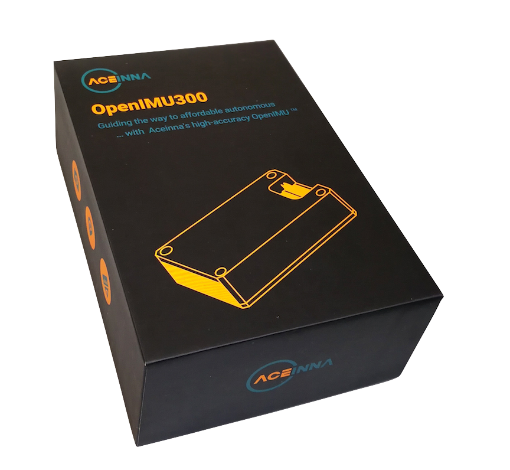

OpenRTK Developer Manual
========================

.. note::

    OpenRTKbox.png to be provided.

OpenRTK is a precisely calibrated open source Inertial Measurement Unit platform.  Users
are able to quickly develop and deploy custom navigation/localization algorithms and custom sensor integrations on top of the OpenRTK platform.  OpenRTK also
has pre-built drivers in Python as well as a developer website - Aceinna Navigation Studio (ANS).  These tools make logging and plotting data, including
custom data structures and packets very simple.

**Social:** `Twitter <https://twitter.com/MEMSsensortech>`_ |
`Medium <https://medium.com/@mikehorton>`_

.. raw:: latex

   \part{About OpenRTK}

.. toctree::
    :caption: About OpenRTK
    :maxdepth: 1
    :hidden:

    intro

.. raw:: latex

   \part{Quick Start}

.. toctree::
    :caption: Quick Start
    :maxdepth: 1
    :hidden:
    :titlesonly:
    
    install
    setup-OpenRTK
    Network
    useOpenRTK

.. raw:: latex

   \part{RTK/IMU Modules}

.. toctree::
    :caption: OpenRTK330 Modules
    :maxdepth: 1
    :hidden:

    OpenRTK330

.. raw:: latex

   \part{Evaluation Kits}

.. toctree::
    :caption: Evaluation Kits
    :maxdepth: 1
    :hidden:

    EVB-OpenRTK330LI

..    EvaluationKits

.. raw:: latex

   \part{Software Development}

.. toctree::
    :caption: Software Development
    :maxdepth: 1
    :hidden:

    software
    algorithms

