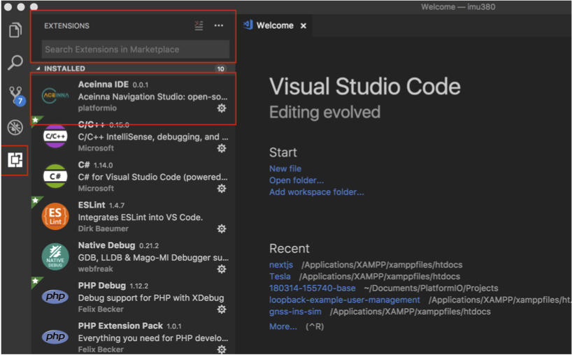
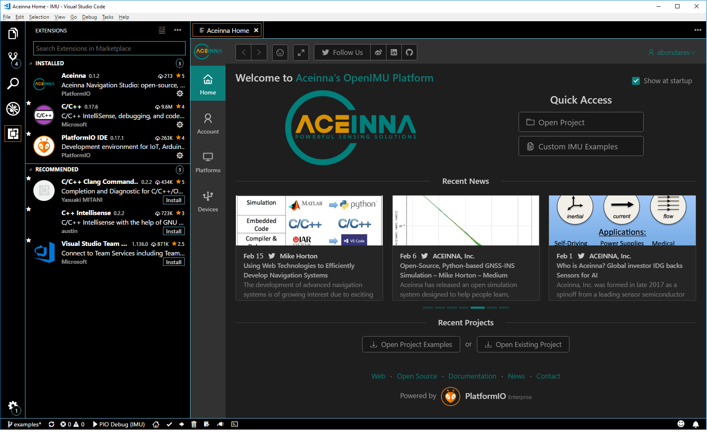
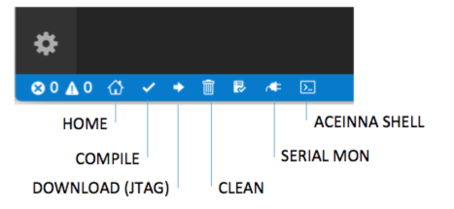

Tools Installation
==================

.. contents:: Contents
    :local:
    

1. Platforms
--------------
 - Windows 10 or 7 PC
 - Ubuntu version 14.0+
 - MAC OS

2. Installation of OpenIMU development environment
--------------------------------------------------
For developing on OpenIMU platform next set of tools needs to installed:

Visual Studio Code - can be downloaded from here: 

https://code.visualstudio.com

ST-LINK V2 driver (Windows only) - can be downloaded from here:  

http://www.st.com/en/development-tools/st-link-v2.html

*ST-LINK drivers are automatically installed for MAC OS.  They must be manually installed for Windows, using link above.
For Ubuntu, please see step 5.
 

3. Installation of OpenIMU development platform
-----------------------------------------------

To install OpenIMU development platform:

1. Start Visual Studio Code.
2. On leftmost toolbar find "Extensions" icon and click on it.
3. In the text box "Search extensions on Marketplace" type "Aceinna" and hit enter
4. Install Aceinna Extension and Follow prompts.

4. First steps
-----------------------------------

After installation of "Aceinna" extension click on "Home" icon at the bottom of the screen. It will bring
up Aceinna OpenIMU platform homepage. Click on "Custom IMU examples", chose desired example and click "Import".

The required example will be imported into working directory in folder:

C:\\Users\\<username>\\Documents\\platformio\\Projects\\ProjectName (Windows)

Now you can edit, build and test the project. All your changes will remain in the above-mentioned directory and subdirectories.
Next time when you return to development - open Aceinna "Home" page and click "Open Project", choose "Projects" and select
required project from the list.

The source tree of imported project has next structure:

:: 

    project directory -|
                       |
                       |---build directory (.pioenvs)
                       |
                       |                                                               libraries
                       |---platform library directory (.piolibdeps)-|                     |
                       |                                            |--library name-|     V
                       |                                                            |---lib1--| 
                       |                                                            |         |--src  
                       |                                                            |         |--include   
                       |                                                            |            
                       |                                                            |            
                       |                                                            |---lib2--|  
                       |                                                            |         |--src  
                       |--include (user include files)                              |         |--include   
                       |                                                             ........            
                       |--lib (optional user library directory) 				   
                       | 				   
                       |--src (user source files) 				   
                       | 				   

5.  Compile and JTAG Code Loading
----------------------------------
Once you have imported an example project, a good first step is to compile and download this application using your ST-LINK.  
At the bottom of the VS Code window is the shortcut toolbar shown below.  To load an application to the OpenIMU with JTAG,
simply click the Install/Download button while the ST-LINK is connected to your EVB.

The OpenIMU development environment uses PlatformIO's powerful open-source builder and IDE.  This on-line manual focuses on 
on OpenIMU specific information, and it does not attempt to fully discuss all of the IDE's powerful features in depth. For more information on PlatformIO builder and IDE features include command line interface, scripting and more please see the 
`PlatformIO  <https://docs.platformio.org>`__

6.  ST-LINK Install for Ubuntu (Manual Version)  
--------------------------------------------------------
Go to https://github.com/texane/stlink and read instructions carefully.

On local Ubuntu machine, you will clone the aforemention repository and make the project.  This requires
the following packages to be installed:

    * CMake > v2.8.7
    * Gcc compiler
    * Libusb v1.0

.. code:: bash

    # Run from source directory stlink/ 
    $make release
    $cd build/Release
    $sudo make install
    
    # Plug ST-LINK/V2 into USB, and check the device is present
    $ls /dev/stlink-v2

    
 

