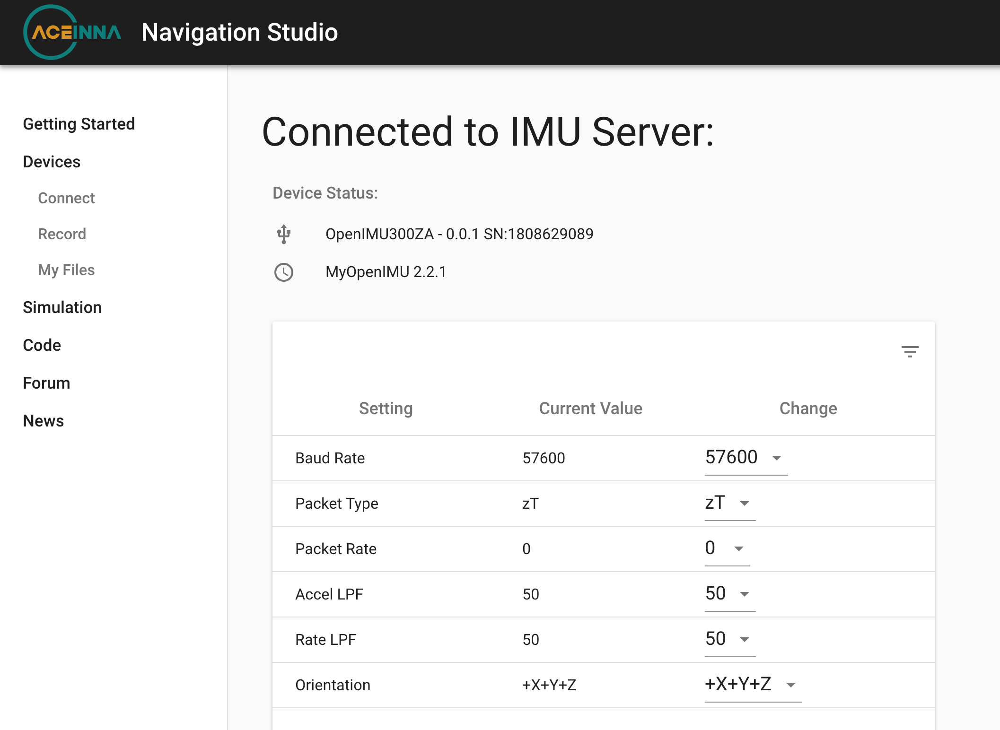
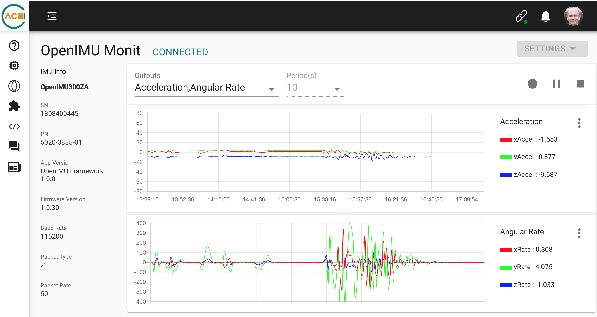
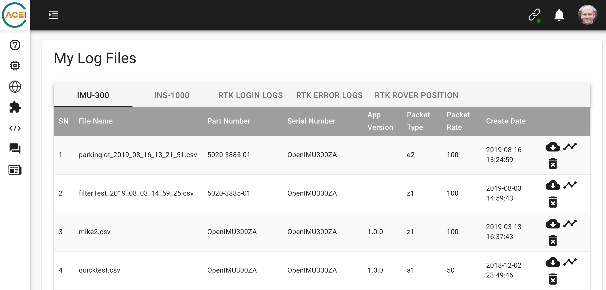

What is Aceinna Navigation Studio?
==================================
.. image:: ../media/ANSHome.png  
   
Aceinna Navigation Studio (https://developers.aceinna.com) is a navigation system developer's website and web-platform.  It consists of a graphical user
interface to control and configure OpenIMU units.  Using a JSON configuration file ("openimu.json"), the graphical user interface can be customized for user specific messaging and settings 
without any additional coding. This aligns the embedded code with both the Python device server and the GUI pages available on ANS (https://developers.aceinna.com).  Additional
site features are being actively developed and will include additional analysis tools such as simulation, as well as a user Forum.

.. contents:: Contents
    :local:

Device configuration
--------------------
Device options (settings) are exposed on the device configuration page.  The baseline OpenIMU firmware provides a set of "standard settings" such as baudrate, output data rate, and more. Custom options are added by adding additional options to "UseConfiguration" in *both*
the OpenIMU embedded C code as well as the the openimu.json file which provides a summary of the descriptions and potential values for the UI.

Graphing
--------
Use the record page to plot live data.  Use the log switch to save this data (*Requires Login*).  Data is saved *both* locally and then backed up to the cloud for later retrieval.

File Retrieval
--------------
Logged files are retrieved on the My Files page which opens up a zoomable graph view.
*Requires Login*  

