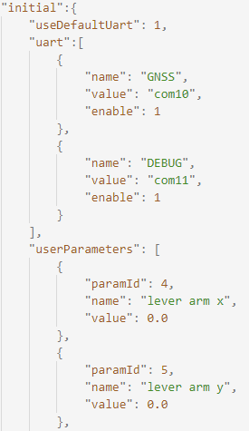
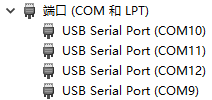
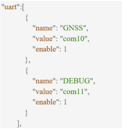
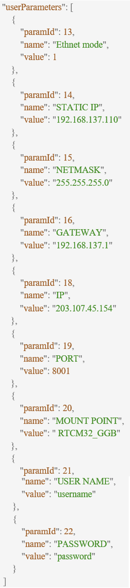

User Port
~~~~~~~~~

- **Pin**: USER_UART_RX(#55), USER_UART_TX(#56)
- **Default configuration**
 
 - Baud tare: 460800 b/s
 - Stop bit: 1
 - Data bits: 8
 - Check Digit: None
 
- **Data format**: ACEINNA format, NMEA format
- **The main function**

 - Obtain module information: hardware version number, software version number;
 - Obtain and configure module user parameters;
 - Send data packets: IMU raw data, positioning data, satellite data;
 - Send NMEA format data;

- **Function details**
 The following takes configuration parameters as an example to introduce how to use the ACEINNA format:

 1) Send the "gA" command to the module to obtain all current user parameters:
  **gA command**: [0x55, 0x55, 0x67, 0x41, 0, 0x31, 0x0A]
 2) Use the "uP" command to modify the  parameters:
  **uP command**: [0x55, 0x55, 0x75, 0x50, data length, parameter number, parameter value, CRC_L, CRC_H]
  
  For example: configure the three parameters of leverArmBx, leverArmBy, leverArmBz to
  [0.5, -0.5, 1] ​​(unit m), you need to send the "uP" command three times, and the setting result will 
  be returned each time. After the last setting result is returned, send again Set the command next time.
  
  - **Configure leverArmBx**: [0x55, 0x55, 0x75, 0x50, 0x08, 0x04, 0, 0, 0, 0, 0, 0, 0x3F, 0x1D, 0x32]
  - **Configure leverArmBy**: [0x55, 0x55, 0x75, 0x50, 0x08, 0x05, 0, 0, 0, 0, 0, 0, 0xBF, 0xCB, 0x69]
  - **Configure leverArmBz**: [0x55, 0x55, 0x75, 0x50, 0x08, 0x06, 0, 0, 0, 0, 0, 0x80, 0x3F, 0x89, 0x0C]

 3) Use the "sC" command to save the parameter value:
  **sC command**: [0x55, 0x55, 0x73, 0x43, 0, 0xC8, 0xCB]

Special Note
""""""""""""

The user serial port is the serial port connected by the python driver. If the user needs to enable the 
data log function or automatically configure user parameters when the python driver is started, first 
configure the "initial" field in openrtk.json as shown in Figure above.

**Use OpenRTK/OpenIMU python driver operation**

1) Set the log serial port

When the python driver is started with the "-r" suffix, the log function will be enabled and the data of 
the three serial ports of USER, GNSS and DEBUG will be recorded at the same time. The USER serial port 
number can be automatically identified by the python driver, but GNSS and DEBUG cannot. The user must 
set these two serial port numbers.

*Case 1*: The GNSS/DEBUG of OpenRTK330 EVK is the USER serial port number plus 1 and 2 respectively. 
Just configure the "useDefaultUart" field to 1, and the "uart" field does not work at this time.

*Case 2*: If the user needs to specify the GNSS/DEBUG serial port number, or does not use the GNSS/DEBUG 
serial port (the user has not made a hardware connection), the "useDefaultUart" needs to be configured 
to 0, and the "uart" field is valid at this time, the GNSS/DEBUG When "enable" is 1, it means to use 
this serial port. When not in use, configure it to 0. "Value" should be the serial port name of the 
serial port in the system. For example: under windos, open the device manager, as shown in Figure above, 
find the connected GNSS and DEBUG serial numbers are COM10 and COM11 respectively, the configuration 
should be as follows:

2) Setting parameters

When starting the python driver with the "-s" suffix, the "userParameters" parameters can be automatically 
configured to the OpenRTK device and saved after power off. Find "userParameters" as shown in Figure 2, 
and configure fields for user parameters. All configurable fields are in "userConfiguration", except for 
"Data CRC" and "Data Size" whose paramId is 0 or 1 are not configurable, the others can be added to 
"userParameters". Among them, "paramId" and "value" are mandatory fields, the value of paramId must be 
consistent with that in "userConfiguration", and the type of value must be consistent with "type".

For example: to configure Ethernet and NTRIP services, the following configuration is required, where the 
Ethnet mode value is 1 to use static IP mode, and the value is 0 to use DHCP mode.

