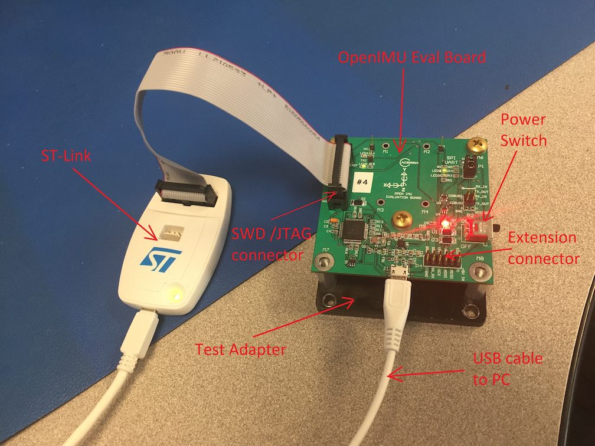

Quick Start
===================

.. contents:: Contents
    :local:

OpenRTK330LI EVK Introduction
~~~~~~~~~~~~~~~~~~~~~~~~~~~~~~~

The OpenRTK330LI Evalution Kit (EVK) is designed to evaluate the OpenRTK330LI module with the  online Aceinna Navigation Studio (ANS) and related software stack. A full set of OpenRTK330 EVK is shown below after you unpack the product box. 

where

  * 1: ST-Link debugger
  * 2: Multi-frequency GNSS antenna
  * 3: Micro-USB cable
  * 4: OpenRTK330 Evaluation Board (EVB) with metal flat mounting board
  * 5: 12-V DC adapter with 5.5 x 2.1 mm power jack

The picture below shows the detailed overview of OpenRTK330 EVB

  .. figure:: media/EvalBoard.png
      :width: 6.0in
      :height: 6.0in

where some of the parts are listed here

  * 1: OpenRTK330 GNSS/IMU integrated module
  * 2: GNSS antenna SMA interface
  * 3: Espressif ESP32 bluetooth module
  * 4: SWD/JTAG connector, 20-pin
  * 7: Boot mode swtich, with two positions (A, B) to select from
  * 8: RJ45 jack for Ethernet connection
  * 9: Micro-USB port
  * 10: 9-pin CAN interface
  * 12: EVB working status LEDs, yellow, red, and green LED from left to right

.. The ESP32 bluetooth module on the OpenRTK330 EVB has been programmed and configured to provide bluetooth wireless connectivity, and user do not have to get hands on it.

.. The OpenRTK330 EVK is all set as a high precision GNSS/INS positioning platform before shipping out, you could skip the following firmware installation/update process and directly go to learn `How to Use OpenRTK330 EVK <https://openrtk.readthedocs.io/en/latest/useOpenRTK.html>`_. Otherwise, if you want to update the module with the latest firmware, follow the instructions below carefully.

.. The OpenRTK Python driver
.. ~~~~~~~~~~~~~~~~~~~~~~~~~~~

.. The OpenRTK Python driver is an open source Python 

Quick Setup and Usage
~~~~~~~~~~~~~~~~~~~~~~~

Prerequisites
^^^^^^^^^^^^^^^^^^^

**Hardware**

  * OpenRTK330LI EVK 
  * Ethernet cable (must have, not included in the EVK)
  * Ethernet router/network switch (optional, not included in the EVK)

**Software**

  * The online Aceinna Navigation Studio (`ANS <https://developers.aceinna.com/devices/rtk>`_) deverloper website, manily for

    * OpenRTK devices management and technical forum and support
    * Web-based Graphical User Interface (GUI)
    * App center for online firmware upgrade

  * The OpenRTK Python driver: Python based program runs on a PC, click `here <https://github.com/Aceinna/python-openimu/releases/>`_ to download the latest version of executables

    * Send/Receive data from ANS to enable Web GUI and online firmware upgrade for OpenRTK330LI device
    * Log and parse OpenRTK330LI output data, positioning solution and other debug information to binary and text files

Usage Steps
^^^^^^^^^^^^^^^^^

1. **Power and data link**: connect the EVB with a PC using a Micro-USB cable, and the **YELLOW** LED (#12 on the EVB figure above) flashes. The EVB is powered on, and four serial com ports are established on the PC. 

2. **Antenna**: connect a GNSS multi-frequency antenna to the SMA interface (#2 on the EVB figure), the **GREEN** LED (#12 on the EVB figure above) flashes if the incoming GNSS signal is valid

3. **Network**: Plug in an Ethernet calbe to the RJ45 port on the EVB, then there are two approaches to get access to OpenRKT330LI's internal embedded web interface from the PC, and also get the EVB access to internet:

  * Get a network router or switch, and connect the EVB and the PC to the same router/switch using Ethernet cables. The OpenRTK330LI EVB gets internet access and assigned an IP address in the local network via DHCP.
  * The other way is to connect the EVB and the PC directly, which requires network sharing between the PC and the EVB. For example, with a Windows 10 PC, 

    * Go to Control Panel\Network and Internet\Network Connections, an Ethernet subnetwork is established for the Ethernet connection between the EVB and the PC, e.g. “Ethernet 2” as shown below. 
    
      .. figure:: media/network_connections.png
        :width: 6.5in
        :height: 3.0in
    
    * Right-click “Ethernet 2”, and then click “Properties”, on the “Networking” tab, click “Internet Protocol Version 4 (TCP/IPv4)”, configure the IP settings as follows: the gateway has to be 192.168.137.1, and the subnet mask has to be 255.255.255.0, while the IP address can be assigned to one that has not been taken in the network 192.168.137.xx.

        .. figure:: media/network_setting_eth.png
          :width: 6.0in
          :height: 3.5in

    * Then, right-click WLAN (assuming the PC uses WiFi for internet access), go to Properties->Sharing, check the “Allow other network users to connect through this computer’s internet connection”, and select “Ethernet 2” on the drop down menu below, click “OK” to enable the EVB to have access to internet shared by the PC. 

        .. image:: media/network_sharing.png
            :align: center
            :scale: 50%

4. **RTK and INS Configuration**: open a browser (Chrome is recommended), visit http://openrtk, on the left side menu bar, 

  * click "NTRIP Setting" tab to configure NTRIP server information for RTK operation

        .. image:: media/ntrip_config.png
                :align: center
                :scale: 50%

  * click "User Configuration" tab to configure INS related parameters, such as lever arm and so on

        .. image:: media/usercfg.png
              :align: center
              :scale: 50%

5. **Firmware Version Check**: unzip the previously downloaded Python driver executables (v2.1.6 and later), and run the driver executable on a command line, for example:

  .. code-block:: python

          cd c:\pythondriver-win
          .\ans-devices.exe

  Check the console output like below, make sure the RTK_INS App version is v2.0.0 and later. Otherwise, follow `these steps <https://openrtk.readthedocs.io/en/latest/firmware_upgrade.html>`_ to upgrade the device's firmware first

         .. image:: media/python_driver_connects.png
              :align: center
              :scale: 50%

6. **Live Web GUI**: when the Python driver is running and connects with the device correctly, 

  * Go to online ANS (deverlopers.aceinna.com), on the left side menu bar, click "Devices"->"OpenRTK", then we will have the "OpenRTK Monitor" webpage as shown below, and the center "Play" button is highlighted indicating correct device connection with the Web GUI, 

        .. image:: media/web_gui_connect.png
              :align: center
              :scale: 50%
  
  * Click "Play", you will have a live web GUI showing positioning information, map presentation and other satellites information

      .. image:: media/web_gui_play.png
              :align: center
              :scale: 50%

7. **Data Logging and Parsing**: every time the Python driver is running, the Python driver is logging all raw data, positioning solution and debug information output from the device, and create a subfolder contains all the binary file logs in the same folder as the Python driver executable

      .. image:: media/python_driver_logging.png
              :align: center
              :scale: 50%

  Navigate to the "openrtk_data_parse" subfolder, run the parser executable as below

    .. code-block:: python

          cd c:\pythondriver-win\openrtk_data_parse
          .\openrtk_parse.exe -p ..\data\openrtk_log_20200828_153600

  Then, the logged binary files are decoded into text files for post-processing analysis.

Note
~~~~~~~

This section presents a brief introduction and quick start on using OpenRTK330LI EVK for RTK and INS positioning. Please refer to the remaining sections of this tutorial chapter for more detailed descriptions on the EVK's features and usage.

  