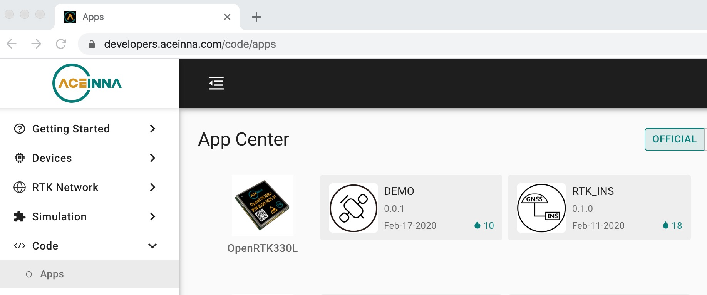
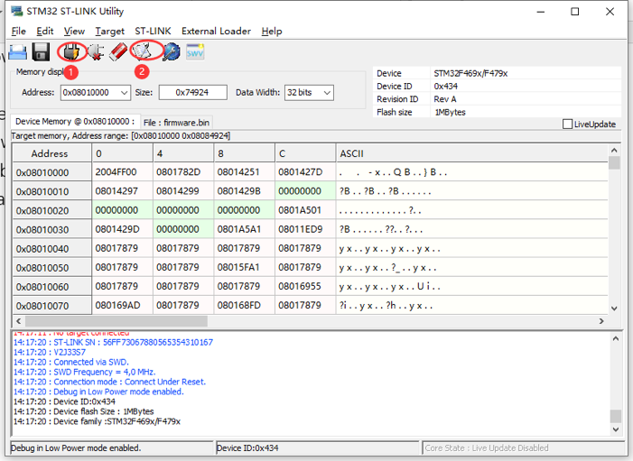
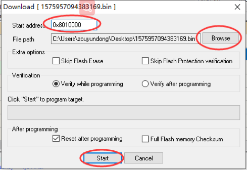

OpenRTK330 Evaluation Kit Setup
=================================
.. contents:: Contents
    :local:

Please refer to the figure below for setting up the OpenRTK330 Evaluation Kit (EVK) with the following steps

.. figure:: media/EvalKit.png
    :width: 6.0in
    :height: 6.0in

<<<<<<< HEAD
    **OpenRTK330 Evaluation Kit**

To set up OpenRTK330 evaluation kit for development you'll need to perform flowing steps:

 1. Unpack OpenRTK330 evaluation kit.
 2. Connect OpenRTK330 evaluation board to the PC via USB cable. USB connection provides power to the test setup as well as connectivity between PC and EVK serial ports.
 3. Connect ST-Link debugger to the PC via USB cable.
 4. Connect OpenRTK330 evaluation board to ST-Link debugger using provided 20-pin flat cable.
 5. Connect satellite antenna.
=======
*  Unpack the OpenRTK330 EVK, you will find the following items

    * OpenRTK330 Evaluation Board (EVB)
    * ST-Link Debugger
    * Micro USB cable
    * Mounting plate
* Connect the micro USB port on the OpenRTK330 EVB to a PC via a USB cable, four serial ports will be established on your PC, and the EVB is also powered up by this USB connection. In addition, the EVB can also be powered up directly by a 9-12v DC adapter/generator. In this case, the USB connection is just a data link. The red LED is always on if powered up.
* Connect the ST-Link debugger to a PC's USB port.
* Connect the other end of the ST-Link debugger to the SWD/JGAG pin connector on OpenRTK330 EVB.
* Connect the SMA female connector with a satellite antenna (OpenRTK330 can power on the antenna if passive, otherwise use a DC blocker)
* Download the OpenRTK330 firmware from Aceinna's developer website https://developers.aceinna.com/code/apps, as shown by

* Download and install the STM32 ST-LINK Utility software from https://www.st.com/en/development-tools/stsw-link004.html
* Open the STM32 ST-LINK Utility software, and click the red circled "1" to establish a connection with the OpenRTK EVB

* Click the red circled "2" to open the firmware flashing dialog, change the start address to "0x8010000", and browse to load the downloaded OpenRTK330 firmware bin file, then click "Start"

At this point, the OpenRTK330 firmware is loaded and ready for GNSS RTK positioning that also requires internet connection to a NTRIP server for GNSS data correction. By default, the ESP32 module on the OpenRTK330 EVB has been programmed and configured to have Bluetooth wireless connectivity, and then connects with Aceinna's OpenRTK Android App for internet connectivity (see next section). Alternatively, the following step can be performed to get internet connectivity

*   (optional) Connect the EVB (RJ45 connector) with a network router/gateway with an Ethernet cable, the usage of this connection will also be addressed in next section
>>>>>>> b7d8ef41578be04f2eb4ba0e80cc3d48b7a3d842

