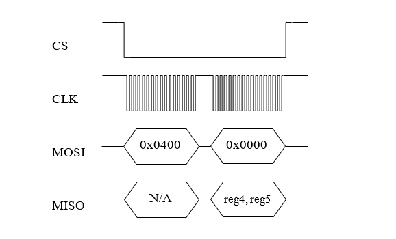
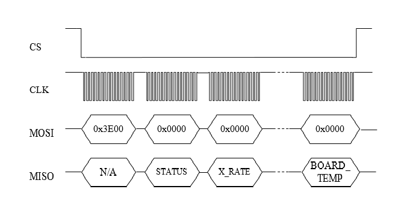
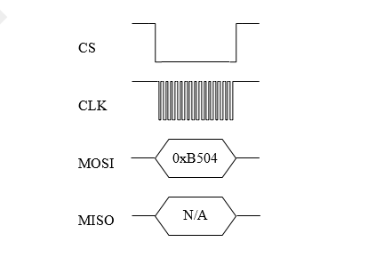
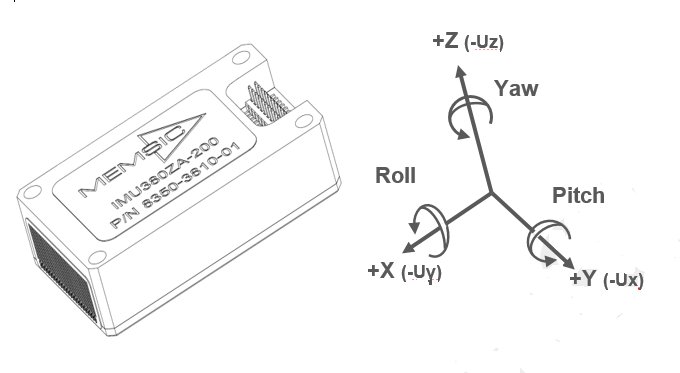

OpenIMU SPI Messaging Framework
================================

.. contents:: Contents
    :local:

**1. Introduction**

    OpenIMU supports a SPI interface for data communications as a one of the choices. To enforce SPI interface mode 'Data Ready' signal needs to be forced HIGH of left unconnected on system startup. OpenIMU SPI interface signals described :doc:`here <../300ZI/pinout>`.
	
    OpenIMU operates as a slave device. 
    
    The master device must be configured to communicate with the OpenIMU using the following settings:
    
    •   Data transferred in 16-bit word-length and MSB-first
    
    •   fCLK ≤ 2.0 MHz
    
    •   CPOL = 1 (clock polarity) and CPHA = 1 (clock phase)
    
**2. OpenIMU SPI communication model**

    OpenIMU has 128 8-bit registers accessible via SPI interface for reading and writing. 
    The usage of these registers is completely user-defined in time of FW development.
    Access to the few registers is implemented in the examples as a reference:

	Table 1. SPI registers used in the examples
	
    +---------------------+----------------+-----------------+------------------+
    | **Register Number** | **Access Type**|  **Function**   | **Notes**        |
    |                     |                |                 |                  |
    +---------------------+----------------+-----------------+------------------+
    | 82,83,84,88,89 (0x52|    r           |  Unit serial    | BCD format       |
    | 0x53,0x54,0x58,0x59)|                |    number       |                  |
    +---------------------+----------------+-----------------+------------------+
    | 86, 87 (0x56, 0x57) |    r           |  Product ID     | BCD format       |
    |                     |                |                 |                  |
    |                     |                |                 |3000 - OpenIMU300 |
    |                     |                |                 |                  |
    |                     |                |                 |3300 - OpenIMU330 |
    +---------------------+----------------+-----------------+------------------+
    | 116 (0x74)          |    r/w         | Unit Orientation| p. 6             |
    |                     |                |       MSB       |                  |
    +---------------------+----------------+-----------------+------------------+
    | 117 (0x75)          |    r/w         | Unit Orientation| p. 6             |
    |                     |                |       LSB       |                  |
    +---------------------+----------------+-----------------+------------------+
    | 56   (0x38)         |    r/w         | LPF Filter Type | p. 7             |
    |                     |                | For Accel       |                  |
    +---------------------+----------------+-----------------+------------------+
    | 57   (0x39)         |    r/w         | LPF Filter Type | p. 7             |
    |                     |                | For Rate Sensors|                  |
    +---------------------+----------------+-----------------+------------------+
    | 62   (0x3E)         |    r           | Sensors Data    | p. 4             |
    |                     |                | Request         |                  |
    +---------------------+----------------+-----------------+------------------+

**3. OpenIMU SPI Register Read Methodology**

SPI master initiates a register read (for example register 0x04) by clocking in the address 
followed by 0x00, i.e. 0x0400, via MOSI. This combination is referred to as a read-command. 
It is followed by 16 zero-bits to complete the SPI data-transfer cycle.
As the master transmits the read command over MOSI, the OpenIMU transmits information back over MISO.

In this transmission, the first data-word sent by the OpenIMU (as the read-command is sent) consists 
of 16-bits of non-applicable data. The subsequent 16-bit message contains information stored inside two consecutive registers (in this case registers 4 (MSB) and 5(LSB)).

**Next figure illustrates register read over SPI interface:**

   
**4. OpenIMU SPI Block Mode Read Methodology**

User can implement reading blocks of data with arbitrary length and information. Specific dedicated register address will indicate request specific block of data.

For example, register address 0x3e (62) indicates request for reading data block containing current data from unit sensors.  Next table lists corresponding parameters:

	Table 2. Block mode message format
	
    +---------------------+-----------------+-----------------------+
    | **Parameter Numer** | **Size (bytes)**|  **Desctiption**      |
    |                     |                 |                       |
    +---------------------+-----------------+-----------------------+
    | Status              |    2            | Unit Status           |
    |                     |                 |                       |
    +---------------------+-----------------+-----------------------+
    | X_Rate              |    2            | Rate Sensor output (X)|
    |                     |                 | (200LSB/deg/s)        |
    +---------------------+-----------------+-----------------------+
    | Y_Rate              |    2            | Rate Sensor output (Y)|
    |                     |                 | (200LSB/deg/s)        |
    +---------------------+-----------------+-----------------------+
    | Z_Rate              |    2            | Rate Sensor output (Z)|
    |                     |                 | (200LSB/deg/s)        |
    +---------------------+-----------------+-----------------------+
    | X_Accel             |    2            | Accel Sensor output(X)|
    |                     |                 | (4000LSB/G)           |
    +---------------------+-----------------+-----------------------+
    | Y_Accel             |    2            | Accel Sensor output(Y)|
    |                     |                 | (4000LSB/G)           |
    +---------------------+-----------------+-----------------------+
    | Z_Accel             |    2            | Accel Sensor output(Z)|
    |                     |                 | (4000LSB/G)           |
    +---------------------+-----------------+-----------------------+
    
Read of data block begins when the master requests a read from specific register address (i.e. 0x3E).  
Next figure illustrates the read sequence:

  
Note: Number of SPI clock pulses should be exactly equal to the length of predefined data packet (in this case – 144 (16 for address 128 for data)) otherwise interface may go out of sync. 
    
**5. OpenIMU SPI Register Write Methodology**

The SPI master device can perform write into any register. The unit reaction on write operation is completely defined by the user. By default, corresponding data written without any reaction from unit. Written data can be read back.
Unlike reads, writes are performed one byte at a time. 

The following example highlights how write-commands are formed:

•   Select the write address of the desired register, for example 0x35
•   Change the most-significant bit of the register address to 1 (the write-bit), e.g. 0x35 becomes 0xB5
•   Create the write command by appending the write-bit/address combination with the value to be written to the register (for example 0x04) - 0xB504 

Next figure illustrates the register write over SPI:

**6. OpenIMU Orientation programming**

OpenIMU Orientation can be changed dynamically by writing corresponding values into the SPI registers 0x74 (MSB) and 0x75 (LSB). Data into register 0x74 should be written first. 
There are 24 possible orientation configurations (see below). Setting/Writing the field to anything else has no effect.

     Table 3. OpenIMU Orientation field values

    +----------+-------+-----+------+
    | Registers|   X   |  Y  | Z    |
    | 0x74/0x75|       |     |      |
    +----------+-------+-----+------+
    | 0x0000   |   +Ux | +Uy | +Uz  |
    |          |       |     |      |
    +----------+-------+-----+------+
    | 0x0009   |   -Ux | -Uy | +Uz  |
    |          |       |     |      |
    +----------+-------+-----+------+
    | 0x0023   |   -Uy | +Ux | +Uz  |
    |          |       |     |      |
    +----------+-------+-----+------+
    | 0x002A   |   +Uy | -Ux | +Uz  |
    |          |       |     |      |
    +----------+-------+-----+------+
    | 0x0048   |   +Ux | -Uy | -Uz  |
    |          |       |     |      |
    +----------+-------+-----+------+
    | 0x0062   |   +Uy | +Ux | -Uz  |
    |          |       |     |      |
    +----------+-------+-----+------+
    | 0x006B   |   -Uy | -Ux | -Uz  |
    |          |       |     |      |
    +----------+-------+-----+------+
    | 0x0085   |   -Uz | +Uy | +Ux  |
    |          |       |     |      |
    +----------+-------+-----+------+
    | 0x008C   |   +Uz | -Uy | +Ux  |
    |          |       |     |      |
    +----------+-------+-----+------+
    | 0x0092   |   +Uy | +Uz | +Ux  | 
    |          |       |     |      |
    +----------+-------+-----+------+
    | 0x009B   |   -Uy | -Uz | +Ux  | 
    |          |       |     |      |
    +----------+-------+-----+------+
    | 0x0041   |   -Ux | +Uy | -Uz  |
    |          |       |     |      |
    +----------+-------+-----+------+
    | 0x00C4   |   +Uz | +Uy | -Ux  | 
    |          |       |     |      |
    +----------+-------+-----+------+
    | 0x00CD   |   -Uz | -Uy | -Ux  | 
    |          |       |     |      |
    +----------+-------+-----+------+
    | 0x00D3   |   -Uy | +Uz | -Ux  |
    |          |       |     |      |
    +----------+-------+-----+------+
    | 0x00DA   |   +Uy | -Uz | -Ux  |
    |          |       |     |      |
    +----------+-------+-----+------+
    | 0x0111   |   -Ux | +Uz | +Uy  |
    |          |       |     |      |
    +----------+-------+-----+------+
    | 0x0118   |   +Ux | -Uz | +Uy  |
    |          |       |     |      |
    +----------+-------+-----+------+
    | 0x0124   |   +Uz | +Ux | +Uy  |
    |          |       |     |      |
    +----------+-------+-----+------+
    | 0x012D   |   -Uz | -Ux | +Uy  |
    |          |       |     |      |
    +----------+-------+-----+------+
    | 0x0150   |   +Ux | +Uz | -Uy  |
    |          |       |     |      |
    +----------+-------+-----+------+
    | 0x0159   |   -Ux | -Uz | -Uy  |
    |          |       |     |      |
    +----------+-------+-----+------+
    | 0x0165   |   -Uz | +Ux | -Uy  |
    |          |       |     |      |
    +----------+-------+-----+------+
    | 0x016C   |   +Uz | -Ux | -Uy  |
    |          |       |     |      |
    +----------+-------+-----+------+

The default factory axis setting for the OpenIMU300ZI for SPI interface is (-Uy, -Ux, -Uz) which defines the connector pointing in the +Z direction and the +X direction going from the connector through the serial number label at the end of the unit. The user axis set (X, Y, Z) as defined by this field setting is depicted in figure below:

**7. OpenIMU Digital Low Pass Filter selection**

OpenIMU low pass filters can be changed dynamically for accelerometers and rate sensors writing corresponding values into the SPI registers 0x38 (for accelerometers) and 0x39 (for rate sensors).
There are 7 possible low pass filter options (see below). Setting/Writing the field to anything else has no effect.

     Table 4. OpenIMU Digital filter choices

    +-------------+--------------------+--------------+
    || Value      | Cutoff Frequency   | Filter Type  |     
    || Hex (dec)  |                    |              |
    +-------------+--------------------+--------------+
    | 0x00 (0)    | N/A                | Unfiltered   |
    |             |                    |              |
    +-------------+--------------------+--------------+
    | 0x30 (48)   | 50 Hz              | Butterworth  |
    |             |                    |              |
    +-------------+--------------------+--------------+
    | 0x90 (144)  | 40 Hz              | Butterworth  |
    |             |                    |              |
    +-------------+--------------------+--------------+
    | 0x80 (128)  | 25 Hz              | Butterworth  |
    |             |                    |              |
    +-------------+--------------------+--------------+
    | 0x40 (64)   | 20 Hz              | Butterworth  |
    |             |                    |              |
    +-------------+--------------------+--------------+
    | 0x50 (80)   | 10 Hz              | Butterworth  |
    |             |                    |              |
    +-------------+--------------------+--------------+
    | 0x60 (96)   | 5 Hz  (default)    | Butterworth  |
    |             |                    |              |
    +-------------+--------------------+--------------+
