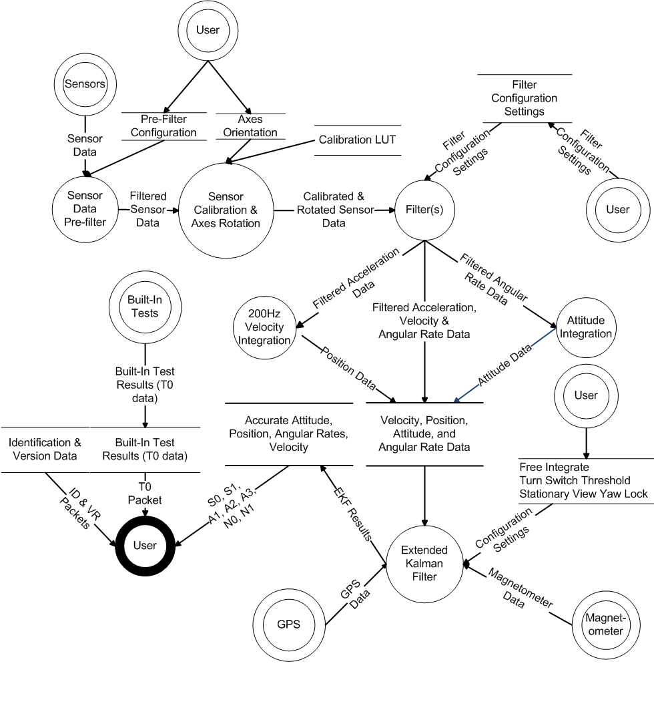

Software DataFlow
==================

.. contents:: Contents
    :local:

.. toctree::
    :maxdepth: 2

The OpenIMU software data flow is depicted in the following diagram.
    * Input, Software Component, and Output Icons
		* The double circle icons denote inputs
		* The single circle icons denote software components
		* The thick single circle icons denote outputs
    * Data Store Icon
		* The double horizontal line icons denote data stores
    * Data Flow Icon
		* The arrows that end at a data store or output are writen by a software component
		* The arrows that end at a software component denote data that is read by that 
		  software component from an input or data store

    **Software Data Flow Diagram**

