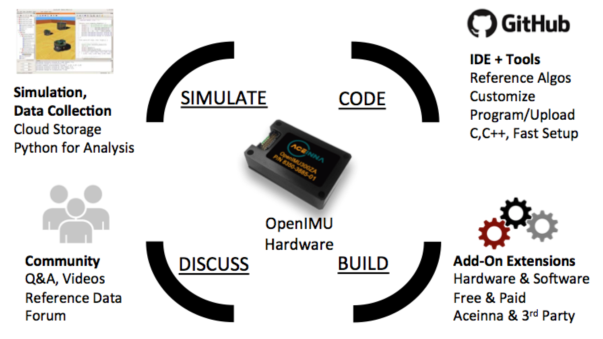

Development Tools
=================

The OpenIMU development environment consists of the following main components:

*   Acienna Navigation Studio (ANS)
*   Visual Studio Code IDE (VSCode)
*   Debugging using the PlatformIO Debugger and the JTAG Debug Adapter
*   OpenIMU300ZI Evaluation Kit
*   OpenIMU300RI Evaluation Kit
*   OpenIMU330BI Evaluation Kit
*   In System Firmware Update
*   Python Interface
*   'openimu.json' Configuration File

.. toctree::
    :maxdepth: 1
    :hidden:

    tools/ans
    tools/vscode
    tools/debug
    tools/evb
    tools/evb_300RI
    tools/isp
    tools/python
    tools/imujson

The easy way to get stared quickly is to purchase an OpenIMU Developer's Kit from Aceinna https://www.aceinna.com or a local distributor.
The developer's kit includes an OpenIMU300EZ inertial measurement unit, JTAG Pod, Eval board, and precision test fixture.
The precision test fixture makes it easy to properly align and install the IMU in a target vehicle for integration testing.
