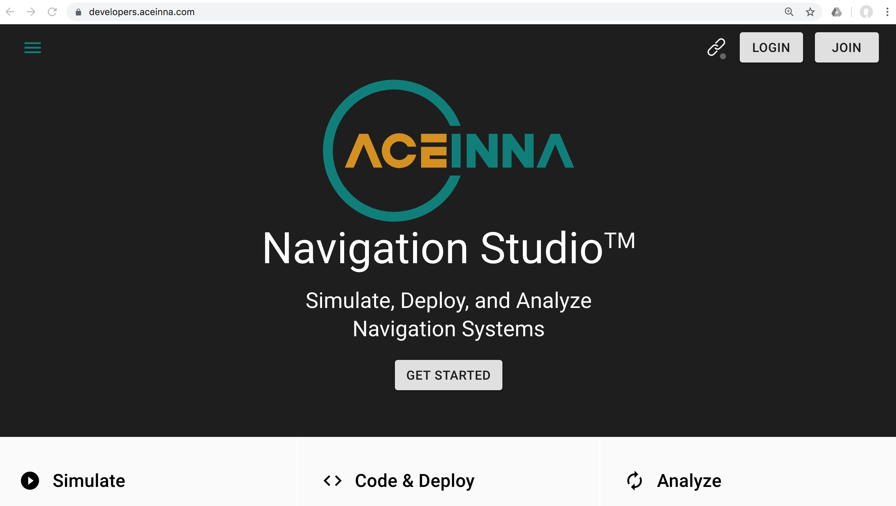

Aceinna Navigation Studio 
=========================

Aceinna Navigation Studio is a web-portal and UI for your OpenIMU.  To run it, first ensure the Python OpenIMU driver is installed, then 
start the server form the command line interface as shown below.

.. code:: python

    $openimu
    Connected ....OpenIMU300ZI - 0.0.1      SN:1808629112

Supported browsers are Chrome, Opera, and Edge.  Firefox also works but requires an extra step described here. https://stackoverflow.com/questions/11768221/firefox-websocket-security-issue 

To plot data go to the link https://developers.aceinna.com/devices/record-next and click play. You can also log from this GUI.

The settings as well as available packet types that show up in ANS graphical user interface are controlled by *openimu.json* and their corresponding code in *userConfiguration.c*.  Select the
packet that you would like to display.

Once a file is logged you can retrieve the file at https://developers.aceinna.com/devices/files 

.. note::

    Your data file list is only shown to you and is tied to your login credentials.  The file list is not available to other users.

.. contents:: Contents
    :local:

