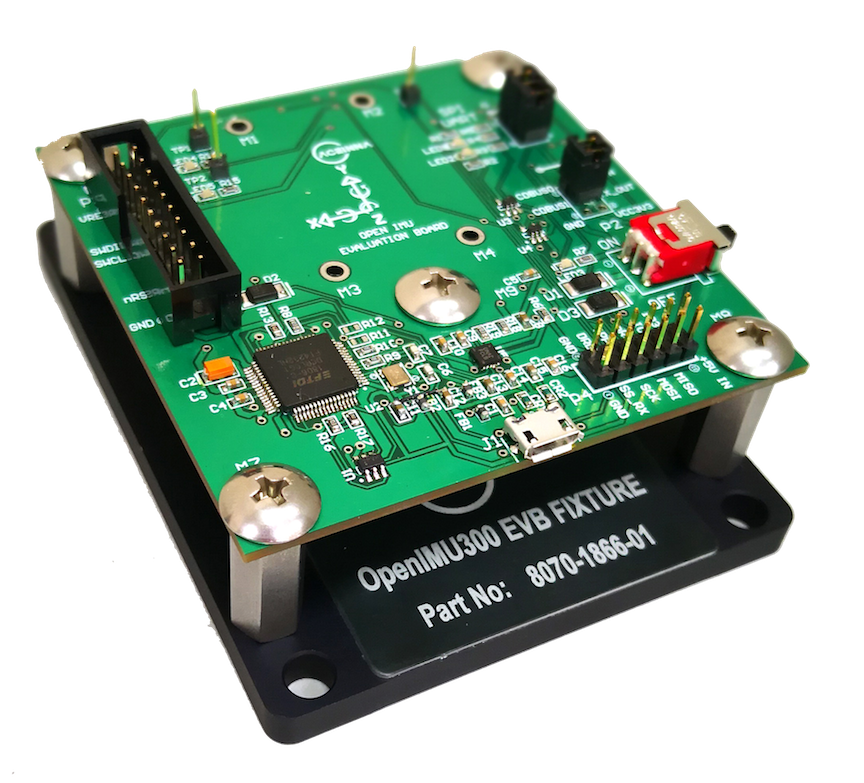
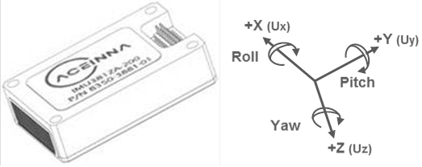

OpenIMU Eval Board
==================

The OpenIMU300EVB interfaces to the main connector of the OpenIMU300EZ.  The EVB and IMU module are mounted together to a precision fixture to assist in testing.  The OpenIMU300EVB uses an 
FTDI 4-port Serial-to-USB converter to allow you to communicate with the OpenIMU300's serial ports and a laptop computer.  There are also 
jumper connections to use to connect to the device's primary SPI port. Use the JTAG interface to directly download compiled code to the device
quickly.

OpenIMU  Default Coordinate System
-----------------------------------------

The OpenIMU  default coordinate systems is shown below.  By defualt a configuration setting is provided
to control the coordinate system.  These configurable elements are known as **Configuration Parameters**.

|image8| 

.. contents:: Contents
    :local:

