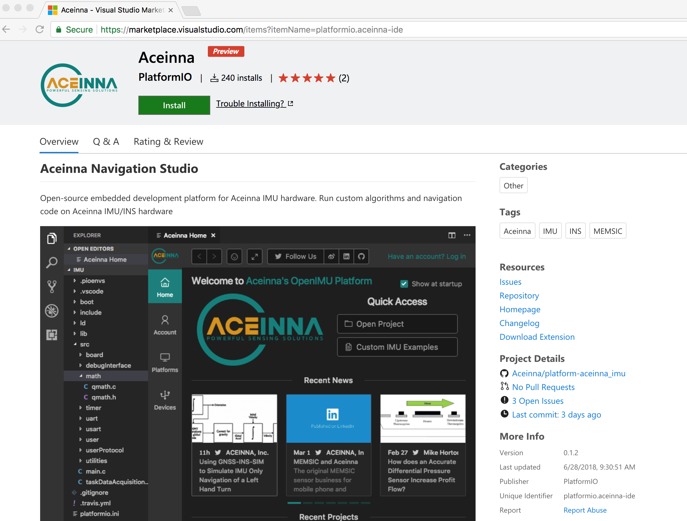

Visual Studio Code IDE
======================

At the heart of the OpenIMU IDE is a custom extension built for Visual Studio Code.  The installation of this extension is detailed in Quick Start.
Aceinna's OpenIMU extension is a custom version of the popular open-source embedded development extension PlatformIO. PlatformIO provides many additional features
including an extensive set of command line tools which are are not documented on this site. Please visit https://docs.platformio.org for more details.

The Aceinna Visual Studio extension adds an easy to find home button at the bottom of the Visual Studio tool bar.  This is shown below.  Click the home button
any time to return to the launch screen for embedded OpenIMU development within Visual Studio Code. 

The Aceinna Visual Studio extension also automatically installs additional supporting tools.  Importantly if your local system does not already have Python,
the extension will install Python which enables a large number of features on the platform including serial drivers and a small server which can connect your IMU to 
the Aceinna Navigation Studio developer's site for charting, graphing, and configuration.

The basic functions such as compile, clean, and upload code to device are also easily accessed from the tool bar at the bottom of 
the VSCode extension.

.. note::

    Do not install the PlatformIO extension.  Instead install the Aceinna extension.  This will install all the PlatformIO tools automatically, as well as the IMU source 
    code and Python drivers.

.. contents:: Contents
    :local:

