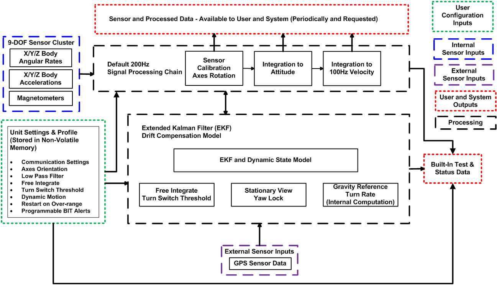

CAN J1939 Example Application
*******************************

.. contents:: Contents
    :local:

The CAN J1939 Example Application provides the framework for custom applications
for the OpenIMU300RI unit.  The example can be used as is or customized to suit
system requirements.  The Software Block Diagram below depicts the connections between the application
inputs, software processing components and application outputs.  The following pages provide:

*   Basic Information about the CAN interface as implemented in the example application
*   Details of the CAN J1939 Example Application.
*   CAN J1939 Example Application CAN Messages

    *Software Block Diagram*

.. toctree::
    :maxdepth: 1
    :hidden:

    ./CAN_J1939_CAN_InterfaceBasicInformation
    ./CAN_J1939_ApplicationDetails
    ./CAN_J1939_CAN_Messages
