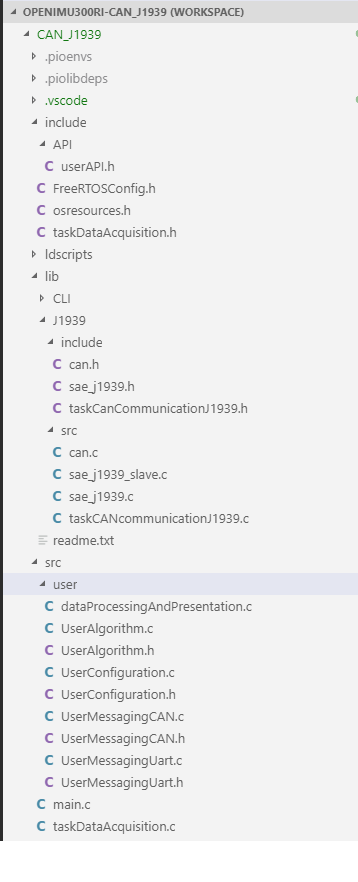

CAN J1939 Example Application Details
*************************************

.. contents:: Contents
    :local:

VSCode project for the J1939 CAN Example Application
---------------------------------------------------------------

The *can_j1939* project is the VSCode project for the J1939 CAN Example Application as shown in the directory tree diagram:

    *'can_j1939' Example Application Directory Tree*

Important Source Files and their functionality
----------------------------------------------

Many of the files shown in the tree above can be ignored when getting familiar with the application.  The following source files
are important for understanding the application:

    **Under 'can_j1939/lib/j1939/src'**

        **taskCANcommunication.c**

            It is unlikely that you will have to add or modify functions in this file.
            However, understanding the functionality of the source file's function '*TaskCANCommunicationJ1939*" is important,
            as it implements the FreeRTOS CAN communication task.  The function performs the following:

            *Configuration*.  The following configurations are performed:

                The GPIOs used for CAN communication are configured for electrical characteristics and initial values.

                The CAN bus baud rate is configured with the initial value.

                The unit's *ECU name* is configured.  The *ECU name* was defined in the "CAN Interface Basic Information" page.

            *Initialization*

                The unit is initialized based on the current CAN address and baud rate.

            *Task Event Loop*.

                The CAN Communication task event loop is implemented as a state machine, as depicted in the following diagram:
                The CAN Communication Task "Ready" state is the state in which actual CAN communication takes place.

.. figure:: ../../media/J1939_TaskStateTransitionDiagram.png
    :width: 500

    **J1939 CAN Communication Task State Diagram**

        **can.c, sae_j1939, sae_j1939_slave.c**.

            The functions in these files are used by the '*TaskCANCommunicationJ1939*" function, 
            as they provide the underlying CAN communication protocol implementation.  

    **Under 'can_j1939/src'**

        *main.c*

        *taskDataCommunication.c*

    **Under 'can_j1939/src/user'**

        *dataProcessingAndPresentation.c'

        *UserAlgorithms.c*

        *UserConfiguration.c*

        *UserMessaging.c*

*Startup Operation*
-------------------

    *   Set messages can be recieved while the application is starting.  If any such request is valid, 
        the requested changes are made or requested actions are performed synchronously with the receipt 
        of Set messages.
    *   Go into steady state operation with the current configuration

*Steady State Operation*
------------------------

        **Make changes and/or take actions requested in Set messages**. The Set messages described above can be recieved
        asynchronously at any time.  If any such request is valid, the requested changes are made
        or requested actions are performed synchronously with the receipt of Set messages.  All other operations are 
        performed asynchronously of other processing.

        **Periodically acquire sensor data, process the data, and output requested data**.  Acquisition, processing 
        and output of sensor and processed data is performed asynchonously to other ongoing operation.

        *   Acquire internal sensor data using the CAN bus: Acceleration, angular-rate, 
            local magnetic-field, and sensor temperature data.  
        *   Optionally, acquire external sensor data using the UART interface.  
            A GPS receiver is the most common external sensor.
        *   Execute the application algorithms and other relevant math functions to create output data.
        *   Periodically or by request, output sensor data, processed data, and status/BIT data.

        **Handle user interaction output**.  If the UART is not being used to acquire external sensor data, one of the following
        user interactions is available over the UART interface:

        *   User data messages are available to interface with the Aceinna Navigation Studio.
        *   Or - sensor data, processed data, and status/BIT data can be output to the debug console.

Application and CAN Bus Configuration
-------------------------------------

Refer to the 'C' source file "*UserConfiguration.c*" in the *can_j1939* application 
for complete detail.  The user configuration for J1939 messaging includes the following items, 
all set to their default values in the example:

    *   *Baud Rate*.  Set to 250K (*_ECU_250K*).
    *   *Packet Rate*.  Set to 1, indicating 100Hz.
    *   *Accelerometer Filter Cutoff Frequency*.  Set to 25.
    *   *Angular Rate Filter Cutoff Frequency*.  Set to 25.
    *   *Packet Types*.  The Packet Type parameter can include multiple subtypes - 
        The Unit Configuration message includes configuration of the J1939 Sensor Slope, the 
        J1939 Angular Rates, and the J1939 Accelerometers.
        (*ACEINNA_SAE_J1939_PACKET_SLOPE_SENSOR* | *ACEINNA_SAE_J1939_PACKET_ANGULAR_RATE* | 
        *ACEINNA_SAE_J1939_PACKET_ACCELERATOR*)
    *   *User Algorithm Behavior*.  Set to 1, indicating "Algorithm is enabled".
    *   *Unit Orientation*.  Set to 0, indicating "+X +Y +Z".
    *   *Termination Resistor Enabled*.  Set to 0, indicating "Not Enabled".
    *   *CAN Baud Rate Detect Enabled*.  Set to 0, indicating "Not Enabled".
    *   *PDU Specific (PS) values*.  There are a number of PS values that are all 
        set to 0.  These PS values can be changed using the *Bank of PS Numbers* set commands.

        *   Status Message
        *   Alg Reset
        *   Config Save
        *   Hardware Bit Message
        *   Software Bit Message
        *   Packet Rate
        *   Packet Type
        *   Low Pass Filter
        *   Orientation
        *   User Behavior
        *   Angle Alarm
        *   Cone Alarm
        *   Acceleration

Default Application Tasks
-------------------------

The following tasks are part of every example application:

    *Data Acquisition Task*.  

    *User Communication Task*.  

