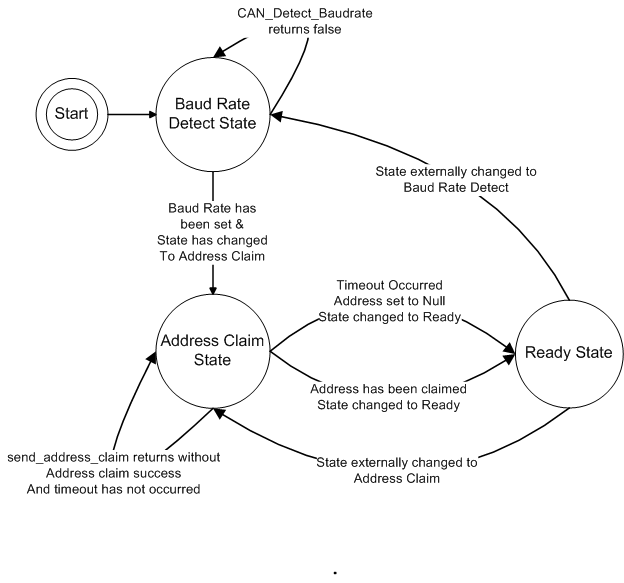

J1939 CAN Communication Task
----------------------------

**lib/J1939/src/taskCANcommunication.c**.  This function implements the FreeRTOS CAN
communication task.  The function is implemented as a state machine, which is depicted below.

    **J1939 CAN Communication Task State Transition Diagram**

The task performs the following functionality in each state:

    *Configuration State*.  The following configurations are performed one time:  The CAN bus baud rate is configured with the initial value and the unit's *ECU name* is configured.
    The *ECU name* was defined in the "CAN Interface Basic Information" page.

    *Initialization State*.  The unit primary communication is initialized based on the
    current CAN address and baud rate.

    *Task Event Loop*.The task event loop implements the  *Baud Rate Detection*, *Address Claim*, and *Ready* states.

        *Block on Semaphore*  The event loop blocks until the *CAN Data* semaphore (canDataSem) is available,at which time the semaphore is taken and the event loop is activated.

        *Baud Rate Detection* State

            If the state is the Baud Rate Detect state:

            *   If Baud Rate Detection is enabled, the baud rate detection process is started.
                The state doesn't change until the Baud Rate is detected.  The state is then set to the *Address Claim* state.

            *   If Baud Rate Detection is not enabled, the state is set to the *Address Claim* State.

        *Address Claim* State

            If the state is the *Address Claim* state, the address arbitration mechanism attempts to claim an address.

            If too many attempts are made (as set by a configured literal constant), the address is set to the maximum predefined value of 247.  The only situation in which the address arbitration mechanism would not yield an available address is if there are too many units on the CAN network.

        *Ready* State

            *Handle set message requests*.  Set message requests can be received
            asynchronously at any time.  If any such request is valid, the requested changes are made
            or requested actions are performed synchronously with the receipt of Set messages. The user configuration
            data set is updated by Set messages. The available Set messages are described below.

            *Handle get message requests*.  Get message requests can be received
            asynchronously at any time.  If any such request is valid, the requested information is packed into a response
            messages and sent.  The available Get messages are described below.

            *Send Data Packets Periodically*.  There are currently 3 example Data Packet messages.  Set messages can configure
            how often data packets messages are sent and which data packets are sent.  There is a setting called "Quiet Mode" that stops
            periodic transmission of data packets.  The Set message that determines which data packets to send selects 1, 2, or
            all 3 data packet type.  The following data packet messages are currently defined:

                *SSI2 Packets*.  Isf SSI2 data packets are to be sent, copy the slope data from the Kalman Filter Euler
                angle results for pitch and rolland send the SSI2 data packet.

                *Acceleration Packets*.  If acceleration data packets are to be sent, get the acceleration data,
                copy the acceleration data to the output data structure, and send the acceleration data packet.

                *Angular Rate Packets*.  If angular rate data packets are to be sent, copy the appropriate rate data
                into the output data structure and send the rate data packet.

**src/user/UserMessaging.c**.  This source file provides the functions that enqueue data packets and process incoming Set and Get requests.

**lib/J1939/src - can.c, sae_j1939, sae_j1939_slave.c**.  The functions in these files are used by the
'*TaskCANCommunicationJ1939*" function, as they provide the underlying CAN communication protocol implementation.

**.piolibdeps/OpenIMU300-platform-library/Core/src/DataAcquisitionSupport.c**.  in addition to the release of the 'canDataSem' in theData Acquisition task, it is also released in the Timer IRQ handler.  Release of the semaphore allows the CAN Communication task to take it and process data.
