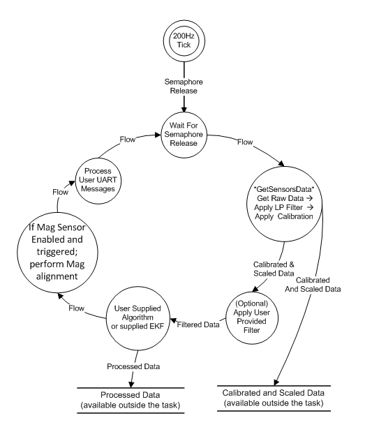
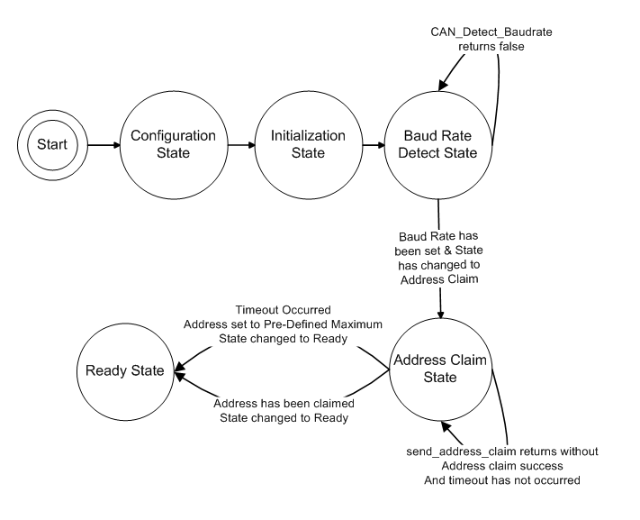
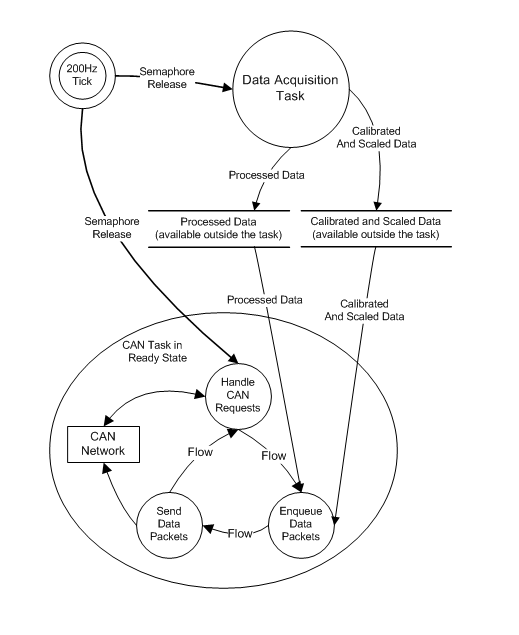

Example J1939 Application Diagrams
----------------------------------

The following diagrams illustrate:

*   The Data Acquisition Task Dataflow
*   The CAN Task State Transition Diagram while in the Ready State
*   The Task Synchronization Diagram for the example application

.. note::

    An internal timer, set to provide a 200Hz tick, provides the basic timing
    synchronization for all task functions.

    **J1939 Data Acquisition Task - Dataflow Diagram**

    **J1939 CAN Task - State Transition Diagram**

    **J1939 Example Application - Task Synchronization Diagram**
