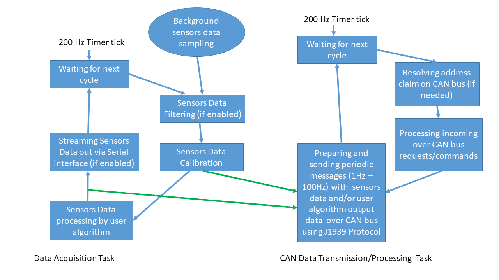

Example J1939 Application Diagrams
----------------------------------

The following diagrams illustrate:

*   The typical data processing flow in OpenIMU300RI applications

.. note::

    An internal timer, set to provide a 200Hz tick, provides the basic timing
    synchronization for all task functions.

    **J1939 Example Application data processing and events scheduling**
