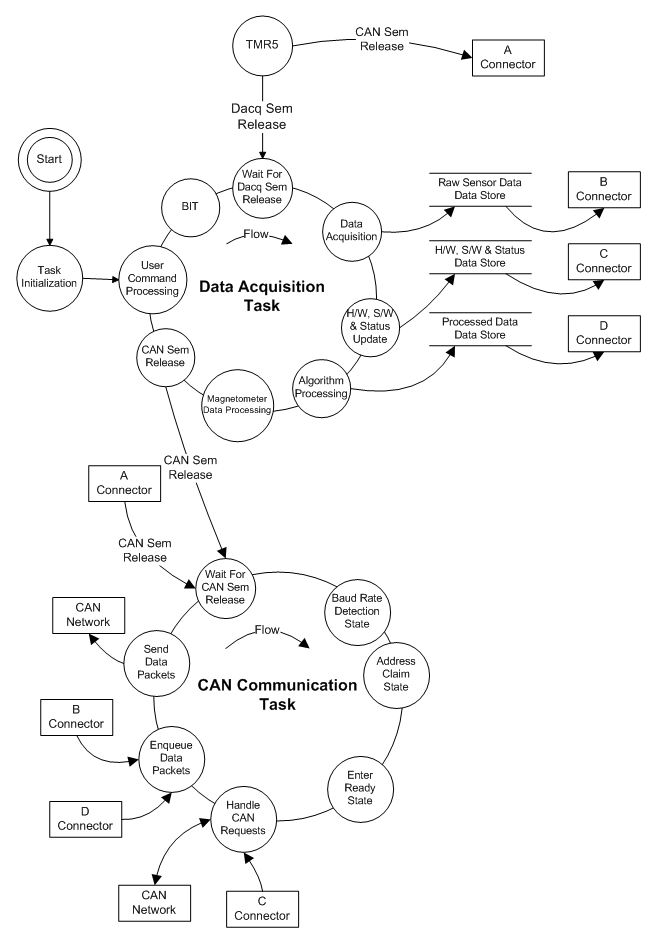

J1939 Task Synchronization
--------------------------

The Task Synchronization Diagram below depicts synchronization of the J1939 tasks.

**Timed Synchronization**.

*   The TMR5 timer provides the basic timing for all functions.  It is set to issue an interrupt at 200Hz for a 5 ms period.
*   The *TIM5_IRQHandler* function is called when the TMR5 timer causes the TMR5 interrupt.  The *dataAcqSem* and *canDataSem* semaphores
    are released every third time the IRQ is called, which is every 15 ms.
*   Release of the semaphores causes the Data Acquisition Task and the CAN Communication Task to be ready to run.
    The tasks will unblock when they are resumed by the scheduler.

**Inter-Task Synchronization**.

*   At the end of its event loop, the Data Acquisition Task also releases the canDataSem
    semaphore.  If the canDataSem semaphore wasn't already release by the *TIM5_IRQHandler* function, as described above.

    **J1939 Application Task Synchronization Diagram**
