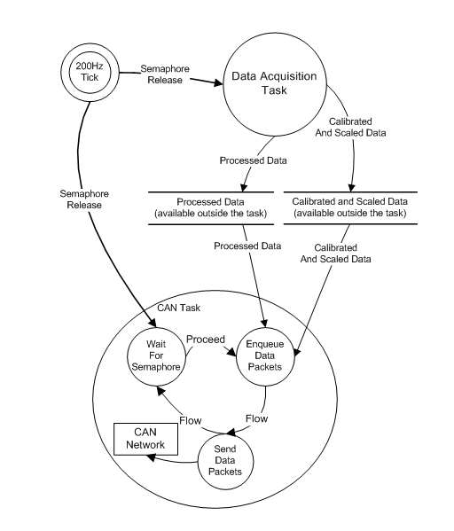

Example DBC Application Diagrams
----------------------------------

The following diagram depicts the the Task Synchronization Diagram for the example application

.. note::

    *   An internal timer, set to provide a 200Hz tick, provides the basic timing
        synchronization for all task functions.
    *   Differences between the DBC application and the J1939 application:
        *   The DBC application CAN Task is not implemented as a state machine, so there is no state transition diagram.
            The simple DBC CAN task dataflow is depicted in the Task Synchronization Diagram
        *   The Data Acquisition Task implemented in the DBC application is identical to that of the J1939 application,
            so the Data Acquisition Task dataflow diagram is not repeated here.

    **DBC Example Application - Task Synchronization Diagram**
