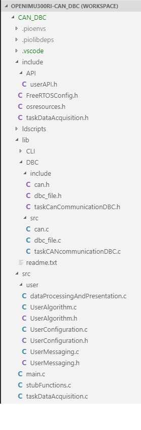

VSCode project for the DBC CAN Example Application
----------------------------------------------------

The *CAN_DBC* project is the VSCode project for the DBC CAN Example Application.

*   The most important files are found in the bottom level 'include', 'include/API', 'lib/DBC/include', 'lib/DBC/src', 'src', and  'src/user' directories.
*   These directories provide the user visible and modifiable files, including the example application code and the
    header files that provide the function prototypes for the user and library code and critical definitions.
*   The directory structure and files are shown in the following screen capture from VSCode.

    **Base folder from VSCode CAN DBC Workspace**
