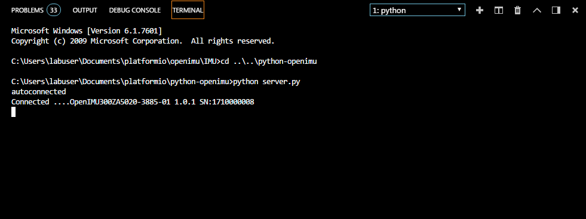
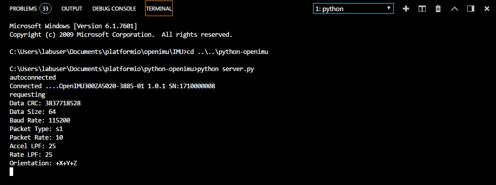

***************************************
Capturing, Displaying, and Saving Data
***************************************

.. contents:: Contents
    :local:
    
.. sectionauthor:: Joseph S Motyka <jmotyka at aceinna.com>

With the following complete:

    1. Serial output-message created and running on the OpenIMU hardware
    2. The message description added to *openimu.json*
    3. *python-openimu* installed on your system

you are now ready to collect IMU data.

OpenIMU Server
===============

To capture data using the `Aceinna Navigation Studio <https://developers.aceinna.com>`__, the first
step is to start the python-based server that will capture the serial data streaming over the COM
port.  This can be done by sending the following command at a terminal prompt from the
*python-openimu* folder:

::

    python commands.py

This initiates a search for the OpenIMU device on the machine's COM ports. When detected, the
terminal returns a message similar to the following:

.. _fig-server-connect:

    **Figure 3: Server-Connection Message at the Terminal Prompt**

Once connected to the IMU type 'start_server' to start the server.  More instructions on the Python driver
are found `here <../../tools/python.html>`__  

Connect to `Aceinna Navigation Studio <https://developers.aceinna.com>`__
==========================================================================

To capture and display data on the `Aceinna Navigation Studio <https://developers.aceinna.com>`__,
open a browser to https://developers.aceinna.com and log in.  From the menu on the left, select
*Devices* and *Connect*.  The following will appear if connected properly:

.. _fig-ans-connect:

.. figure:: ./media/IMU_DevelopersPage.PNG
    :alt: ANS_Connection
    :width: 7.0in
    :align: center

    **Figure 4: Connection to IMU Server**

If desired, the packet output rate and other settings can be changed here.

After connecting to the OpenIMU device, the terminal reflects this by displaying the configuration
of the unit:

.. _fig-server-connect-post:

    **Figure 5: Server-Connection Message at the Terminal Prompt**

Displaying Data
================

For a live display of data from the device, select the *Record* menu then click on the *Play*
button. An example capture of the accelerometer data follows:

.. _fig-ans-att-plot:

.. figure:: ./media/IMU_AccelerationPlot.PNG
    :alt: ANS_AccelerationPlot
    :width: 7.0in
    :align: center

    **Figure 6: Plot of IMU Accelerometer Data**

Logging Data
=============

To log data select the *Log Control* switch.  The output file consists of data found in the serial
message.  In particular the message consists of:

    * Time (in counts and seconds)
    * Accelerometer data (in :math:`[g]`)
    * Rate-Sensor data (in :math:`[° / s]`)
    * Magnetometer data (in :math:`[G]`)
    * Board-Temperature data (in :math:`[°C]`)

.. note:

    To log data files you must login to `Aceinna Navigation Studio <https://developers.aceinna.com>`__,
    otherwise the data cannot be saved.

The following figure shows the contents of the captured data file, indicating that all selected
data are saved as intended.

.. _fig-ans-data-log:

.. figure:: ./media/IMU_OutputData.PNG
    :alt: ANS_OutputDataPlot
    :width: 7.5in
    :align: center

    **Figure 7: IMU Angle Data File**

