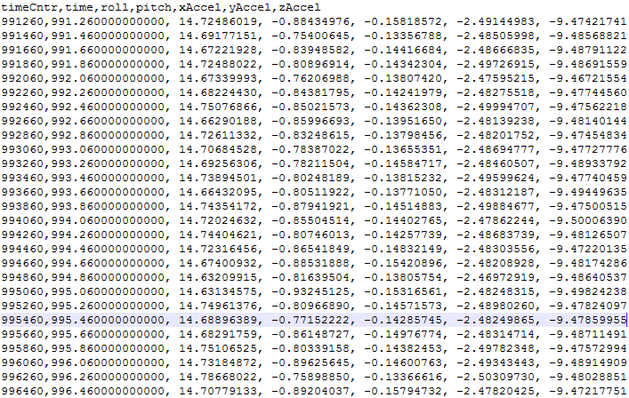

***************************************
Capturing, Displaying, and Saving Data
***************************************

.. contents:: Contents
    :local:
    
.. sectionauthor:: Joseph S Motyka <jmotyka at aceinna.com>

With the following complete:

    1. Algorithm and serial output-message created and running on the OpenIMU hardware
    2. Message description added to *openimu.json*
    3. *python-openimu* installed on your system

you are now ready to collect VG/AHRS data.

OpenIMU Server
===============

To capture data using the Aceinna Navigation Studio, the first step is to start the python-based
server that will capture the serial data streaming over the COM port.  This can be done by
sending the following command at a terminal prompt:

::

    python server.py

This initiates a search for the OpenIMU device on the machine's COM ports. When detected, the
terminal returns a message similar to the following:

.. _fig-server-connect:

.. figure:: ./media/VG_ServerCapture_PreConnect.PNG
    :alt: ServerConnection_Pre
    :width: 7.0in
    :align: center

    **Figure 3: Server-Connection Message at the Terminal Prompt**

Connect to Aceinna Navigation Studio
=====================================

To capture and display data on the Aceinna Navigation Studio, open a browser to
https://developers.aceinna.com and log in.  From the menu on the left, select *Devices*, and *Connect*.
The following will appear if connected properly:

.. _fig-ans-connect-pre:

.. figure:: ./media/Leveler_DevelopersPage.PNG
    :alt: ANS_Connection
    :width: 7.0in
    :align: center

    **Figure 4: Connection to IMU Server**

If desired, the packet output rate and other settings can be changed here.

After connecting to the OpenIMU device, the terminal reflects this by displaying the configuration
of the unit:

.. _fig-server-connect-post:

.. figure:: ./media/VG_ServerCapture_PostConnect.PNG
    :alt: ServerConnection_Post
    :width: 7.0in
    :align: center

    **Figure 5: Server-Connection Message at the Terminal Prompt**

Displaying Data
================

For a live display of data from the device, select the ‘Record’ menu. An example capture follows:

.. _fig-ans-att-plot:

.. figure:: ./media/VG_AttitudePlot.PNG
    :alt: ANS_AttitudePlot
    :width: 7.0in
    :align: center

    **Figure 6: Plot of Leveler Angle Data**

Logging Data
=============

To log data select the *Log Control* switch.  The output file consists of data found in the serial
message.  In particular the message consists of:

    * Time (in counts and seconds)
    * Roll and pitch angles (in :math:`[°]`)
    * Accelerometer data (in :math:`m/s^2`)

The following figure shows the contents of the captured data file, indicating that all selected
data are saved as intended.

.. _fig-ans-att-plot:

    **Figure 7: Leveler Angle Data File**

