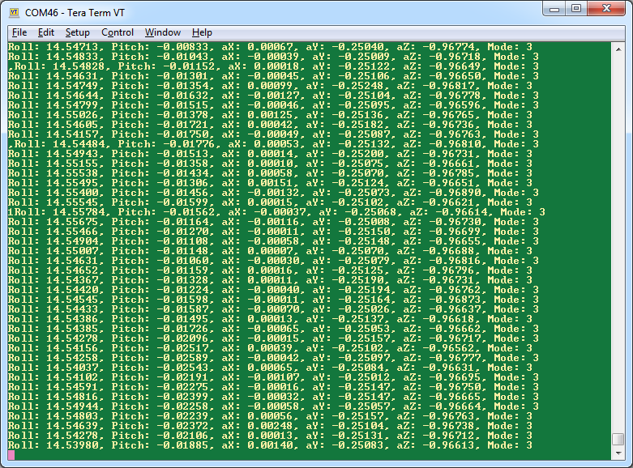

********************
Serial Debugging
********************

.. contents:: Contents
    :local:
    
.. sectionauthor:: Joseph S Motyka <jmotyka at aceinna.com>

Generating Debug Messages
==========================

**Creating the Message**:

Debug messages, using the built-in debugging capability of the OpenIMU platform, are added to the
VG/AHRS application to verify that the algorithm generates the correct results; the complete
implementation is found in *UserAlgorithm.c* in the VG/AHRS application code.  The relevant
debugger calls are:

::

    DebugPrintFloat("Roll: ",    gEKFOutputData.eulerAngs_BinN[ROLL], 5);
    DebugPrintFloat(", Pitch: ", gEKFOutputData.eulerAngs_BinN[PITCH], 5);
    DebugPrintFloat(", aX: ",    gEKFInputData.accel_B[X_AXIS], 5);
    DebugPrintFloat(", aY: ",    gEKFInputData.accel_B[Y_AXIS], 5);
    DebugPrintFloat(", aZ: ",    gEKFInputData.accel_B[Z_AXIS], 5);
    DebugPrintFloat(", Mode: ",  (float)gEKFOutputData.opMode, 0);
    DebugPrintEndline();

In the output message, roll and pitch angles are provided along with measured acceleration and
operational-mode at a 5 [Hz] output rate, controlled by an output counter variable.

Arguments to *DebugPrintFloat()* consist of:

    1. A character-string describing the output message
    2. The floating-point value to be output
    3. The number of significant digits in the output message

In this example, only *DebugPrintFloat()* and *DebugPrintInt()* are used to output a debug message,
other debug message functions are available. In particular, the following messages (provided in
*debug.c*) form the complete list:

::

    DebugPrintString();
    DebugPrintInt();
    DebugPrintLongInt();
    DebugPrintHex();
    DebugPrintFloat();
    DebugPrintEndline();

Compile and Test
=================

The final step is to build and upload the firmware to the OpenIMU hardware using the PIO framework.
When complete, use a terminal program (such as TeraTerm in Windows) to connect to the appropriate
COM port to assess if the program is operating as expected.

**Debug Communication Settings**:

Debug messages are provided as serial messages over the third port of the OpenIMU platform. When
connected to a PC, the device generates four COM ports.  In this case, the ports are 44, 45, 46,
and 47. The first COM port is the serial messaging port (discussed in the
`Platform Communications <../../EVB/overview.html#communication-with-imu-from-pc>`__ section), the
second port can be used for serial inputs to the platform (such as GPS), and the fourth is
unconnected.

The nominal serial baud-rate setting is 38.4 kbps.  This can be set to other rates, such as 57.6
kbps, 115.2 kbps, or 230.4 kbps via the argument to *InitDebugSerialCommunication()*, found in
*main.c*.  For the VG/AHRS application, this value was changed to 115.2 kbps.

**System Testing using Debug Communications**:

To test the OpenIMU output, the unit was rotated by approximately 15 [deg] about its roll-axis.
Results from the serial-debug message (found in :ref:`Figure <fig-term-debug-out>`) reflect this
fact and provide confidence that the algorithm is generating the correct roll angle.

.. _fig-term-debug-out:

    **VG Algorithm Debug Output**

