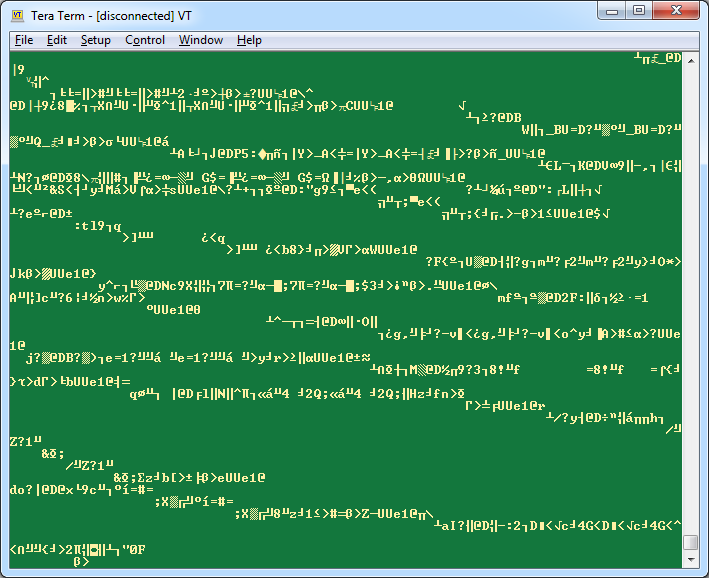

******************
Serial Messaging
******************

.. contents:: Contents
    :local:

Serial Message Definition
==========================

A streaming, serial message can be generated by the OpenIMU platform. In this example, a message
matching the requirements, defined earlier, is created.  It consists of:

    1. An integer counter, representing time in :math:`[ms]`
    2. Roll, pitch, and heading angles, in :math:`[°]`
    3. Uncorrected acceleration readings, in :math:`[g]`
    4. Uncorrected rate-sensor readings, in :math:`[° / s]`
    5. Estimated rate-sensor bias, in :math:`[° / s]`
    6. Magnetometer readings, in :math:`[G]`

To generate this output, a serial-message was created in *UserMessaging.c* and *UserMessaging.h*.
In the firmware, the message is given the name, *USR_OUT_EKF1*, along with the packet code “e1”
(with lower-case e representing EKF).

To form the message, the first step is to define the message components and determine the total
number of bytes the message will occupy.  The components of the message, variable type, and number
of bytes are listed in the following table:

.. table:: **Table 2: User-Defined Serial Message Components**

    +-----------------------+----------------------+----------------+------------+
    |                       | **Description**      |                |            |
    | **Message Component** |                      || **Number of** || **Total** |
    |                       +----------+-----------+| **Variables** || **Bytes** |
    |                       |          |           |                |            |
    |                       | **Type** | **Bytes** |                |            |
    |                       |          |           |                |            |
    +=======================+==========+===========+================+============+
    |                       |          |           |                |            |
    | Integer counter       | uint32_t | 4         | 1              | 4          |
    |                       |          |           |                |            |
    +-----------------------+----------+-----------+----------------+------------+
    |                       |          |           |                |            |
    || Attitude measurement | Float    | 4         | 3              | 12         |
    || (roll/pitch/heading) |          |           |                |            |
    |                       |          |           |                |            |
    +-----------------------+----------+-----------+----------------+------------+
    |                       |          |           |                |            |
    || Acceleration         | Float    | 4         | 3              | 12         |
    || (3 axis)             |          |           |                |            |
    |                       |          |           |                |            |
    +-----------------------+----------+-----------+----------------+------------+
    |                       |          |           |                |            |
    || Angular-Rate         | Float    | 4         | 3              | 12         |
    || (3 axis)             |          |           |                |            |
    |                       |          |           |                |            |
    +-----------------------+----------+-----------+----------------+------------+
    |                       |          |           |                |            |
    || Angular-Rate Bias    | Float    | 4         | 3              | 12         |
    || (3 axis)             |          |           |                |            |
    |                       |          |           |                |            |
    +-----------------------+----------+-----------+----------------+------------+
    |                       |          |           |                |            |
    || Magnetic-Field       | Float    | 4         | 3              | 12         |
    || (3 axis)             |          |           |                |            |
    |                       |          |           |                |            |
    +-----------------------+----------+-----------+----------------+------------+
    |                       |          |           |                |            |
    || Algorithm            | uint8_t  | 1         | 1              | 1          |
    || Operational Mode     |          |           |                |            |
    |                       |          |           |                |            |
    +-----------------------+----------+-----------+----------------+------------+

This shows that the *payload* section of the output message (not including preamble, message
type, or CRC) consists of 65 bytes.

Adding this message to the firmware requires modifications to two files: *UserMessaging.c* and
*UserMessaging.h*.

*UserMessaging.h* Modifications
================================

The packet code and number of bytes must be added to UserMessaging.h. This requires adding the
output packet code to the packet-type enum variable:

::

    // User output packet codes, change at will
    typedef enum {
        USR_OUT_NONE = 0, // 0
        USR_OUT_TEST,     // 1
        USR_OUT_DATA1,    // 2
        // add new output packet type here, before USR_OUT_MAX
        USR_OUT_EKF1,     // 3
        USR_OUT_MAX
    } UserOutPacketType;

and creating a *#define* identifier to hold the payload length

::

    #define USR_OUT_EKF1_PAYLOAD_LEN (65)

These can be found in the VG/AHRS example code.

*UserMessaging.c* Modifications
================================

With the above additions to *UserMessaging.h* made, the output message can be added to
*UserMessaging.c*, completing the process.  To accomplish this, add a new case to the
switch-statement found in *HandleUserOutputPacket()* using the output name added to
*UserMessaging.h*:

::

    case USR_OUT_EKF1:
    {
        // Variables used to hold the EKF values
        real EulerAngles[3];
        double accels[3];
        double rates[3];
        double mags[3];
        uint8_t opMode;
        
        // The payload length (NumOfBytes) is based on the following:
        // 1 uint32_t (4 bytes) =  4 bytes
        // 3 floats (4 bytes)   = 12 bytes
        // 3 floats (4 bytes)   = 12 bytes
        // 3 floats (4 bytes)   = 12 bytes
        // 3 floats (4 bytes)   = 12 bytes
        // 3 floats (4 bytes)   = 12 bytes
        // 1 uint8_t (1 byte)   =  1 byte
        // =================================
        //           NumOfBytes = 65 bytes
        *payloadLen = USR_OUT_LEV1_PAYLOAD_LEN;
        
        // Output time as represented by gLeveler.timerCntr (uint32_t
        // incremented at each call of the algorithm)
        uint32_t *algoData_1 = (uint32_t*)(payload);
        *algoData_1++ = gLeveler.timerCntr;
        
        // Set the pointer of the algoData array to the payload
        float *algoData_2 = (float*)(algoData_1);
        EKF_GetAttitude_EA(EulerAngles);
        *algoData_2++ = (float)EulerAngles[ROLL];
        *algoData_2++ = (float)EulerAngles[PITCH];
        *algoData_2++ = (float)EulerAngles[YAW];

        GetAccelsData_g(accels);
        *algoData_2++ = (float)accels[X_AXIS];
        *algoData_2++ = (float)accels[Y_AXIS];
        *algoData_2++ = (float)accels[Z_AXIS];

        GetRateData_degPerSec(rates);
        *algoData_2++ = (float)rates[X_AXIS];
        *algoData_2++ = (float)rates[Y_AXIS];
        *algoData_2++ = (float)rates[Z_AXIS];

        GetEKF_EstimatedAngRateBias(rates);
        *algoData_2++ = (float)rates[X_AXIS];
        *algoData_2++ = (float)rates[Y_AXIS];
        *algoData_2++ = (float)rates[Z_AXIS];

        GetMagData_G(mags);
        *algoData_2++ = (float)mags[X_AXIS];
        *algoData_2++ = (float)mags[Y_AXIS];
        *algoData_2++ = (float)mags[Z_AXIS];
        
        // Set the pointer of the algoData array to the payload
        uint8_t *algoData_3 = (uint8_t*)(algoData_2);
        EKF_GetOperationalMode(opMode);
        *algoData_3++ = opMode;
    }
    break;

Data is appended to the payload array using pointers.  This enables variables of different
datatypes to fit into the payload array (defined as an array of 8-bit unsigned integers); this
approach is highlighted in the previous code snippet and is done by generating a pointer of the
desired type to a typecast version of the payload address.  In the example above, 32-bit unsigned
integer data is appended to the payload, followed by floating-point and 8-bit unsigned integer
variables.

Finally, the packet type must be added to the switch-statement in *setUserPacketType()* to enable
the firmware to select the packet:

::

    case USR_OUT_EKF1: // packet with EKF algorithm data
        _outputPacketType = type;
        _userPayloadLen = USR_OUT_EKF1_PAYLOAD_LEN;
        break;
    
    
and the packet-code must be added to the list of user output packets, *userOutputPackets*.

::

    // packet codes here should be unique -
    // should not overlap codes for input packets and system packets
    // First byte of Packet code should have value >= 0x61
    usr_packet_t userOutputPackets[] = {
        // Packet Type Packet Code
        {USR_OUT_NONE, {0x00, 0x00}},
        {USR_OUT_TEST,  "zT"},
        {USR_OUT_DATA1, "z1"},
        // place new type and code here
        {USR_OUT_EKF1,  "e1"},
        {USR_OUT_MAX, {0xff, 0xff}}, // ""
    };

These changes are found in *UserMessaging.c*.

Default Configuration Settings
===============================

To make the "e1" serial message (created previously) the default output, make changes to the
default user-configuration structure found in *UserConfiguration.c*:

::

    // Default user configuration structure
    // Applied to unit upon reception of "zR" command
    // Do Not remove - just add extra parameters if needed
    // Change default settings if desired
    const UserConfigurationStruct gDefaultUserConfig = {
        .dataCRC = 0,
        .dataSize = sizeof(UserConfigurationStruct),
        .userUartBaudRate = 115200,
        .userPacketType = "e1",
        .userPacketRate = 20,
        .lpfAccelFilterFreq = 50,
        .lpfRateFilterFreq = 50,
        .orientation = "+X+Y+Z"
        // add default parameter values here, if desired
    } ;

.. note::

    *userPacketType* was set to “e1” to cause the new packet to be broadcast by default.
    Additionally, the desired message baud rate and message rate are set to 115.2 kbps and 20
    [Hz], respectively.  Finally, the accelerometer and rate-sensor filters are set to 50 Hz.

Testing using Serial Terminal Emulator
=======================================

At this point, the VG/AHRS application has been implemented and the output messaging created.
Build and upload the firmware to the OpenIMU.  A serial terminal (such as TeraTerm) can be used to
verify if a message is being generated by the device.  In the following figure, output messaging
creation can be verified by searching for the string “UUe1”.  If present, the message is being
generated; whether the message is populated correctly requires the use of additional tools.

.. _fig-ser-msg-test:

    **Figure 2: Test of Serial Message Output**

.. note::

    In the above figure the message preamble sometimes does not display correctly.  This is solely
    a TeraTerm glitch.  Other serial terminal programs (such as CoolTerm) do not show such
    behavior.

