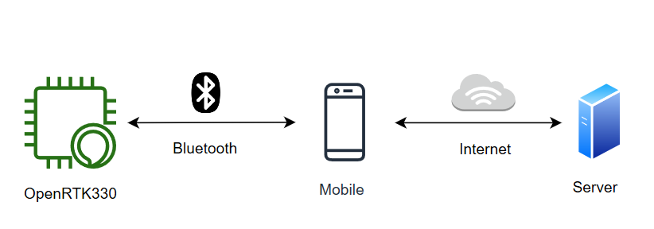
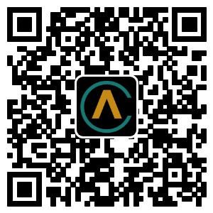

Mobile
======

OpenRTK works for Aceinna OpenRTK app. APP get RTCM/NMEA data
via Bluetooth from RTK device, and then send to Aceinna server on Internet,
calculation results to be sent to the device. The RTK device will calibrate according to the data.

Installation and initialization
~~~~~~~~~~~~~~~~~~~~~~~~~~~~~~~

::

1. You can scan the QR code to download, currently only the android version and make sure
   your Android version is 8.0 or above.

::

2. After downloading the OpenRTK app, open the APK file for installation.

::

3. Please whitelist the APP.

Account Registration
~~~~~~~~~~~~~~~~~~~~

 **Sign up**. you need a account to login in. The account is same as
 `Aceinna Developer Site <https://developers.aceinna.com/>`__ and
 `Aceinna Fourm <https://forum.aceinna.com//>`__. You can sign up an account,
 or log in quickly using your github account.

 .. image:: ../media/login.jpg
    :align: center
    :scale: 18%   

Aceinna Network service subscription
~~~~~~~~~~~~~~~~~~~~~~~~~~~~~~~~~~~~

 **Generate API**. If you do not have the API key, you need generate API
 Key to use Aceinna RTK network.
  1. click next.
   .. image:: ../media/generate-step-1.jpg
     :align: center
     :scale: 18%

  2. set a number, it means how many devices you can use this account at the same time.
   .. image:: ../media/generate-step-2.jpg
     :align: center
     :scale: 18%

  3. click finish to generate API key.
   .. image:: ../media/generate-step-3.jpg
     :align: center
     :scale: 18%

Configuration
~~~~~~~~~~~~~

 **1. Network Configuration**.

  - *RTK Type*: 

     - RTK: get NEMA(GPGGA) from device,get RTCM from Aceinna server. 
     - cloudRTK: get RTCM from device, get NEMA(GPGGA) from Aceinna server. 
  - *Use Local Service*:

     - ON: you can use other service, and you need input its URL and Port.
     - OFF: use Aceinna OpenRTK service.

    .. image:: ../media/networkConfig.jpg
       :align: center
       :scale: 18%
      

 **2. User Configuration**.

  You can swipe left or click the icon "≡" for more user configuration, as flowing picture.

  .. image:: ../media/leftMenu.png
       :align: center
       :scale: 18%

  - *Cloud RTK*: show API key info or generate key.

  .. image:: ../media/CloudRTK.png
         :align: center
         :scale: 18%

  - *Device Setting*: change device setting, like Bluetooth name, baud rate, output packet and so on.
    
    .. image:: ../media/customDeviceConfig.jpg
         :align: center
         :scale: 18%

  - *Debug Mode*: Costum some map settings
    
    .. image:: ../media/mapConfig.jpg
         :align: center
         :scale: 18%

  - *Save result*: Save result information in GPGGA format if switch is on. The storage path is *Android/data/com.aceinna.rtk/files/log*.

Connection
~~~~~~~~~~

 - Turn on your RTK Bluetooth device and make it discoverable.
 - Click the "search" icon to search for your device, if it's not on already, please turn on location permissions for your Bluetooth.

  .. image:: ../media/connect.jpg
    :align: center
    :scale: 18%   

 - After it’s connected, you can see the following interface.

  .. image:: ../media/connectLog.jpg
    :align: center
    :scale: 18%   
 
Map
~~~

 - Livemap

  .. image:: ../media/offlineMap.jpg
    :align: center
    :scale: 18%   

 - Track map

  .. image:: ../media/trajectory.jpg
    :align: center
    :scale: 18%   
    