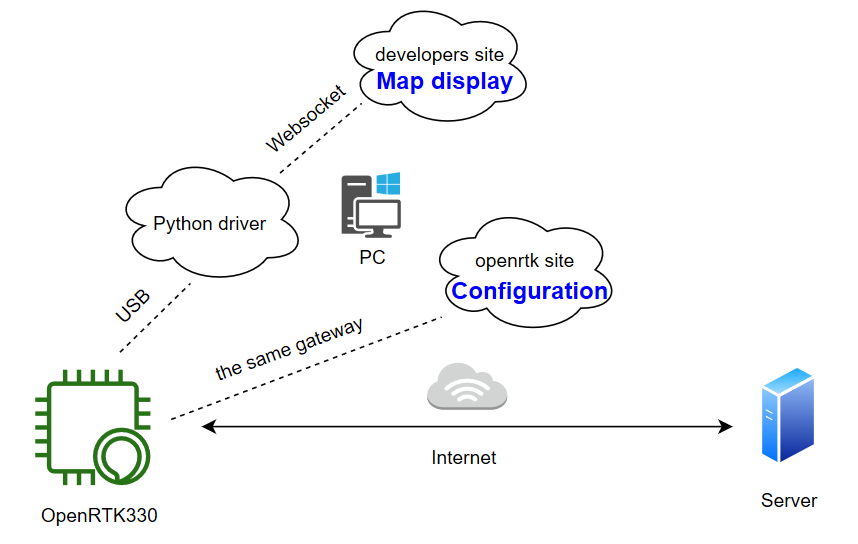

PC
===

.. OpenRTK platform acts as NTRIP client
   connects with NTRIP server to gets/sends RTCM/NMEA data via ethernet. For more
   details, please refer to RTK/Cloud RTK.

OpenRTK PC platform acts as an auxiliary tool, connected to the OpenRTK module via USB to 
configure parameters during data transmission. Finally display trajectory in map.

.. OpenRTK acts as NTRIP client connects with NTRIP server to fetch
   RTCM/NMEA data from ethernet in RTK, and then send to Aceinna server,
   after the calculation of the server, the data is returned, and then
   written to the device. The RTK device will calibrate according to the
   data.

Installation and initialization
~~~~~~~~~~~~~~~~~~~~~~~~~~~~~~~

 ::

 1. Plug in a RJ45 cable from the host(e.g. Router or Desktop) to the
    ethernet port of OpenRTK.
 ::

 2. DHCP IP address is used by OpenRTK as default, if no success,
    manually setup a STATIC IP (ip = 192.168.1.110, netmask =
    255.255.255.0, gateway = 192.168.1.1).
 ::

 3. Visit the embedded web site ("http://openrtk") on the same LAN as
    OpenRTK.

Aceinna Network service subscription
~~~~~~~~~~~~~~~~~~~~~~~~~~~~~~~~~~~~

 **Generate API**. If you do not have the API key, you need `generate API
 key <https://openrtk.readthedocs.io/en/latest/Network/getapikey.html>`__  
 to use Aceinna RTK network and set the number of allowed devices.

 .. image:: ../media/signup.png
    :align: center
    :scale: 50%

Configuration
~~~~~~~~~~~~~

 **1. Ntrip Configuration**.

  - *IP*: NTRIP server ip, it can be ip like "106.12.40.121", or be the hostname like "rtk.aceinna.com".
  - *PORT*: NTRIP server port.
  - *MOUNT POINT*: NTRIP mount point, if you use Aceinna Cloud Server, it will be "/RTK".
  - *USER NAME*: If you use Aceinna Cloud Server, it will be the user name.
  - *PASSWORD*: If you use Aceinna Cloud Server, it will be the Apikey.
  - *NTRIP STATUS*: CONNECTET/DISCONNECTED: indication of ntrip connection status.
  - *BSAE STREAM*: AVAILABLE/UNAVAILABLE: indication of base rtcm stream.

  You can click 'SAVE', if the NTRIP STATUS is CONNECTED, it will be effective next time. So, you should 
  reconnect the network or restart the OpenRTK board.

  .. image:: ../media/ntripcfg.png
     :align: center
     :scale: 50%

 **2. User Configuration**.

    - change device setting, like baud rate, output packet and so on.

    .. image:: ../media/usercfg.png
       :align: center
       :scale: 50%

 **3. Ethernet Configuration**.

    -  *MAC*: It can be modified in the code, the last three bytes is the CPU's device ID.
    -  *MODE*: 

         - *DHCP mode*: it will do dhcp util success. 
         - *STATIC IP*: STATIC NETMASK and STATIC GATEWAY. You should config the same gateway of your net device and config a free ip.

    You can click 'SAVE' to let the configuration be effective immediately. If the NTRIP STATUS is CONNECTED, it will reconnect immediately.

    .. image:: ../media/ethcfg.png
       :align: center
       :scale: 50%

 **4. Device Info**

    You can see all the device infomation.

    .. image:: ../media/deviceinfo.png
       :align: center
       :scale: 50%

Connection
~~~~~~~~~~

 - You should download python driver from https://github.com/Aceinna/python-openimu/tree/ans-devices. 
   Then, you need to run main.py (python main.py -p 9753).

 - Device information is exposed on the DEVICE INFO page (https://developers.aceinna.com/devices/rtk). 
   The default webserver port for rtk is 9753. If you change the port on the web, you should also 
   change the port when running main.py.

 - Connection Status is shown on the link symbol at the top right hand side of the page.
 
 .. image:: ../media/connect.png
   :align: center
   
 - You can visit https://developers.aceinna.com/devices/files to see      RTK LOGIN LOGS.

    .. image:: ../media/serverrtk.png
        :align: center 

Map
~~~

 Play button will be enabled when openrtk is connected. Click 'play' to see the openrtk output information.

 .. image:: ../media/map.png
   :align: center
   :scale: 50%

 .. image:: ../media/skyview.png
   :align: center
   :scale: 50%

